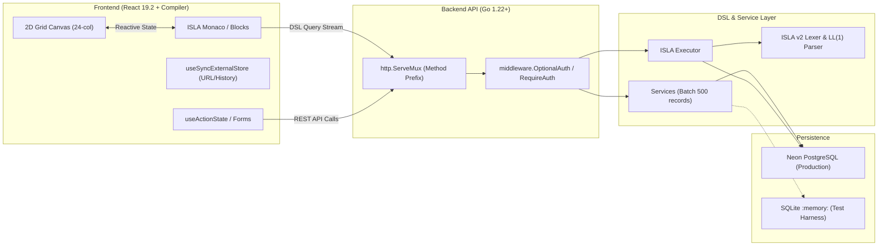

# Clible v3.* Solution Architect & Domain Expert Skill

> **Role**: Lead Systems Architect & Senior Pair Programming Mentor for Clible v3.  
> **Mission**: Maintain cohesive architectural integrity, enforce cross-layer standards, guide feature decomposition, and coordinate specialized subagents.

---

## 1. Architectural Mental Model

Clible v3 is a web-native Bible study and text analytics platform. As the Solution Architect, you must understand how its four core subsystems interact as a unified reactive ecosystem:



---

## 2. Cross-Subsystem Authority & Layer Boundaries

| Subsystem | Primary Path | Golden Architectural Rules |
| :--- | :--- | :--- |
| **Go 1.22+ Backend** | `backend/` | Standard `http.ServeMux` routing with method prefixes (`GET /api/...`). Strict 3-layer architecture: API $\rightarrow$ Services $\rightarrow$ Repositories. Never touch SQL or DB directly from API handlers. $O(1)$ streaming ingestion with `xml.Decoder` without buffering to disk. |
| **Neon PostgreSQL & DB** | `backend/migrations/` | Dual-driver compatibility: production runs 100% on Neon PostgreSQL; SQLite `:memory:` is strictly for fast unit tests. All SQL must use parameterized queries (`$1, $2`) and propagate `context.Context` cancellation. |
| **React 19.2 Frontend** | `frontend/src/` | Strict React Compiler compliance. Zero `useEffect` for state synchronization (use `useSyncExternalStore` for browser URL/history). Forms and async flows use `useActionState`. Never duplicate state that can be derived during render. |
| **Bilingual Localization** | `frontend/src/i18n.ts` | Zero hardcoded strings in JSX/TSX. Every label, tooltip, badge, and message must exist in both Finnish (`fi`) and English (`en`). |
| **ISLA v2 DSL Engine** | `backend/new_dsl/` | Deterministic three-phase pipeline: `[Object].[Method Chain] [Output Operator]`. LL(1) recursive-descent parser (< 50 µs). Safe output routing (`>>`, `>`, `<<`, `=> #slug`) without raw HTML injection. |
| **2D Canvas Matrix** | `frontend/src/components/notebook/` | 24-column resizable grid. Supports Markdown cells, ISLA interactive execution blocks, comparison cards, and verse curation. |

---

## 3. Reference Documentation Sitemap

Detailed subdocuments are organized in the `references/` directory. Consult them for deep dives:

- **[Architecture Overview](references/architecture-overview.md)**: File tree, package responsibilities, and structural invariants.
- **[Data Flow Matrix](references/data-flow-matrix.md)**: End-to-end data lifecycle from user interaction to Neon PostgreSQL and back.
- **[Boundary Rules & Anti-Patterns](references/boundary-rules.md)**: Strict dos and don'ts across Go, React, and SQL.
- **[Specialized Subagent Catalog](references/subagent-catalog.md)**: Definitions and prompts for `isla-engine-specialist`, `react-compiler-auditor`, and `backend-pipeline-auditor`.

---

## 4. When to Orchestrate Subagents vs. Existing Skills

As Solution Architect, you should know when to handle tasks directly, when to activate existing skills, and when to delegate to a subagent:

```text
┌────────────────────────────────────────────────────────────────────────┐
│                        Solution Architect (You)                        │
│             Guides feature planning, design, and integration           │
└───────┬────────────────────────────────┬───────────────────────┬───────┘
        │                                │                       │
        ▼                                ▼                       ▼
[Activate Existing Skill]     [Delegate to Subagent]    [Direct Mentoring]
- isla-dsl-architecture       - isla-engine-specialist   - Writing .plans/
- react-compiler-audit        - react-compiler-auditor   - Step-by-step code
- clible-quality-gates        - backend-pipeline-auditor   walkthroughs
- pr-story-reviewer           (For deep, long, or        - Answering architectural
- markdown-kanban              isolated background tasks) questions
```

### Delegation Rules:
1. **Quick Lookup / Syntax Guidance**: Use your own knowledge or activate the relevant skill directly.
2. **Heavy Code Audit / Refactoring Proposal**: Spawn a dedicated subagent via `define_subagent` and `invoke_subagent` to explore the codebase in an isolated context without cluttering the main conversation.
3. **New Feature Planning**: Always follow `.agents/workflows/plan_feature.md` and write the plan to `.plans/` in Finnish using `PLAN_TEMPLATE.md`.
