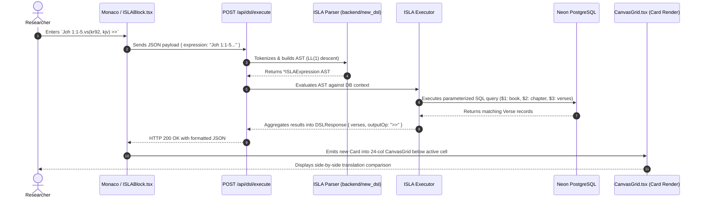
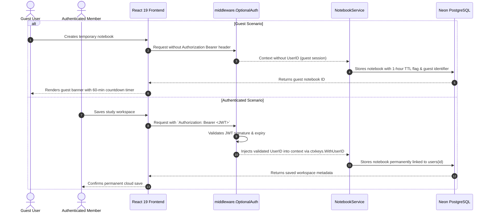
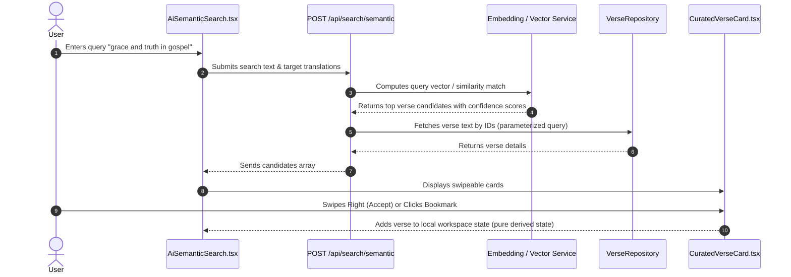

# Clible v3 Data Flow Matrix

This reference traces key end-to-end user workflows across the frontend, API, service, DSL engine, and database layers.

---

## 1. Trace 1: ISLA v2 Execution in 2D Notebook Canvas

---

## 2. Trace 2: Guest Mode vs. Authenticated User Request

---

## 3. Trace 3: AI Semantic Search & Curation Triage

