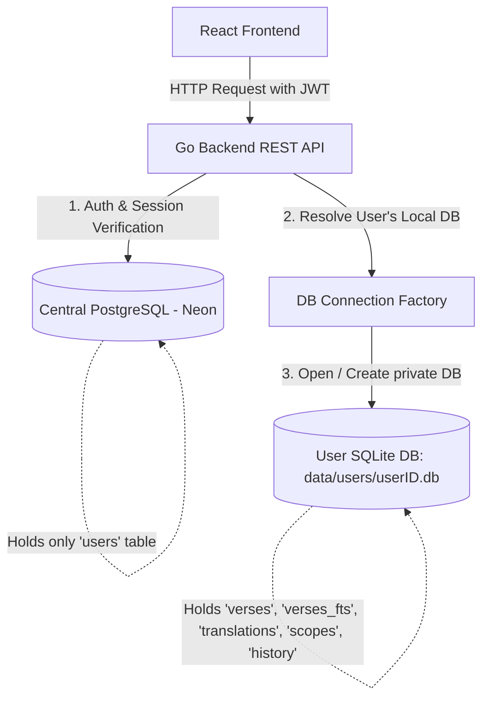

# Suunnitelma: Käyttäjäkohtaiset SQLite-tietokannat (User-Isolated SQLite Databases)

Tässä suunnitelmassa hahmotellaan arkkitehtuurimuutos, jossa raskaat Raamattutiedot, hakuhistoria ja tallennetut haut eristetään kunkin käyttäjän omaan paikalliseen SQLite-tietokantatiedostoon. Keskustietokantana (PostgreSQL Neon) pidetään ainoastaan kevyt käyttäjien tunnistautumistieto (`users`).

---

## 1. Nykytilan ongelmat ja arkkitehtuurin tausta

* **Neon Postgres -kustannukset ja rajat:** Raamatun jakeet vievät paljon tilaa (yksi käännös on n. 31 000 jaetta). FTS-indeksien (Full-Text Search) kanssa tilaa kuluu vielä enemmän. Neonin ilmaistasolla tallennustilan ja suorituskyvyn rajat voivat tulla nopeasti vastaan, jos monta käyttäjää lataa useita eri käännöksiä.
* **Yhteysrajoitukset (PgBouncer):** Neon käyttää taustalla pgBouncer-yhteysallasta (usein Transaction Pooling -tilassa). Tämä tila ei tue Go-kielessä oletuksena käytettäviä valmisteltuja kyselyitä (Prepared Statements, `$1` syntaksi), mikä voi aiheuttaa satunnaisia 500-virheitä (`prepared statement already exists` tai yhteyskatkoja), kun useita kyselyitä suoritetaan rinnakkain.
* **Käyttäjien välinen eristys:** Nykytilassa asennetut käännökset ovat globaaleja. Jos käyttäjä A asentaa käännöksen, se näkyy kaikille muillekin, mikä poikkeaa alkuperäisestä ajatuksesta, jossa jokaisella käyttäjällä on täysin oma henkilökohtainen työtilansa.

---

## 2. Ehdotettu arkkitehtuuri: Hybridi-malli



### 2.1. Keskustietokanta (PostgreSQL Neon)

Säilyttää vain kriittisen tunnistautumistiedon:

* **`users`**-taulu (id, email, password_hash, created_at, updated_at).
* Tämä data on erittäin kevyttä (kilotavuja käyttäjää kohden), joten Neonin ilmaistaso riittää ikuisesti tuhansillekin käyttäjille.

### 2.2. Käyttäjäkohtaiset tietokannat (SQLite-tiedostot)

Jokaiselle rekisteröityneelle käyttäjälle luodaan palvelimen levylle oma SQLite-tiedosto: `/data/users/<user_id>.db` (tai vastaavaan pysyvään kansioon).
Tämä tietokanta sisältää:

* **`translations`**: Käyttäjän itse asentamat käännökset.
* **`verses`**: Kyseisten käännösten jakeet.
* **`verses_fts`**: Käyttäjän oma FTS5-hakuindeksi (haku on salamannopea ja täysin eristetty).
* **`scopes` & `saved_searches` / `saved_analyses`**: Työtilat ja tallennetut haut.
* **`search_history`**: Käyttäjän oma hakuhistoria.

---

## 3. Tekninen toteutussuunnitelma (Go-backend)

### 3.1. Tietokantayhteyksien hallinta (Database Factory)

Luodaan backendille hallintakomponentti, joka vastaa käyttäjäkohtaisten SQLite-yhteyksien avaamisesta ja sulkemisesta:

```go
// backend/internal/db/user_db_factory.go
package db

import (
 "database/sql"
 "fmt"
 "os"
 "path/filepath"
 "sync"
 "time"
)

type UserDBFactory struct {
 mu       sync.RWMutex
 active   map[string]*sql.DB
 basePath string
}

func NewUserDBFactory(basePath string) *UserDBFactory {
 _ = os.MkdirAll(basePath, 0755)
 return &UserDBFactory{
  active:   make(map[string]*sql.DB),
  basePath: basePath,
 }
}

func (f *UserDBFactory) GetDB(userID string) (*sql.DB, error) {
 f.mu.Lock()
 defer f.mu.Unlock()

 // Jos yhteys on jo auki, palautetaan se suoraan
 if db, ok := f.active[userID]; ok {
  return db, nil
 }

 dbPath := filepath.Join(f.basePath, fmt.Sprintf("%s.db", userID))
 db, err := sql.Open("sqlite", dbPath)
 if err != nil {
  return nil, err
 }

 // Alustetaan SQLite-asetukset suorituskykyä varten
 _, _ = db.Exec("PRAGMA foreign_keys = ON;")
 _, _ = db.Exec("PRAGMA journal_mode = WAL;")
 _, _ = db.Exec("PRAGMA busy_timeout = 5000;")

 // Suoritetaan käyttäjäkohtaiset migraatiot (luodaan taulut jos niitä ei ole)
 if err := RunUserMigrations(db); err != nil {
  _ = db.Close()
  return nil, err
 }

 f.active[userID] = db
 return db, nil
}
```

### 3.2. Rajapintojen ja palveluiden muutokset

Koska tietokantayhteys riippuu nyt kirjautuneesta käyttäjästä:

1. HTTP-käsittelijät (Handlers) hakevat ensin käyttäjän ID:n JWT-istunnosta (`middleware.GetUserID(ctx)`).
2. Käsittelijä pyytää `UserDBFactorylta` kyseisen käyttäjän SQLite-yhteyden.
3. Repositoriot tai palvelut ottavat vastaan tämän dynaamisen tietokantayhteyden parametrinä tai ne alustetaan pyynnön elinkaaren ajaksi.

Esimerkiksi jakeiden hakeminen:

```go
// handlerissa:
userID, _ := middleware.GetUserID(r.Context())
userDB, _ := h.dbFactory.GetDB(userID)

verses, err := h.verseService.GetVerses(r.Context(), userDB, ref, translation)
```

---

## 4. Hyödyt ja haitat

### Edut (Pros)

* **Kustannustehokkuus (0 €):** Levytila palvelimella (esim. VPS) on erittäin halpaa verrattuna SaaS-tietokantojen (kuten Neonin) tallennusrajoihin ja I/O-maksuihin. 10 000 käyttäjän Raamatut mahtuvat helposti parinkymmenen gigatavun levytilaan.
* **Täydellinen tietoturva ja eristys:** Yhden käyttäjän tietokantavirhe tai korruptoituminen ei vaikuta muihin käyttäjiin. Jokaisella on vain omat tietonsa.
* **Helpot varmuuskopiot ja siirrettävyys:** Käyttäjä voi ladata oman `.db`-tiedostonsa suoraan talteen (esim. varmuuskopiona) tai siirtää sen toiseen sovellukseen.
* **Keveys:** Ei monimutkaisia monen käyttäjän indeksointeja tai suuria tietokantakyselyitä.

### Haitat ja huomioitavat asiat (Cons)

* **Ephemeral tallennus (Cloud Run / AWS Lambda):** Jos sovellus ajetaan palvelimella, jonka levy nollautuu jokaisessa uudelleenkäynnistyksessä (kuten Google Cloud Run ilman ulkoista levyä), SQLite-tiedostot häviävät. Tällöin palvelimella on oltava käytössä pysyvä levy (Persistent Volume, kuten Fly.io Volumes tai AWS EFS).
* **Docker-volyymit:** Docker-ajossa käyttäjätietokantojen kansio (esim. `/data/users`) on mountattava host-koneelle, jotta tiedot säilyvät kontin päivittyessä.

---

## 5. Vaihtoehto A: Yhteinen Postgres, jossa käyttäjäkohtainen näkyvyys

Jos haluamme pitää kaiken yhdessä PostgreSQL-kannassa, voimme luoda välitaulun:

* **`user_translations`** (user_id, translation_id)
Tällöin:
* Jos käyttäjä A lataa KJV:n, sen jakeet tallennetaan **kerran** globaaliin `verses`-tauluun.
* Luodaan linkki käyttäjän A ja KJV:n välille.
* Käyttäjä näkee vain ne käännökset, joihin hänellä on linkki.
* **Etu:** Käännöksiä ei ladata moninkertaisesti levylle, säästää tilaa globaalisti.
* **Haitta:** Suuri riski ylittää ilmaisen pilvitietokannan rajat nopeasti, ja kaikki pgBouncer/Prepared statement -ongelmat on ratkaistava.

---

## 6. Kysymys kehittäjälle

> [!IMPORTANT]
> Haluatko edetä hybridimalliin (Option B: SQLite tiedostot per käyttäjä + kevyt Postgres tunnistautumiseen), vai pidetäänkö kaikki yhdessä PostgreSQL-kannassa (Option A) ja ratkaistaan pgBouncerin yhteysongelmat?
