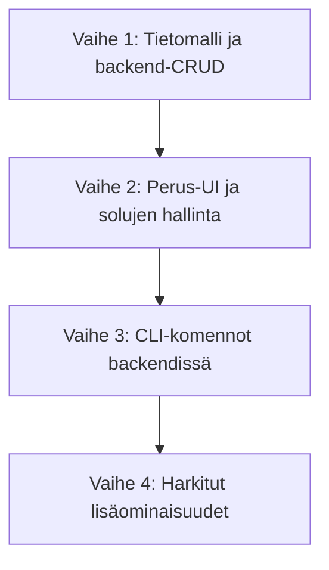

# Clible Notebooks — Kehitystiekartta (Roadmap)

Tämä dokumentti määrittelee Clible Notebooks -kokonaisuuden kehitystiekartan. Tavoitteena on tuoda sovellukseen
laadukas, solupohjainen muistiinpanojärjestelmä, joka yhdistää vapaan tekstinkäsittelyn (Markdown) ja
interaktiivisen komentorivin (CLI). Kehitys pitäydytään tarkoituksella kapeana ja tehdään huolellisesti —
mieluummin yksi toimiva ominaisuus kuin monta puolitekoista.

> **Suunnitteluperiaate:** Vältä "slob code" -ansaa. Jokainen vaihe viedään loppuun ennen seuraavan aloittamista.
> Erikoistoiminnot (hover-efektit, graafivisualisoinnit, tietograafit) ovat erinomaisia ideoita, mutta ne otetaan
> käsittelyyn vasta kun perusta on vakaa ja testattu.

---

## Vaiheiden yleiskuva

---

## Vaihe 1: Tietomalli ja backend-CRUD (PR 1)

Rakennetaan kestävä tietokantapohja ja Go-rajapinta, joka ei tule vaatimaan muutoksia myöhemmin.

**Backend:**

- SQL-migraatiot: `notebooks`- ja `notebook_cells`-taulut selkeällä skeemalla.
- Repository-kerros: tyypilliset CRUD-operaatiot, `context.Context` kaikkialla.
- Service-kerros: validointilogiikka (solujärjestyksen hallinta, tyyppitarkistukset).
- REST-endpointit:
  - `GET /api/notebooks` — lista käyttäjän notebookeista
  - `POST /api/notebooks` — luo uusi notebook
  - `GET /api/notebooks/:id` — hae yksittäinen notebook solusineen
  - `PUT /api/notebooks/:id` — päivitä otsikko/metadata
  - `DELETE /api/notebooks/:id` — poista notebook
  - `POST /api/notebooks/:id/cells` — lisää solu
  - `PUT /api/notebooks/:id/cells/:cell_id` — päivitä solun sisältö
  - `DELETE /api/notebooks/:id/cells/:cell_id` — poista solu

**Testaus:**

- Yksikkötestit repository-kerrokselle (SQLite in-memory).
- API-tason integraatiotestit pääpolkuja varten.

---

## Vaihe 2: Perus-UI ja solujen hallinta (PR 2)

Rakennetaan toimiva, selkeä käyttöliittymä ilman ylimääräistä virittelyä.

**Frontend:**

- Notebook-näkymä: lista notebookeista ja yksittäinen avoinna oleva notebook.
- Markdown-solujen renderöinti (`react-markdown`) ja editointitila (tavallinen `<textarea>`).
- Koodisolujen syötekenttä: yksinkertainen monospacetekstialue, ei tarvita koodieditoria.
- Solujen järjestäminen: nuolipainikkeet ylös/alas.
- Solun lisääminen ja poistaminen.
- Automaattinen tallennus (`debounce` 800 ms) — ei erillistä Tallenna-painiketta.
- **Jaelinkit Markdownissa:** Tuetaan `[[KNJ3:16]]`-syntaksia pelkkänä klikattavana linkkinä
  VerseReaderiin. Hover-efektit jätetään myöhempään vaiheeseen — ei nyt.

> **Huomio:** Markdown-solujen `[[kirja:luku:jae]]`-syntaksin käsittely toteutetaan yksinkertaisena
> regex-pohjaisena tekstimuunnoksena `renderMarkdown`-utilissa — ei erillistä kieltä, ei
> `ProseMirror`/`CodeMirror`-riippuvuuksia.

---

## Vaihe 3: CLI-komennot backendissä (PR 3)

Lisätään koodisolun suorittaminen, delegoiden olemassa oleville palveluille.

**Backend:**

- `POST /api/notebooks/:id/cells/:cell_id/execute` — suorittaa koodisolun.
- `CLIService` jäsentää komennon ja delegoi:
  - `/read <viite>` → `VerseService.GetVerses`
  - `/search "<hakusana>"` → `VerseService.SearchVerses`
- Tulos tallennetaan `result_json`-kenttään ja palautetaan frontendille.
- Komennon virheilmoitukset palautetaan selkeänä JSON-rakenteena, ei HTTP 500:na.

**Frontend:**

- Koodisolun suorituspainike ja latausanimaatio.
- Tulosten renderöinti solun alle (jakelistaus, virheilmoitus).
- Ei autocompletionia tässä vaiheessa — selkeä tekstikenttä riittää.

> **Huomio:** `/compare` ja `/analyze` ovat luontevia seuraavia komentoja, mutta ne toteutetaan vasta kun
> `/read` ja `/search` ovat tuotantolaatuisia. Priorisoidaan syvyys ennen leveyttä.

---

## Vaihe 4: Harkitut lisäominaisuudet (PR 4+)

Lisätään ominaisuuksia *vasta* kun vaiheet 1–3 ovat vakaat ja testatut. Seuraavat ovat ehdokkaita:

- `/compare <viite> --translations=<id1,id2>` — käännösvertailu.
- Koodisolun autocompletion `/`-merkillä — kevyt dropdown, ei ulkoisia editorikirjastoja.
- Notebookien export puhtaana Markdownina.
- Hover-preview jaelinkeille Markdown-soluissa (**vain jos toteutus osoittautuu siistiksi**).

> **Varoitus — Hover-efektit (`[[JHN3:16]]` → popover):** Jätetään toistaiseksi kokonaan pois.
> Implementaatio on osoittautunut kömpelöksi ja aiheuttaa enemmän ongelmia kuin tuottaa arvoa.
> Palataan asiaan kun ydinkoodi on kunnossa.

---

## Suunnitteludokumentit

1. [01-notebooks-database-and-backend.md](file:///home/vivaldev/code/clible-v3-go/.plans/05-notebooks-and-study-paths/01-notebooks-database-and-backend.md) — Tietomallit, SQL-migraatiot ja Go-backend.
2. [02-notebooks-frontend-and-cells.md](file:///home/vivaldev/code/clible-v3-go/.plans/05-notebooks-and-study-paths/02-notebooks-frontend-and-cells.md) — Solujen hallinta, editointi ja peruskäyttöliittymä.
3. [03-notebooks-cli-interpreter.md](file:///home/vivaldev/code/clible-v3-go/.plans/05-notebooks-and-study-paths/03-notebooks-cli-interpreter.md) — CLI-komennot ja suoritusputki.
