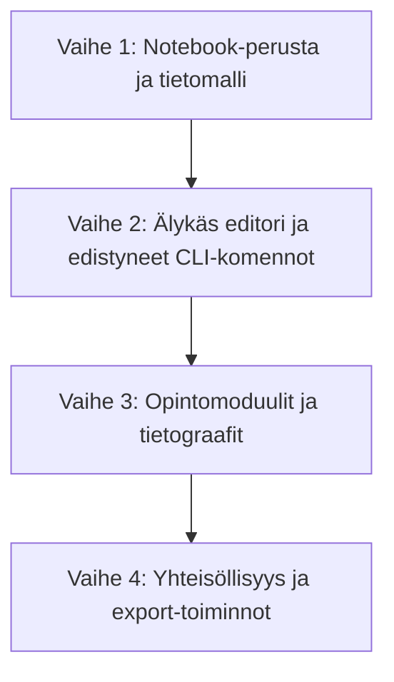

# Clible Notebooks & Study Paths — Kehitystiekartta (Roadmap)

Tämä dokumentti määrittelee Clible Notebooks & Study Paths -kokonaisuuden kehitystiekartan. Tavoitteena on tuoda sovellukseen Jupyter Notebook -tyylinen, solupohjainen muistiinpanojärjestelmä, joka yhdistää vapaan tekstinkäsittelyn (Markdown), interaktiivisen komentorivin (Clible CLI) ja teologisen tietograafin visualisoinnit (Study Paths).

---

## Vaihekohtainen kehitysaikataulu

Kehitys jaetaan neljään loogiseen vaiheeseen, joista jokainen toteutetaan omana erillisenä Pull Requestina (PR).

### Vaihe 1: Notebook-perusta ja tietomalli (PR 1 & PR 2)

Keskittyy tietokantarakenteeseen, backendin perusrajapintoihin sekä React-pohjaiseen solukäyttöliittymään.

* **Backend:**
  * Tietokantamigraatio: `notebooks`- ja `notebook_cells`-taulut.
  * CRUD-palvelut ja -repositoriot.
  * API-endpointit: `GET /api/notebooks`, `POST /api/notebooks`, `PUT /api/notebooks/:id`, `DELETE /api/notebooks/:id` sekä solukohtaiset päivitykset.
* **Frontend:**
  * Jupyter-tyylinen käyttöliittymä (Markdown- ja komentorivisolut).
  * Markdown-solujen renderöinti (Rich Text) ja editointi (Raw text -kenttä).
  * Yksinkertainen komentojen suoritus (/read, /search).

### Vaihe 2: Älykäs editori ja edistyneet CLI-komennot (PR 3)

Parantaa Notebookien käytettävyyttä ja tuo mukaan monipuolisempia analyysityökaluja.

* **Komentotulkki:**
  * Laajennetut komennot: `/compare` (rinnakkaisvertailu) ja `/analyze` (tekstianalyysi).
  * Kyselytulosten dynaaminen renderöinti solujen alle (taulukot ja graafit Recharts-kirjastolla).
* **Editorin parannukset:**
  * Auto-complete / IntelliSense `/`-komentotulkin käynnistämiseksi.
  * Pikahaku ja -viitteet `[`-merkillä (jaehaku ja linkitys).

### Vaihe 3: Opintomoduulit ja tietograafit (PR 4 & PR 5)

Tuo mukaan visualisoinnit ja valmiit opintomoduulit (lukusuunnitelmat).

* **Teologinen tietograafi:**
  * Tietokantamigraatio: `entities`- ja `entity_relations`-taulut.
  * Graafitiedon lataus- ja suodatusrajapinta backendissä.
* **Yhteyskartoituskomento:**
  * `/graph <entiteetti>` (esim. `/graph Moses`) piirtää interaktiivisen SVG- tai Canvas-pohjaisen verkostokuvaajan solun alle.
* **Opintomoduulit (Templates):**
  * Mahdollisuus luoda ja monistaa valmiita Notebook-malleja opintopolkuina.

### Vaihe 4: Yhteisöllisyys ja export-toiminnot (PR 6)

Viimeistelee järjestelmän yhteistyöominaisuuksilla ja raportoinnilla.

* **Yhteiskäyttö:**
  * Jaetut Notebookit ryhmätyötiloissa.
* **Vientitoiminnot:**
  * Notebookien vienti puhtaana Markdownina, HTML-sivuna tai PDF-muodossa kaavioineen.

---

## Kansiorakenne

Suunnitteludokumentit on jaettu seuraavasti:

1. [01-notebooks-database-and-backend.md](file:///home/vivaldev/code/clible-v3-go/.plans/05-notebooks-and-study-paths/01-notebooks-database-and-backend.md) — Tietomallit, SQL-migraatiot ja Go-backend.
2. [02-notebooks-frontend-and-cells.md](file:///home/vivaldev/code/clible-v3-go/.plans/05-notebooks-and-study-paths/02-notebooks-frontend-and-cells.md) — Solujen hallinta, editointi ja peruskäyttöliittymä.
3. [03-notebooks-cli-interpreter.md](file:///home/vivaldev/code/clible-v3-go/.plans/05-notebooks-and-study-paths/03-notebooks-cli-interpreter.md) — Komennot, autokompletointi ja editori.
4. [04-notebooks-visualisations-and-graphs.md](file:///home/vivaldev/code/clible-v3-go/.plans/05-notebooks-and-study-paths/04-notebooks-visualisations-and-graphs.md) — Tietograafi, visualisoinnit ja valmiit opintomoduulit.
