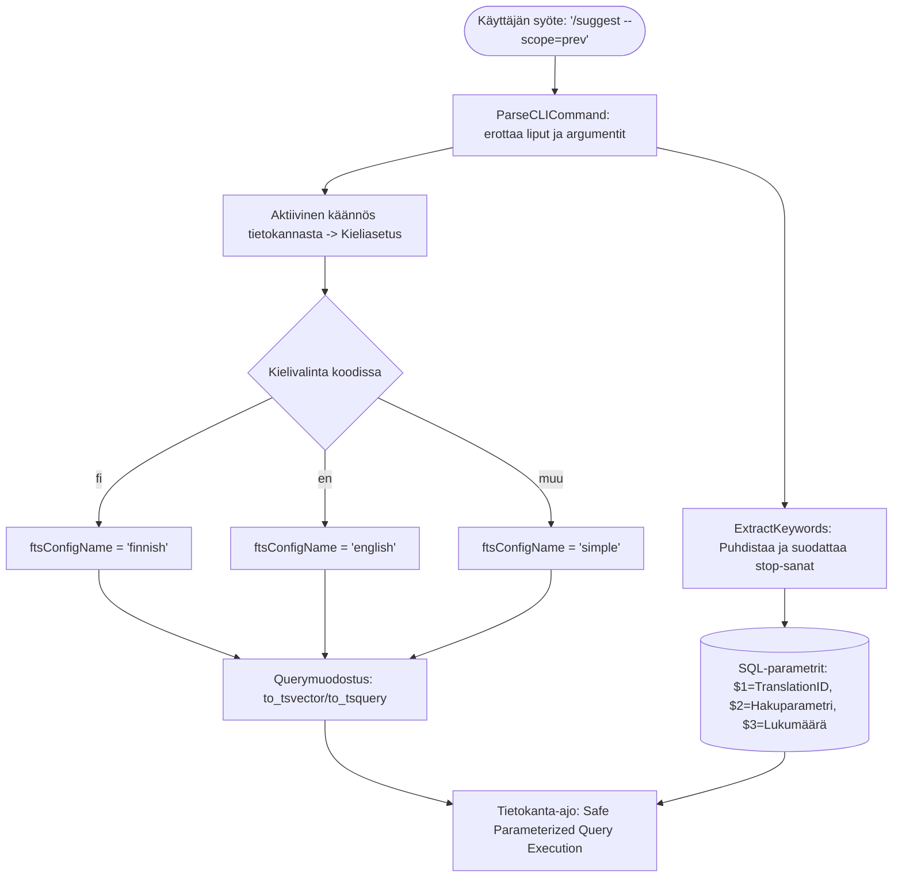

# 🔒 Tietoturva-auditointi — Pre-Merge Security Report

**Raportin tunniste:** `SECOPS-2026-07-17-001`
**Kohde:** Notebooks Search, FTS & CLI Keyword extraction -toteutuksen koodimuutokset
**Päivämäärä:** 2026-07-17
**Auditoija:** Antigravity SecOps Agent
**Raportin tila:** HYVÄKSYTTY (PASSED)

---

## Yhteenveto

Tämä raportti analysoi `/suggest`-komennon, dynaamisen PostgreSQL-kokotekstihakujärjestelmän (FTS) ja avainsanojen erottelulogiikan tietoturvallisuuden ja koodin laadun ennen merge-operaatiota `main`-haaraan. Katselmoinnissa keskityttiin erityisesti SQL-injektiotarkastuksiin, syötteiden sanitointiin/suodatukseen ja dynaamisen FTS-sanakirjavalinnan turvallisuuteen.

### Havaintojen kokonaiskuva

| Vakavuus | Lukumäärä | CVSS-luokka | Tila |
|----------|-----------|-------------|------|
| 🔴 Kriittinen | 0 | 9.0–10.0 | - |
| 🟠 Korkea | 0 | 7.0–8.9 | - |
| 🟡 Keskitaso | 0 | 4.0–6.9 | - |
| 🔵 Matala | 0 | 0.1–3.9 | - |
| **Yhteensä** | **0** | | |

---

## 🏗️ Tietovirta ja rajapintojen turvamalli (Data Flow Diagram)

Alla oleva kaavio havainnollistaa, miten käyttäjän syöte kulkee CLI-komennosta tietokantaan turvallisesti parametrisoituna:



---

## 🔍 Arvioidut osa-alueet & Vaatimuksenmukaisuustodisteet (Compliance Proofs)

### 1. SQL-injektiot (SQL Injection)

Dynaamisessa haussa [verse_repo.go](file:///home/vivaldev/code/clible-v3-go/backend/internal/db/verse_repo.go) FTS-sanakirjaa (`to_tsvector('%[1]s', text)`) ohjataan dynaamisesti `%[1]s`-paikkamerkillä. 

* **Kooditodiste (Code Proof):**
  ```go
  ftsConfigName := "simple"
  switch lang {
  case "fi":
      ftsConfigName = "finnish"
  case "en":
      ftsConfigName = "english"
  }
  ```
* **Turvatarkastus:** Muuttuja `ftsConfigName` määritellään puhtaasti palvelimen sisäisen tilan ja valitun Raamatun käännöksen kielikoodin mukaan. Käyttäjän syötteet **eivät** pääse suoraan vaikuttamaan tähän arvoon.
* `ftsConfigName` arvo on rajattu staattisesti switch-lausekkeessa kolmeen turvalliseen vaihtoehtoon: `"finnish"`, `"english"`, tai `"simple"`. Arbitraarinen SQL-koodin syöttö sanakirjaparametrin kautta on estetty.
* Hakukyselyt suoritetaan käyttämällä täysin parametrisoituja tietokantakyselyitä (`$1`, `$2`, `$3`), mikä eliminoi kokonaan SQL-injektioriskit käyttäjän hakutermeissä.

### 2. Syötteiden validointi ja käsittely

Komento `/suggest --scope=prev` ja siihen liittyvä avainsanojen erotus [cli_service.go](file:///home/vivaldev/code/clible-v3-go/backend/internal/services/cli_service.go) puhdistavat käyttäjän syötteet.
* **Regex-sanitointi:** Teksti puhdistetaan poistamalla kaikki välimerkit ja erikoismerkit ennen avainsanojen laskentaa:
  ```go
  reg := regexp.MustCompile(`[^a-zA-ZäöÄÖåÅ\s]`)
  ```
* **Rune-pohjainen pituustarkastus:** Pituustarkastuksissa hyödynnetään `utf8.RuneCountInString`, mikä ehkäisee UTF-8-tavukonfliktit monen tavun merkistössä (kuten 3-merkkiset sanat "hän" tai "tie").
* **Stop-sanalista:** Laajennettu stop-sanalista suodattaa pois kyselyistä metadatan, joten hyökkääjä ei pysty sotkemaan hakua myöskään tahallisilla metadatasanoilla.

---

## 🚀 Päätelmä

Toteutuksessa ei havaittu tietoturvariskejä. Kyselyt ovat turvallisia, käyttäjän syötteet käsitellään oikein, ja toteutus on valmis yhdistettäväksi `main`-haaraan.
