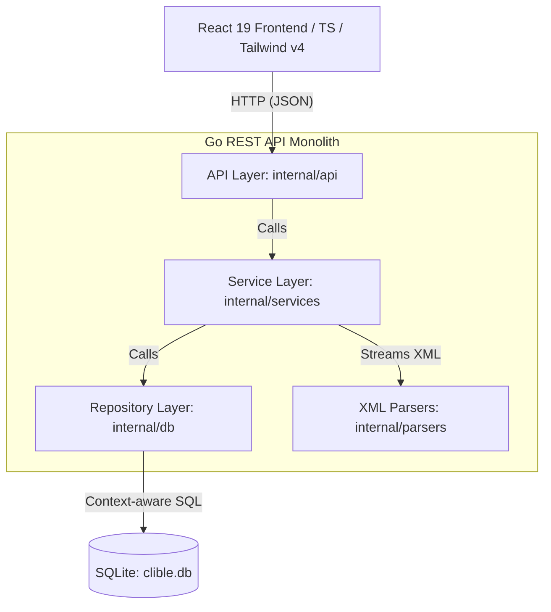

# clible-v3-go

Modern, high-performance, web-native Bible study platform featuring a stateless Go REST API and a responsive React 19 frontend. Designed from the ground up for cloud environments and optimized for concurrent stateless/session web traffic.

Unlike previous versions, **clible-v3** is designed as a cloud-ready client-server web application. It features a lightweight, high-performance **Go REST API** utilizing local SQLite for fast read operations, and a beautiful, responsive **React 19** frontend powered by TailwindCSS v4.

---

## Key Features

- **Web-Native REST API** — High-performance backend utilizing Go 1.22+ standard routing (`http.ServeMux`), structured JSON logging (`slog`), and robust graceful shutdown, optimized for stateless cloud deployment.
- **O(1) Streaming XML Ingestion** — Import Bible translations from HTTP network streams directly into SQLite using a memory-efficient `xml.Decoder` and functional callbacks. Zero temporary files, zero DOM tree buffers.
- **Instant FTS5 Search** — SQLite-backed full-text search with optional regex filtering, sorting, and statistics.
- **Modern React 19 Frontend** — A beautifully curated UI featuring a gold/warm-neutral design system, Georgia serif typography, and dark/light modes.
- **Workspaces & Scopes** — Save search configurations and text analysis results into persistent scopes (workspaces) to organize your Bible study.
- **Text Analytics** — Lexical metrics, n-grams, and word comparisons across different translations.
- **No Heavy CLI or Monolithic Bridges** — Deprecated Python scripts and child process bridges in favor of a fast, compiled Go binary.

---

## Architecture Overview



### Boundary & Layering Rules

To maintain high maintainability, the backend strictly enforces boundaries between layers:

1. **API Layer (`internal/api/`)**: Translates HTTP requests to Service calls. Forbidden: database access, direct SQL, file system interaction. Space complexity is kept to O(1) by passing streams through.
2. **Service Layer (`internal/services/`)**: Orchestrates business logic, parses files, and calls Repositories. Forbidden: HTTP objects (`ResponseWriter`, `Request`).
3. **Repository Layer (`internal/db/`)**: Interacts directly with SQLite. Uses `context.Context` everywhere to abort queries instantly if the HTTP connection is terminated. Forbidden: Services, API, direct network I/O.
4. **Parser Layer (`internal/parsers/`)**: Parses input streams. Forbidden: DB, Services, Repos. Space complexity is O(1) using sequential token tracking.

---

## Tech Stack

| Layer | Technology |
|---|---|
| **Backend** | Go 1.22+, `http.ServeMux` (standard router), `log/slog` (structured logger) |
| **Frontend** | React 19, TypeScript, Vite, TailwindCSS v4 |
| **Database** | SQLite 3 (with FTS5 full-text search extension enabled) |
| **DevOps & Tooling** | Taskfile, golangci-lint, Docker |

---

## Quick Start

### Prerequisites

- [Go 1.22+](https://go.dev/)
- [Node.js 18+](https://nodejs.org/)
- [Task](https://taskfile.dev/) (Taskfile runner)

### Running Locally

We use `Taskfile` to simplify local development commands.

1. **Clone the repository:**

   ```bash
   git clone https://github.com/mvirtai/clible-v3-go.git
   cd clible-v3-go
   ```

2. **Run the backend dev server:**
   The backend auto-runs migrations on startup and initializes the database.

   ```bash
   task backend:dev
   ```

   *The API will be available at `http://localhost:8080`.*

3. **Run the frontend dev server:**
   In a separate terminal:

   ```bash
   task frontend:dev
   ```

   *The web UI will be available at `http://localhost:5173`.*

4. **Verify quality gates:**
   Run all linter checks and tests across both backend and frontend:

   ```bash
   task check
   ```

---

## Documentation

The detailed, interactive documentation is generated using **VitePress** and resides in the [`docs/`](./docs) directory.

To run the documentation site locally:

```bash
cd docs
pnpm install
pnpm run docs:dev
```

*This starts the documentation server at `http://localhost:5173` (or the next available port).*

The docs cover:

- **Getting Started** — Detailed guide to setup, run, and configure Clible-v3.
- **Architecture & Database** — Technical deep-dive into layers, SQLite schemas, FTS5 triggers, and migrations.
- **XML Ingestion Engine** — Detailed mechanics of O(1) memory-efficient streaming XML ingestion.
- **API Reference** — REST endpoint references with request/response schemas.

---

## License

This project is licensed under the MIT License. Bible translation data sources and license details can be found in `NOTICE.md`.
