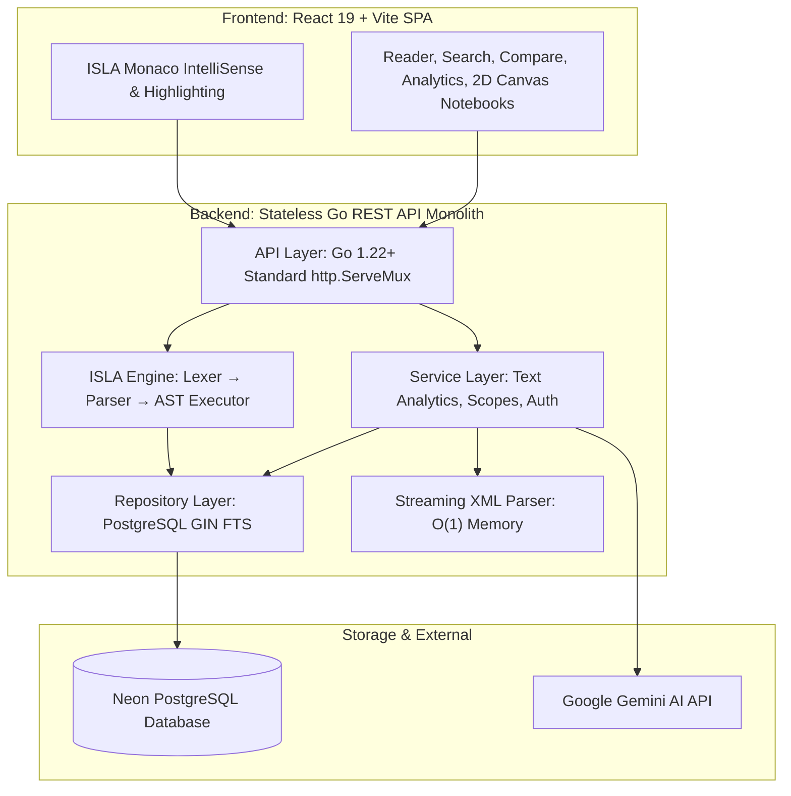

# clible-v3

<div align="center">

**The Modern, 100% Free & Open Web-Native Bible Study & Text Analytics Platform**

*Professional-grade theological exegesis, quantitative linguistics, 2D canvas study sheets,
and the ISLA v2 inline query language — directly in your browser, completely free forever.*

[](https://go.dev/)
[](https://react.dev/)
[](https://tailwindcss.com/)
[](https://neon.tech/)
[](https://www.typescriptlang.org/)
[](LICENSE)
[](https://mvirtai.github.io/clible-v3-go/)

[**Explore the Documentation**](https://mvirtai.github.io/clible-v3-go/) · [**ISLA Language Guide**](https://mvirtai.github.io/clible-v3-go/guide/isla-guide) · [**API Reference**](https://mvirtai.github.io/clible-v3-go/api/reference)

</div>

---

## Why clible-v3?

Traditional theological software is often locked behind **$200–$3,000 paywalls**, expensive
monthly subscriptions, and legacy desktop installations that demand gigabytes of disk space.
Browser-based alternatives rarely surpass simple verse lookup and basic concordance search.

**clible-v3 changes the paradigm.**

It is a cloud-native web platform engineered for theological students, researchers, pastors,
and curious readers who demand more than a verse search engine. Access academic-grade exegesis,
lexical statistics, parallel translation matrices, interactive 2D study notebooks, and a
purpose-built query language — from any web browser, free of charge, permanently.

```
┌────────────────────────────────────────────────────────────────────────┐
│  Notebook: Romans 5 Exegesis (2D Canvas Matrix)                        │
├──────────────────────────────────┬─────────────────────────────────────┤
│  [Card 1: Markdown Exegesis]     │  [Card 2: Live ISLA v2 Embed]       │
│  colSpan: 12                     │  colSpan: 12                        │
│                                  │                                     │
│  Justification by faith brings   │  @(Rom 5:1).vs(KR92, KJV) =>       │
│  peace with God through Christ.  │  ─────────────────────────────────  │
│                                  │  KR92: Koska me siis olemme...      │
│                                  │  KJV:  Therefore being justified... │
├──────────────────────────────────┴─────────────────────────────────────┤
│  [Card 3: ISLA Analytics Scratchpad]                                   │
│  colSpan: 24                                                           │
│  search("grace").at(epistles).count(verses) =>                         │
│  search("armo" AND "rauha").at(epistolat).stats() >>                   │
└────────────────────────────────────────────────────────────────────────┘
```

---

## Key Differentiators & Core Features

### 1. ✦ ISLA v2 — The Object-Method Query Language

**ISLA** (*Inline Structure & Logic Architecture*) is a purpose-built, ergonomic query language
embedded directly inside your Markdown research documents. ISLA v2 introduces a clean
**object-method paradigm** — every query follows a uniform three-stage structure:

```
Object  .method1().method2()  OutputOperator
```

The four source **objects**:

| Object | Syntax | Description |
|---|---|---|
| **Verse Reference** | `@(Joh 3:16)` | Single verse or verse range |
| **Passage Range** | `range(GEN, DEU)` | Contiguous book or chapter span |
| **Full-Text Search** | `search("grace")` | Boolean, regex, or phrase search |
| **Cell Context** | `^` / `^3` / `^all` | Reference preceding notebook cell content |

**Method chains** compose transformations without boilerplate:

```isla
@(Joh 3:16).vs(KR92, KJV) =>
@(Rom 8:28-30).use(KR92).themes(5) >>
range(GEN, DEU).count(verses) =>
search("armo" AND "rauha").at(epistolat).stats() =>
search("grace").at(epistles).limit(10) >>
^3.suggest(5) =>
^all.top(20) >>
```

**Output operators** direct where results are rendered:

- `=>` renders inline within the current cell.
- `>` creates a new named cell **above**.
- `>>` creates a new named cell **below**.

- **Smart Scope Inference**: Searching `@epistolat` or `@toora` automatically resolves
  the matching Bible translation (Finnish scopes → KR92; English scopes → WEB).
- **Monaco IntelliSense**: Real-time syntax highlighting, autocompletion triggered by
  `@(`, `.`, and `search(`, with inline hover documentation for every method.
- **Levenshtein Diagnostics**: Mistype `.cnt()` and the parser returns
  `Unknown method 'cnt'. Did you mean 'count'?`

### 2. 📓 2D Canvas Matrix & the Persistent CLI Scratchpad

- **24-Column Resizable Grid**: Place exegesis notes, comparison cards, and analytical
  dashboards side-by-side with custom column spans (1–24) and heights.
- **Persistent `$ clible` Scratchpad**: Execute ad-hoc queries, pick relevant verses
  with checkboxes, and click **Freeze** to convert them to permanent Markdown prose.
  The scratchpad resets instantly — one cell serves as a continuous inquiry workbench.

### 3. 📊 Quantitative Text Analytics

- **Lexical Diversity (Type-Token Ratio / TTR)**: Measure vocabulary richness across
  chapters or entire epistles in milliseconds.
- **Token Frequencies & N-Grams**: Extract dominant keywords and recurring phrase patterns
  without external linguistic tooling — a single ISLA directive suffices:
  `range(ROM, GAL).top(15) =>`

### 4. ⚖️ Comparative Translation Matrix with Visual Diffing

- **Side-by-Side Comparison**: Align multiple Bible versions (KR92, KR38, WEB, KJV, and more)
  verse by verse in a synchronized matrix.
- **LCS Word Diffing**: Visual highlighting reveals exact phrasing variations, syntactic
  shifts, and translational choices at a glance.

### 5. 🗂️ Project Research Workspaces

- **Isolated Exegesis Workspaces**: Organize studies into dedicated scopes
  (e.g., *Romans 8 Exegesis*, *Sermon on the Mount*, *Covenant Theology*).
- **Single-Roundtrip Loading**: Pinned searches, saved frequency analyses, and linked
  notebooks load via a single `GET /api/scopes/workspace?id=...` request.
- **Data Integrity**: Personal notebooks are preserved even if a workspace scope is deleted
  (`ON DELETE SET NULL`).

### 6. 🤖 Theological AI Integrations (Google Gemini)

- **Original Language Insights**: Greek and Hebrew root word breakdowns, grammatical
  morphology, and lexicons.
- **Semantic Conceptual Search**: Query scripture with natural language
  (*"Where does scripture discuss the armor of God?"*).
- **Hermeneutical Deep-Dives**: Structural outlines, literary tone analysis, and
  covenantal exegesis.

### 7. 🌐 Bilingual & Designed to Last

- **Finnish & English**: Seamlessly switch the full UI between Finnish (`fi`) and English
  (`en`) with one click. Every ISLA scope identifier has language-matched aliases.
- **Aesthetic Warm Theme**: Curated warm-neutral and gold design tokens with automatic
  light and dark modes.

---

## Architecture & Technology Stack

clible-v3 is engineered with clean layer boundaries, $O(1)$ streaming memory guarantees,
and a dedicated ISLA execution engine that processes queries in under 50 µs:


```mermaid
flowchart TD
    subgraph Frontend_App ["Frontend: React 19 + Vite SPA"]
        UI["Reader, Search, Compare, Analytics, 2D Canvas Notebooks"]
        Monaco["ISLA Monaco IntelliSense & Highlighting"]
    end

    subgraph Backend_App ["Backend: Stateless Go REST API Monolith"]
        API["API Layer: Go 1.22+ Standard http.ServeMux"]
        SVC["Service Layer: Text Analytics, Scopes, Auth"]
        ISLA["ISLA Engine: Lexer → Parser → AST Executor"]
        REP["Repository Layer: PostgreSQL GIN FTS"]
        PRS["Streaming XML Parser: O(1) Memory"]
    end

    subgraph Storage_External ["Storage & External"]
        DB[("Neon PostgreSQL Database")]
        AI["Google Gemini AI API"]
    end

    UI --> API
    Monaco --> API
    API --> SVC
    API --> ISLA
    SVC --> REP
    SVC --> PRS
    SVC --> AI
    ISLA --> REP
    REP --> DB
```

| Component | Technology | Purpose |
|---|---|---|
| **Backend API** | Go 1.22+ Standard Library | Stateless REST routing, O(1) streaming XML parser, graceful shutdown |
| **ISLA Engine** | Go (`backend/new_dsl/`) | Deterministic Lexer → Parser → AST Executor for ISLA v2 queries |
| **Frontend Client** | React 19.2, TypeScript, Vite | 2D canvas matrix, Monaco IntelliSense, TailwindCSS v4 |
| **Primary Database** | Neon PostgreSQL | Cloud persistence, GIN tsvector full-text indexing, ACID transactions |
| **Testing DB** | In-Memory SQLite (`:memory:`) | Fast, self-contained unit and integration test suite |
| **Documentation** | VitePress | Search-indexed documentation with interactive examples |

---

## Quick Start for Developers & Self-Hosters

### 1. Prerequisites

- **Go**: 1.22+ ([Download](https://go.dev/))
- **Node.js**: 18+ ([Download](https://nodejs.org/))
- **pnpm**: Fast package manager ([Install](https://pnpm.io/))
- **Task**: Automation runner ([Install](https://taskfile.dev/))

### 2. Clone and Run

```bash
# Clone the repository
git clone https://github.com/mvirtai/clible-v3-go.git
cd clible-v3-go

# Install frontend dependencies
task frontend:install

# Start Go REST API (:8080) and React frontend (:5173) concurrently
task dev
```

*The web application will be live at `http://localhost:5173`.*

### 3. Run Quality Gates & Tests

```bash
task check
```

---

## Complete Documentation

Visit the full documentation suite for comprehensive guides and specifications:

- 📖 **[Platform Overview & Quick Start](https://mvirtai.github.io/clible-v3-go/guide/getting-started)**
- 🗂️ **[Research Workspaces & Scopes](https://mvirtai.github.io/clible-v3-go/guide/workspaces)**
- 🔎 **[Search & Text Analytics Guide](https://mvirtai.github.io/clible-v3-go/guide/search-and-analytics)**
- 📓 **[Notebooks & 2D Canvas Matrix](https://mvirtai.github.io/clible-v3-go/guide/notebooks)**
- ✦ **[ISLA v2 Language Guide](https://mvirtai.github.io/clible-v3-go/guide/isla-guide)**
- 📚 **[Translation Ingestion & O(1) Streaming](https://mvirtai.github.io/clible-v3-go/guide/import-and-seeding)**
- 🛠️ **[Self-Hosting & Docker Setup](https://mvirtai.github.io/clible-v3-go/guide/self-hosting)**
- 📐 **[ISLA v2 Formal Specification (EBNF)](https://mvirtai.github.io/clible-v3-go/architecture/isla-specification)**
- 🔌 **[REST Web API Reference](https://mvirtai.github.io/clible-v3-go/api/reference)**

---

## License & Acknowledgements

Licensed under the [PolyForm Noncommercial License 1.0.0](LICENSE).

Bible translation data sources, copyright notices, and acknowledgements are listed in `NOTICE.md`.
