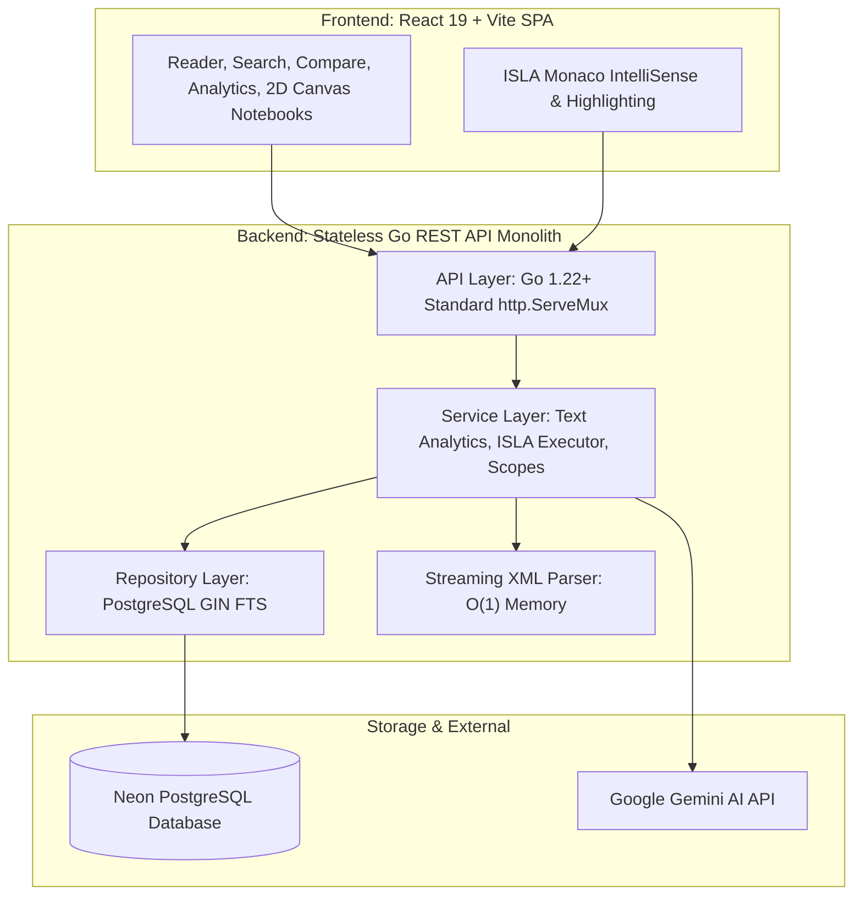

# clible-v3

<div align="center">

**The Modern, 100% Free & Open Web-Native Bible Study & Text Analytics Platform**

*Professional-grade theological exegesis, quantitative linguistics, 2D canvas study sheets, and the ISLA inline query language — directly in your browser, completely free forever.*

[](https://go.dev/)
[](https://react.dev/)
[](https://tailwindcss.com/)
[](https://neon.tech/)
[](https://www.typescriptlang.org/)
[](LICENSE)
[](https://mvirtai.github.io/clible-v3-go/)

[**Explore the Documentation**](https://mvirtai.github.io/clible-v3-go/) · [**ISLA Language Guide**](https://mvirtai.github.io/clible-v3-go/guide/isla-guide) · [**API Reference**](https://mvirtai.github.io/clible-v3-go/api/reference)

</div>

---

## 🌟 Why clible-v3?

Traditional theological software is often locked behind **$200 to $3,000 paywalls**, expensive monthly subscriptions, and clunky, legacy desktop installations that hog gigabytes of disk space.

**clible-v3 changes the paradigm:**
It is a **modern, cloud-native web platform** built for theological students, researchers, pastors, and curious readers. Access academic-grade exegesis, lexical statistics, parallel translations, and interactive study notebooks from any web browser on your laptop, tablet, or smartphone — **100% free and open**.

```
┌────────────────────────────────────────────────────────────────────────┐
│  Notebook: Romans 5 Exegesis (2D Canvas Matrix)                        │
├──────────────────────────────────┬─────────────────────────────────────┤
│  [Card 1: Markdown Exegesis]     │  [Card 2: Live ISLA Reactive Embed] │
│  colSpan: 12                     │  colSpan: 12                        │
│                                  │                                     │
│  Justification by faith brings   │  ! at(Rom 5:1) => vs(KR92, KJV)     │
│  peace with God through Christ.  │  ─────────────────────────────────  │
│                                  │  KR92: Koska me siis olemme...      │
│                                  │  KJV:  Therefore being justified... │
├──────────────────────────────────┴─────────────────────────────────────┤
│  [Card 3: Persistent CLI Scratchpad]                                   │
│  colSpan: 24                                                           │
│  $ clible search "grace" --scope=ROM                                   │
│  [x] ROM 5:2  [x] ROM 5:15  [ ] ROM 5:17  ──> [ Freeze to Markdown ]   │
└────────────────────────────────────────────────────────────────────────┘
```

---

## 🚀 Key Differentiators & Core Features

### 1. ✦ ISLA DSL — The Query Language That Lives Inside Your Text
Clible introduces **ISLA** (*Inline Structure & Logic Architecture*), an ergonomic query language embedded directly inside your Markdown documents:
- **Instant Reactive Directives**: Insert `! at(Joh 3:16) => vs(KR92, KJV)` or `! search("armo" AND "rauha") @epistolat => count()`.
- **Clean Reading Mode**: Technical syntax automatically disappears in reading mode, presenting elegant serif scripture cards. Hovering reveals a `✦` inspect badge.
- **Smart Scopes & Translation Inference**: Search smart genres like `@epistolat`, `@evankeliumit`, `@toora`, or `@viisaus` with automatic language-matched translation resolution.
- **Monaco IntelliSense**: In-editor autocompletion (`! `, `@`, `=>`, `?`), hover documentation, and Levenshtein-driven typo corrections.

### 2. 📓 2D Canvas Matrix & the "Freeze" Scratchpad
- **24-Column Resizable Grid**: Place exegesis notes, comparison cards, and analytical charts side-by-side with custom widths (1–24 columns) and heights.
- **Persistent `$ clible` CLI Scratchpad**: Run ad-hoc searches directly in your notebook, pick relevant verses with interactive checkboxes, and click **Freeze**. Selected verses instantly convert to permanent Markdown text while the CLI prompt resets cleanly for your next inquiry.

### 3. 📊 Quantitative Text Analytics & Linguistics
- **Lexical Diversity (Type-Token Ratio / TTR)**: Measure vocabulary richness across chapters or authors in milliseconds.
- **Token Frequencies & N-Grams**: Extract dominant keywords, recurring 2-grams/3-grams, and stylistic patterns without external linguistic software.

### 4. ⚖️ Comparative Translation Matrix with Visual Diffing
- **Side-by-Side Comparison**: Align multiple Bible versions (KR92, KR38, WEB, KJV, etc.) verse by verse.
- **LCS Word Diffing**: Visual highlighting reveals exact phrasing variations, syntactic shifts, and translational choices at a glance.

### 5. 🗂️ Project Research Workspaces (Scopes)
- **Isolated Exegesis Workspaces**: Organize studies into dedicated scopes (e.g., *Romans 8 Exegesis*, *Sermon on the Mount*, *Covenant Theology*).
- **Single-Roundtrip Loading**: Pinned searches, saved frequency analyses, and linked notebooks load instantly via `GET /api/scopes/workspace?id=...`.
- **Data Protection**: Personal notebooks are preserved even if a workspace scope is deleted (`ON DELETE SET NULL`).

### 6. 🤖 Theological AI Integrations (Google Gemini)
- **Original Language Insights**: Greek and Hebrew root word breakdowns, grammatical morphology, and lexicons.
- **Semantic Conceptual Search**: Query scripture with natural language concepts (*"Where does scripture discuss the armor of God?"*).
- **Hermeneutical Deep-Dives**: Detailed literary tone, structural outlines, and covenantal exegesis.

### 7. 🌐 100% Bilingual & Modern Design Tokens
- **Bilingual Interface**: Seamlessly switch between Finnish (`fi`) and English (`en`) with one click.
- **Aesthetic Warm Theme**: Curated warm-neutral and gold design tokens with automatic light and dark modes.

---

## 🏗️ Architecture & Technology Stack

clible-v3 is engineered with clean layer boundaries and $O(1)$ streaming memory guarantees:


```mermaid
flowchart TD
    subgraph Frontend_App ["Frontend: React 19 + Vite SPA"]
        UI["Reader, Search, Compare, Analytics, 2D Canvas Notebooks"]
        Monaco["ISLA Monaco IntelliSense & Highlighting"]
    end

    subgraph Backend_App ["Backend: Stateless Go REST API Monolith"]
        API["API Layer: Go 1.22+ Standard http.ServeMux"]
        SVC["Service Layer: Text Analytics, ISLA Executor, Scopes"]
        REP["Repository Layer: PostgreSQL GIN FTS"]
        PRS["Streaming XML Parser: O(1) Memory"]
    end

    subgraph Storage_External ["Storage & External"]
        DB[("Neon PostgreSQL Database")]
        AI["Google Gemini AI API"]
    end

    UI --> API
    Monaco --> API
    API --> SVC
    SVC --> REP
    SVC --> PRS
    SVC --> AI
    REP --> DB
```

| Component | Technology | Purpose |
|---|---|---|
| **Backend API** | Go 1.22+ Standard Library | Stateless REST routing, O(1) streaming XML parser, graceful shutdown |
| **Frontend Client** | React 19, TypeScript, Vite | 2D canvas matrix, Monaco editor, responsive TailwindCSS v4 theme |
| **Primary Database** | Neon PostgreSQL | Cloud persistence, GIN tsvector full-text indexing, ACID transactions |
| **Testing DB** | In-Memory SQLite (`:memory:`) | Blazing fast, self-contained unit and integration test suite |
| **Documentation** | VitePress | Interactive, search-indexed documentation with native i18n |

---

## ⚡ Quick Start for Developers & Self-Hosters

clible-v3 is ready to run as a web application. For local development or self-hosting:

### 1. Prerequisites

- **Go**: 1.22+ ([Download](https://go.dev/))
- **Node.js**: 18+ ([Download](https://nodejs.org/))
- **pnpm**: Fast package manager ([Install](https://pnpm.io/))
- **Task**: Automation runner ([Install](https://taskfile.dev/))

### 2. Clone and Run Concurrently

```bash
# Clone the repository
git clone https://github.com/mvirtai/clible-v3-go.git
cd clible-v3-go

# Install frontend dependencies
task frontend:install

# Start both Go REST API (:8080) and React frontend (:5173) concurrently
task dev
```

*The web application will be live at `http://localhost:5173`.*

### 3. Run Quality Gates & Tests

```bash
task check
```

---

## 📖 Complete Documentation

Visit our full documentation suite for comprehensive guides and specifications:

- 📖 **[Platform Overview & User Guide](https://mvirtai.github.io/clible-v3-go/guide/getting-started)**
- 🗂️ **[Research Workspaces & Scopes](https://mvirtai.github.io/clible-v3-go/guide/workspaces)**
- 🔎 **[Search & Text Analytics Guide](https://mvirtai.github.io/clible-v3-go/guide/search-and-analytics)**
- 📓 **[Notebooks & 2D Canvas Matrix](https://mvirtai.github.io/clible-v3-go/guide/notebooks)**
- ✦ **[ISLA Language Guide & Directives](https://mvirtai.github.io/clible-v3-go/guide/isla-guide)**
- 📚 **[Translation Ingestion Engine & $O(1)$ Streaming](https://mvirtai.github.io/clible-v3-go/guide/import-and-seeding)**
- 🛠️ **[Self-Hosting & Docker Setup](https://mvirtai.github.io/clible-v3-go/guide/self-hosting)**
- 📐 **[ISLA Language Formal Specification (EBNF)](https://mvirtai.github.io/clible-v3-go/architecture/isla-specification)**
- 🔌 **[REST Web API Reference](https://mvirtai.github.io/clible-v3-go/api/reference)**

---

## 📜 License & Acknowledgements

Licensed under the [PolyForm Noncommercial License 1.0.0](LICENSE).  
Bible translation data sources, copyright notices, and acknowledgements are listed in `NOTICE.md`.
