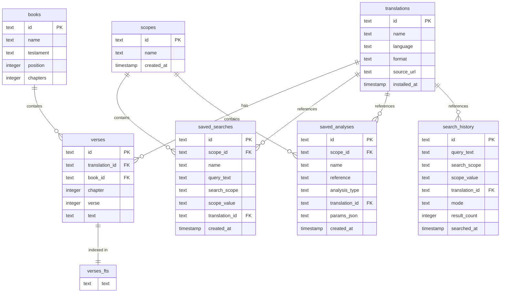

# Database Architecture & FTS5 Search

clible-v3-go utilizes a local, single-file **SQLite 3** database to store all Bible texts, index systems, research workspaces, and search history. By utilizing SQLite on the backend instance, the application ensures zero-latency lookups and complete independence from external translation APIs at query time.

---

## Entity-Relationship Diagram (ERD)

The database schema is structured into two main areas: the static, read-only Bible translation tables and the dynamic, user-generated workspace and history tables.



---

## Core Tables Schema

### 1. `books`

Contains metadata for the 66 canonical books of the Bible. Seeded automatically during initial schema setup.

- `id` (TEXT, PK): Unique uppercase code (e.g. `GEN`, `EXO`, `JHN`).
- `name` (TEXT): Canonical name of the book.
- `testament` (TEXT): Testament identifier (`OT` or `NT`).
- `position` (INTEGER): Sorted order in the Bible canon (1 to 66).
- `chapters` (INTEGER): Total count of chapters in the book.

### 2. `translations`

Stores metadata about imported Bible translations.

- `id` (TEXT, PK): Unique translation slug (e.g., `web`, `kjv`, `fin-1992`).
- `name` (TEXT): The human-readable name of the translation.
- `language` (TEXT): Language ISO code (e.g., `ENG`, `FIN`).
- `format` (TEXT): Input format used (`USFX` or `OSIS`).
- `source_url` (TEXT, Nullable): URL from where the translation XML was streamed.
- `installed_at` (TIMESTAMP): Installation timestamp.

### 3. `verses`

The primary table storing the actual text of each verse.

- `id` (TEXT, PK): Generated string UUID/unique ID.
- `translation_id` (TEXT, FK): References `translations.id` with `ON DELETE CASCADE`.
- `book_id` (TEXT, FK): References `books.id`.
- `chapter` (INTEGER): Chapter number.
- `verse` (INTEGER): Verse number.
- `text` (TEXT): Raw string text of the verse.
- *Indexes*: Unique constraint and index `idx_verses_lookup` on `(translation_id, book_id, chapter, verse)` to make lookups near-instantaneous.

---

## Workspace & User Data Tables

### 1. `scopes`

Workspaces created by the user to group related research.

- `id` (TEXT, PK): Unique ID.
- `name` (TEXT): Name of the scope/workspace (must be unique).
- `created_at` (TIMESTAMP).

### 2. `saved_searches`

Searches that users explicitly save under a specific workspace scope.

- `id` (TEXT, PK).
- `scope_id` (TEXT, FK): References `scopes.id` with `ON DELETE CASCADE`.
- `name` (TEXT): Display name for the saved search.
- `query_text` (TEXT): The search string.
- `search_scope` (TEXT): Scope of the query (`bible`, `testament`, `book`, `chapter`).
- `scope_value` (TEXT, Nullable): Corresponding target value (e.g., `JHN` or `NT`).
- `translation_id` (TEXT, FK): References `translations.id` with `ON DELETE SET NULL`.

### 3. `saved_analyses`

Lexical and statistical analysis results saved under a workspace scope.

- `id` (TEXT, PK).
- `scope_id` (TEXT, FK): References `scopes.id` with `ON DELETE CASCADE`.
- `name` (TEXT): Display name.
- `reference` (TEXT): Target reference (e.g., `Romans 8`, `Genesis`).
- `analysis_type` (TEXT): E.g., `lexical`, `ngrams`, `word_count`.
- `translation_id` (TEXT, FK): References `translations.id` with `ON DELETE SET NULL`.
- `params_json` (TEXT): JSON dump of the computed metrics (such as frequencies or densities) for UI rendering.

### 4. `search_history`

Automatically logs all search executions for fast recall and navigation.

- `id` (TEXT, PK).
- `query_text` (TEXT): Search query string.
- `search_scope` (TEXT).
- `scope_value` (TEXT, Nullable).
- `translation_id` (TEXT, FK): References `translations.id` with `ON DELETE SET NULL`.
- `mode` (TEXT): Search mode (`phrase`, `regex`, `fts`).
- `result_count` (INTEGER): Number of matching verses found.
- `searched_at` (TIMESTAMP).

---

## SQLite FTS5 Full-Text Search

To power high-speed word and phrase searches, clible-v3-go leverages SQLite’s native **FTS5 (Full-Text Search)** extension.

Instead of duplicating the verse text table into a massive FTS virtual table, we use an **external content table** structure:

```sql
CREATE VIRTUAL TABLE verses_fts USING fts5(
    text,
    content = 'verses',
    content_rowid = 'rowid'
);
```

### Why External Content?

- **Disk Space Savings**: By using `content = 'verses'`, FTS5 does not duplicate the actual string text of every verse. It only stores the token index maps. This reduces the total SQLite database file size by roughly 40-50%.
- **Zero Query Overhead**: FTS5 queries (`MATCH`) return the internal `rowid` values, which are then used in standard `JOIN` operations to read the actual rows from the primary `verses` table.

### Trigger Synchronization

Since FTS5 with external content does not automatically track edits in the primary table, we register three SQLite triggers to keep the search index in sync during inserts, updates, and deletes:

1. **Insert Trigger (`verses_ai`)**:

   ```sql
   CREATE TRIGGER verses_ai AFTER INSERT ON verses BEGIN
       INSERT INTO verses_fts(rowid, text) VALUES (new.rowid, new.text);
   END;
   ```

2. **Delete Trigger (`verses_ad`)**:

   ```sql
   CREATE TRIGGER verses_ad AFTER DELETE ON verses BEGIN
       INSERT INTO verses_fts(verses_fts, rowid, text) VALUES('delete', old.rowid, old.text);
   END;
   ```

3. **Update Trigger (`verses_au`)**:

   ```sql
   CREATE TRIGGER verses_au AFTER UPDATE ON verses BEGIN
       INSERT INTO verses_fts(verses_fts, rowid, text) VALUES('delete', old.rowid, old.text);
       INSERT INTO verses_fts(rowid, text) VALUES (new.rowid, new.text);
   END;
   ```

---

## Embedded Database Migrations

clible-v3-go implements schema migrations directly in Go without relying on external packages.

### How it works

1. All migrations are stored as sequential SQL files (`001_initial_schema.sql`, `002_seed_architecture.sql`, etc.) in the `backend/migrations/` directory.
2. The Go 1.16+ compiler embeds these files statically into the compiled binary using the `//go:embed` directive inside `backend/migrations/migrations.go`:

   ```go
   //go:embed *.sql
   var MigrationFiles embed.FS
   ```

3. On startup, the application runs `InitializeDB`:
   - It reads/creates a tracking table named `_migrations`.
   - It reads the embedded `.sql` files, sorts them by number, and executes any script that has not yet been logged in `_migrations`.
   - All migrations run in SQL transactions. If one fail, the database rolls back to the previous state.
