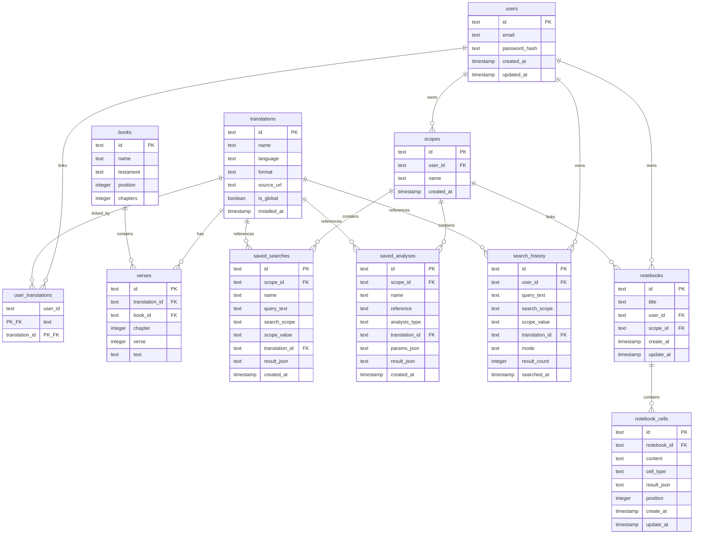

# Database Architecture & Full-Text Search (FTS)

clible-v3-go utilizes a dual-database architecture. It is designed to run on **PostgreSQL** (specifically **Neon PostgreSQL** in cloud and development environments) as its primary relational engine, providing robust cloud persistence, scalability, and managed point-in-time recovery.

For unit and integration testing, the application dynamically falls back to an in-memory **SQLite 3** database to keep the test suite isolated, fast, and self-contained.

---

## Entity-Relationship Diagram (ERD)

The database schema is structured into two main areas: the static, read-only Bible translation tables and the dynamic, user-generated workspace and history tables.


```mermaid
erDiagram
    users {
        text id PK
        text email
        text password_hash
        timestamp created_at
        timestamp updated_at
    }

    books {
        text id PK
        text name
        text testament
        integer position
        integer chapters
    }

    translations {
        text id PK
        text name
        text language
        text format
        text source_url
        boolean is_global
        timestamp installed_at
    }

    user_translations {
        text user_id PK_FK
        text translation_id PK_FK
    }

    verses {
        text id PK
        text translation_id FK
        text book_id FK
        integer chapter
        integer verse
        text text
    }

    scopes {
        text id PK
        text user_id FK
        text name
        timestamp created_at
    }

    saved_searches {
        text id PK
        text scope_id FK
        text name
        text query_text
        text search_scope
        text scope_value
        text translation_id FK
        text result_json
        timestamp created_at
    }

    saved_analyses {
        text id PK
        text scope_id FK
        text name
        text reference
        text analysis_type
        text translation_id FK
        text params_json
        text result_json
        timestamp created_at
    }

    search_history {
        text id PK
        text user_id FK
        text query_text
        text search_scope
        text scope_value
        text translation_id FK
        text mode
        integer result_count
        timestamp searched_at
    }

    notebooks {
        text id PK
        text title
        text user_id FK
        text scope_id FK
        timestamp create_at
        timestamp update_at
    }

    notebook_cells {
        text id PK
        text notebook_id FK
        text content
        text cell_type
        text result_json
        integer position
        timestamp create_at
        timestamp update_at
    }

    users ||--o{ scopes : "owns"
    users ||--o{ notebooks : "owns"
    users ||--o{ search_history : "owns"
    users ||--o{ user_translations : "links"
    translations ||--o{ user_translations : "linked_by"
    translations ||--o{ verses : "has"
    books ||--o{ verses : "contains"
    scopes ||--o{ saved_searches : "contains"
    scopes ||--o{ saved_analyses : "contains"
    scopes ||--o{ notebooks : "links"
    notebooks ||--o{ notebook_cells : "contains"
    translations ||--o{ saved_searches : "references"
    translations ||--o{ saved_analyses : "references"
    translations ||--o{ search_history : "references"
```

---

## Core Tables Schema

### 1. `books`

Contains metadata for the 66 canonical books of the Bible. Seeded automatically during initial schema setup.

- `id` (TEXT, PK): Unique uppercase code (e.g. `GEN`, `EXO`, `JHN`).
- `name` (TEXT): Canonical name of the book.
- `testament` (TEXT): Testament identifier (`OT` or `NT`).
- `position` (INTEGER): Sorted order in the Bible canon (1 to 66).
- `chapters` (INTEGER): Total count of chapters in the book.

### 2. `translations`

Stores metadata about Bible translations available in the catalog.

- `id` (TEXT, PK): Unique translation slug (e.g., `web`, `kjv`, `fin-1992`).
- `name` (TEXT): The human-readable name of the translation.
- `language` (TEXT): Language ISO code (e.g., `ENG`, `FIN`).
- `format` (TEXT): Input format used (`USFX` or `OSIS`).
- `source_url` (TEXT, Nullable): URL from where the translation XML was streamed.
- `is_global` (BOOLEAN): `TRUE` for system-controlled global presets.
- `installed_at` (TIMESTAMP): Catalog installation timestamp.

### 3. `verses`

The primary table storing the actual text of each verse.

- `id` (TEXT, PK): Generated string UUID/unique ID.
- `translation_id` (TEXT, FK): References `translations.id` with `ON DELETE CASCADE`.
- `book_id` (TEXT, FK): References `books.id`.
- `chapter` (INTEGER): Chapter number.
- `verse` (INTEGER): Verse number.
- `text` (TEXT): Raw string text of the verse.
- *Indexes*: Unique constraint and index `idx_verses_lookup` on `(translation_id, book_id, chapter, verse)` to make lookups near-instantaneous.

---

## User & Workspace Data Tables

### 1. `users`

Stores credentials and account metadata for system users.

- `id` (TEXT, PK): Generated unique UUID.
- `email` (TEXT): Unique email address.
- `password_hash` (TEXT): Bcrypt-hashed password.
- `created_at` (TIMESTAMP): Account registration timestamp.
- `updated_at` (TIMESTAMP): Profile last updated timestamp.

### 2. `user_translations`

Mapping table linking users to their activated/enabled translations.

- `user_id` (TEXT, PK, FK): References `users.id` with `ON DELETE CASCADE`.
- `translation_id` (TEXT, PK, FK): References `translations.id` with `ON DELETE CASCADE`.

### 3. `scopes`

Workspaces created by users to group related research.

- `id` (TEXT, PK): Unique UUID.
- `user_id` (TEXT, FK): References `users.id` with `ON DELETE CASCADE`.
- `name` (TEXT): Name of the scope/workspace.
- `created_at` (TIMESTAMP).

### 4. `saved_searches`

Searches that users explicitly save under a specific workspace scope.

- `id` (TEXT, PK): Unique UUID.
- `scope_id` (TEXT, FK): References `scopes.id` with `ON DELETE CASCADE`.
- `name` (TEXT): Display name for the saved search.
- `query_text` (TEXT): The search string.
- `search_scope` (TEXT): Scope of the query (`all`, `ot`, `nt`, `book`, `reference`).
- `scope_value` (TEXT, Nullable): Corresponding target value (e.g., `JHN` or `NT`).
- `translation_id` (TEXT, FK): References `translations.id` with `ON DELETE SET NULL`.
- `result_json` (TEXT, Nullable): Caches the search results payload to skip re-execution upon loading.

### 5. `saved_analyses`

Lexical and statistical analysis results saved under a workspace scope.

- `id` (TEXT, PK): Unique UUID.
- `scope_id` (TEXT, FK): References `scopes.id` with `ON DELETE CASCADE`.
- `name` (TEXT): Display name.
- `reference` (TEXT): Target reference (e.g., `Romans 8`, `Genesis`).
- `analysis_type` (TEXT): E.g., `single_stats`, `comparison`.
- `translation_id` (TEXT, FK): References `translations.id` with `ON DELETE SET NULL`.
- `params_json` (TEXT): Parameter configuration for UI rendering.
- `result_json` (TEXT, Nullable): Caches computed results (like LCS similarity mappings or token frequencies) to skip heavy server-side processing upon loading.

### 6. `search_history`

Automatically logs all search executions for fast recall and navigation.

- `id` (TEXT, PK): Unique UUID.
- `user_id` (TEXT, FK): References `users.id` with `ON DELETE CASCADE`.
- `query_text` (TEXT): Search query string.
- `search_scope` (TEXT).
- `scope_value` (TEXT, Nullable).
- `translation_id` (TEXT, FK): References `translations.id` with `ON DELETE SET NULL`.
- `mode` (TEXT): Search mode (`phrase`, `regex`, `fts`).
- `result_count` (INTEGER): Number of matching verses found.
- `searched_at` (TIMESTAMP).

### 7. `notebooks`

Interactive notebook documents owned by users.

- `id` (TEXT, PK): Unique UUID.
- `title` (TEXT): Title of the notebook.
- `user_id` (TEXT, FK): References `users.id` with `ON DELETE CASCADE`.
- `scope_id` (TEXT, Nullable, FK): References `scopes.id` with `ON DELETE SET NULL`.
- `create_at` (TIMESTAMP).
- `update_at` (TIMESTAMP).

### 8. `notebook_cells`

Individual cells contained within notebooks.

- `id` (TEXT, PK): Unique UUID.
- `notebook_id` (TEXT, FK): References `notebooks.id` with `ON DELETE CASCADE`.
- `content` (TEXT): Raw input content of the cell (Markdown or code command).
- `cell_type` (TEXT): Must be `'markdown'` or `'code'`.
- `result_json` (TEXT, Nullable): Cached query output.
- `position` (INTEGER): Zero-indexed order index. Enforces `UNIQUE (notebook_id, position)`.
- `create_at` (TIMESTAMP).
- `update_at` (TIMESTAMP).

---

## Dual Full-Text Search (FTS) Implementation

To maintain optimal search performance across both databases, the repository dynamically builds queries based on whether the active connection is PostgreSQL or SQLite:

### 1. PostgreSQL (GIN-indexed Full-Text Search)

PostgreSQL leverages native tsvector indexing for high-speed token queries.

- **Indexing**: During migration, we establish a Generalized Inverted Index (GIN) on the verse text cast to a `simple` text vector:

  ```sql
  CREATE INDEX IF NOT EXISTS idx_verses_text_fts ON verses USING GIN(to_tsvector('simple', text));
  ```

- **Query execution**: Full-text queries are executed using the native `@@` matching operator:

  ```sql
  SELECT id, translation_id, book_id, chapter, verse, text
  FROM verses
  WHERE to_tsvector('simple', text) @@ to_tsquery('simple', $1)
  ```

### 2. SQLite (FTS5 Virtual Table with External Content)

Since SQLite does not have GIN indexes, we leverage its native **FTS5** extension with an **external content table** structure to minimize disk space:

```sql
CREATE VIRTUAL TABLE verses_fts USING fts5(
    text,
    content = 'verses',
    content_rowid = 'rowid'
);
```

- **Trigger Synchronization**: Triggers are established to automatically keep the virtual search index in sync with the primary `verses` table during inserts, updates, and deletes:

  ```sql
  CREATE TRIGGER verses_ai AFTER INSERT ON verses BEGIN
      INSERT INTO verses_fts(rowid, text) VALUES (new.rowid, new.text);
  END;
  ```

- **Query execution**:

  ```sql
  SELECT v.id, v.translation_id, v.book_id, v.chapter, v.verse, v.text
  FROM verses v
  JOIN verses_fts ON v.rowid = verses_fts.rowid
  WHERE verses_fts MATCH $1
  ```

---

## Embedded Database Migrations

clible-v3-go implements dynamic schema migrations directly in Go.

### How it works

1. All migrations are stored as sequential SQL files (`001_initial_schema.sql`, `002_seed_architecture.sql`, etc.) in the `backend/migrations/` directory.
2. The Go compiler embeds these files statically into the compiled binary using the `//go:embed` directive inside `backend/migrations/migrations.go`.
3. On startup, the application runs `InitializeDB`:
   - It reads/creates a tracking table named `_migrations`.
   - It checks whether the active database is PostgreSQL or SQLite:

     ```go
     isPostgres := db.QueryRow("SELECT version()").Scan(&temp) == nil
     ```

   - If PostgreSQL is active, SQLite-specific migration scripts (like virtual tables setup) are intercepted and rewritten inline into standard PostgreSQL commands (e.g., GIN index setups).
   - All migrations run in SQL transactions. If one fails, the database rolls back to the previous state.
