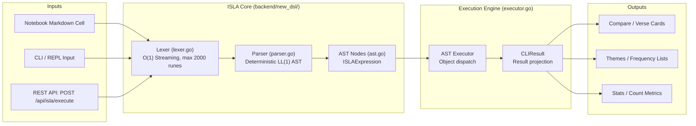
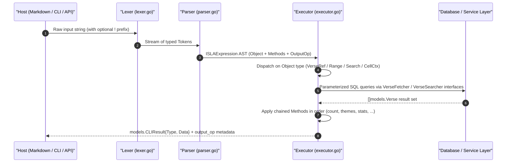
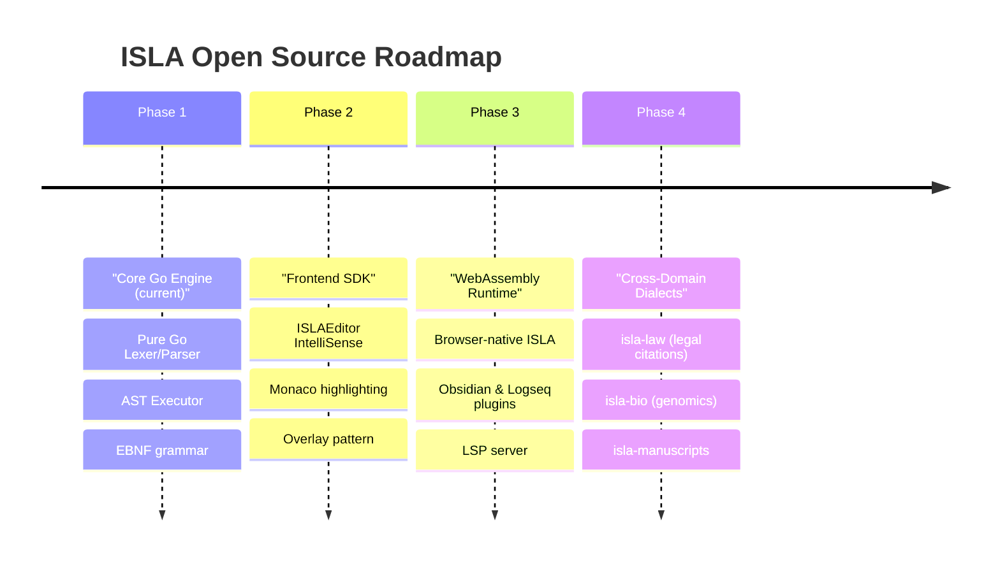

# ISLA v2 Language Specification & Architecture

> **ISLA** — *Inline Structure & Logic Architecture*
> *(Also: Interactive Scripture & Layout Analyzer)*
>
> Dedicated with love to Isla Aurora.

---

## 1. Executive Summary

**ISLA v2** is an ergonomic, deterministic, domain-specific query language designed for
structured text exploration, multidimensional comparison, and reactive document embedding.
It is implemented as a pure Go package (`backend/new_dsl/`) with zero external dependencies.

ISLA v2 introduces a clean **object-method paradigm**: every expression consists of a typed
source object, zero or more chained method transformations, and a mandatory output operator.
This structure is strictly deterministic (LL(1) parseable) and resolves to an immutable
Abstract Syntax Tree (AST) in under 50 µs.



---

## 2. Core Design Principles

1. **Uniform Object-Method Structure**: Every expression is `Object.Method*().OutputOp`.
   The grammar has no ambiguity; the parser needs no backtracking.
2. **Deterministic & Context-Free**: The grammar is strictly LL(1) / Pratt-parseable,
   allowing instantaneous parsing (< 100 µs) without heap allocations in the hot path.
3. **Method Composability**: Multiple methods are chained in left-to-right order.
   Each method transforms or annotates the result of the preceding step.
4. **Output Operator as First-Class Citizen**: The output operator (`=>`, `>`, `>>`)
   is mandatory and extracted from the tail of the token stream before parsing begins,
   enabling clean separation of "what to compute" from "where to render it".
5. **Host-Agnostic Embeddability**: The `!` prefix and `isla ` keyword prefix are
   transparently stripped by the lexer, so ISLA expressions can be embedded in Markdown
   cells, CLI terminals, or REST API calls identically.
6. **Strict Method Validation**: The parser validates method applicability against the
   current object type at parse time, returning structured diagnostic errors before
   any I/O is performed.

---

## 3. Formal Syntax & Grammar (EBNF)

The following grammar precisely reflects the parser implementation in `backend/new_dsl/parser.go`:

```ebnf
ISLAExpression  ::= Object Method* OutputOp

Object          ::= VerseRef
                  | RangeExpr
                  | SearchExpr
                  | CellCtxExpr

VerseRef        ::= "@(" Citation ")"

RangeExpr       ::= "range(" RangePart "," RangePart ")"
RangePart       ::= (* any tokens up to "," or ")" *)

SearchExpr      ::= ("search(" | "?") SearchBody
SearchBody      ::= StringLiteral
                  | RegexLiteral
                  | BooleanExpr
                  | NamedParamExpr

BooleanExpr     ::= SearchTerm { ("AND" | "OR" | "&" | "|") SearchTerm }
SearchTerm      ::= StringLiteral | Ident

RegexLiteral    ::= "/" (* regexp chars *) "/"

CellCtxExpr     ::= "^" [ Number | "all" ]

Method          ::= "." MethodName "(" MethodArgs? ")"

MethodName      ::= "use" | "vs" | "at" | "refs" | "themes"
                  | "suggest" | "count" | "top" | "stats" | "limit"

MethodArgs      ::= Arg { "," Arg }
Arg             ::= StringLiteral | Ident | Number

OutputOp        ::= "=>"                   (* OutputInline: render in current cell *)
                  | ">" [ CellName ]       (* OutputNewCellAbove *)
                  | ">>" [ CellName ]      (* OutputNewCellBelow *)

CellName        ::= "#" Slug              (* #slug identifier *)
                  | StringLiteral          (* "quoted title" *)
                  | Ident { Ident }        (* free title words *)

Citation        ::= BookRef [ Chapter [ ":" VerseRange ] ]
VerseRange      ::= Number [ "-" Number ]
```

> [!NOTE]
> The `!` trigger prefix and `isla ` keyword prefix are stripped by the **lexer**
> (`NewLexer()`), not the parser. The grammar above describes the expression content
> after prefix stripping. Maximum input length: **2000 runes** (enforced by the lexer).

---

## 4. AST Node Types

The parser produces a typed `ISLAExpression` root node containing one of four concrete
object types. All types are defined in `backend/new_dsl/ast.go`.

### `ISLAExpression` — Root

```go
type ISLAExpression struct {
    Object  Object       // Mandatory: one of the four object types
    Methods []MethodCall // Zero or more chained method calls, in order
    Output  OutputOp     // Mandatory: => | > [name] | >> [name]
}
```

### Object Types

| AST Type | Syntax | ObjectKind constant |
|---|---|---|
| `VerseRefNode` | `@(Joh 3:16)` | `ObjectVerseRef` |
| `RangeNode` | `range(GEN, DEU)` | `ObjectRange` |
| `SearchNode` | `search("grace")` | `ObjectSearch` |
| `CellCtxNode` | `^` / `^3` / `^all` | `ObjectCellCtx` |

### `MethodCall` — Chained Transformation

```go
type MethodCall struct {
    Name string   // "use", "vs", "at", "refs", "count", "top", "stats", "themes", "suggest", "limit"
    Args []string // String arguments, e.g. ["KR92"], ["KR92", "KJV"], ["5"]
}
```

### `OutputOp` — Output Directive

```go
type OutputOp struct {
    Kind OutputKind // OutputInline | OutputNewCellAbove | OutputNewCellBelow
    Name string     // "" | "#slug" | "free title"
}
```

---

## 5. Method Validation Matrix

The parser enforces method applicability at parse time. Calling a forbidden method
returns an error immediately, before any database I/O is attempted:

| Method | `@()` | `range()` | `search()` | `^` |
|---|---|---|---|---|
| `.use(trans)` | ✅ | ✅ | ✅ | ❌ |
| `.vs(t1, t2)` | ✅ | ❌ | ❌ | ❌ |
| `.refs(n)` | ✅ | ❌ | ❌ | ❌ |
| `.at(scope)` | ❌ | ❌ | ✅ | ❌ |
| `.limit(n)` | ❌ | ❌ | ✅ | ❌ |
| `.count([unit])` | ✅ | ✅ | ✅ | ✅ |
| `.top(n)` | ✅ | ✅ | ✅ | ✅ |
| `.stats()` | ✅ | ✅ | ✅ | ✅ |
| `.themes(n)` | ✅ | ✅ | ✅ | ✅ |
| `.suggest(n)` | ✅ | ✅ | ✅ | ✅ |

---

## 6. Execution Pipeline

ISLA expressions are processed in four distinct, decoupled stages defined in
`backend/new_dsl/`:



1. **Tokenization (Lexer)**: Strips the `!` trigger prefix, scans input runes into
   positional tokens (`TokenAtOpen`, `TokenSearch`, `TokenCaret`, `TokenDot`, etc.)
   in a single O(1) linear pass with no heap allocations per token.
2. **Output Extraction**: Before parsing the expression body, the parser scans backward
   from the token tail to locate and extract the output operator (`=>`, `>`, `>>`).
   This clean separation ensures the expression grammar is unambiguous.
3. **Syntax Analysis (Parsing)**: Transforms the remaining tokens into a typed
   `ISLAExpression` AST. Method applicability is validated per object kind.
4. **Execution (AST Engine)**: Dispatches on the concrete `Object` type, resolves
   the translation ID (with smart scope inference), executes database queries via
   the `VerseFetcher` and `VerseSearcher` interfaces, then applies chained methods
   sequentially to the result set.

---

## 7. ISLAEditor — Frontend IntelliSense Engine

*(Implementation: plan 21 — in active development)*

The frontend provides a rich language intelligence layer for ISLA authoring in the
notebook editor. The system is composed of three standalone TypeScript modules:

| Module | File | Responsibility |
|---|---|---|
| **Lexer** | `islaLexer.ts` | `tokenizeISLALine()` → typed token stream for syntax highlighting |
| **IntelliSense** | `islaIntellisense.ts` | `getISLASuggestions()`, `getHoverDocumentation()` |
| **Registry** | `islaUtils.ts` | `COMMAND_REGISTRY`, `BIBLE_BOOKS`, `SMART_BOOK_GROUPS` |

The editor component (`ISLAEditor.tsx`) uses the **overlay pattern** to deliver
real-time syntax highlighting without the complexity of a full code editor framework:

```
┌───────────────────────────────────────────────────────────────┐
│  div.relative (wrapper)                                        │
│  ├─ div[aria-hidden] ISLASyntaxLayer  ← z-index upper layer   │
│  │   ├─ <span class="text-amber-400">@(</span>               │
│  │   ├─ <span class="text-cyan-300">Joh 3:16</span>          │
│  │   └─ <span class="text-fuchsia-400">.vs</span>            │
│  └─ <textarea>                        ← z-index base layer   │
│      color: transparent; caret-color: amber                   │
└───────────────────────────────────────────────────────────────┘
```

The `<textarea>` handles all keyboard input and cursor management. The
`aria-hidden` overlay renders the identical text as colour-coded `<span>` elements.
Both elements share identical `font`, `font-size`, `padding`, and `line-height`.

---

## 8. Quality & Performance Targets

| Metric | Target | Measurement |
|---|---|---|
| **Lexer allocation rate** | 0 allocs/op for single-line queries | Go `testing.B` with `AllocsPerRun` |
| **Parser latency** | < 50 µs per query | Single-pass deterministic parse |
| **Maximum input length** | 2000 runes | Enforced by `NewLexer()` |
| **AST immutability** | 100% thread-safe | Value receivers & copy-on-write nodes |
| **Binary footprint** | < 500 KB standalone | Static Go compilation, no cgo |

---

## 9. Open-Source Ecosystem Roadmap

The ISLA language is designed for extensibility. A multi-phase roadmap establishes
it as a broadly adoptable inline query standard:



### Phase 1: Core Go Engine (Current)

- Pure Go standard library implementation with zero external dependencies.
- Comprehensive test suite: lexer, parser, executor, and edge-case coverage.
- Deep integration with the Clible v3 database and service layer architecture.

### Phase 2: Frontend SDK & ISLAEditor

- Real-time syntax highlighting via the overlay pattern (`ISLAEditor.tsx`).
- Monaco-compatible autocompletion engine (`islaIntellisense.ts`).
- Hover documentation for all methods and scope identifiers.

### Phase 3: WebAssembly & Developer Tooling

- Compile `isla-core` to a Wasm binary (< 150 KB target) for browser-native validation.
- Language Server Protocol (LSP) for VS Code, JetBrains, and Neovim integration.
- Obsidian and Logseq community plugins for personal knowledge graph embedding.

### Phase 4: Generalized Cross-Domain Dialects

- Abstract the core AST and execution interfaces to support custom domain adapters.
- Third-party implementors plug in custom `VerseFetcher`-equivalent interfaces for
  their domain (case law citations, genomics annotations, historical manuscripts).

---

## 10. Naming & Dedication

The name **ISLA** honors *Isla Aurora*, symbolizing brightness, clarity, and elegant structure.

Every expression parsed by the engine is a commitment to clean architecture,
joyful engineering, and lasting open-source value.
