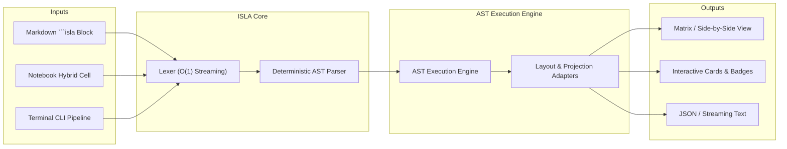
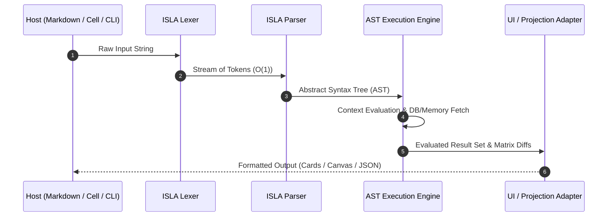
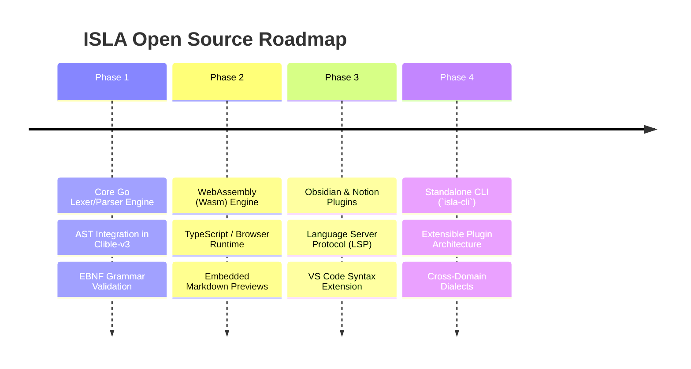

# ISLA Language Specification & Architecture

> **ISLA** — *Inline Structure & Logic Architecture*  
> (Also: *Interactive Scripture & Layout Analyzer*)  
> Dedicated with love to Isla Aurora.

---

## 1. Executive Summary & Vision

**ISLA** is an ergonomic, human-readable, domain-agnostic inline query and command language designed for structured text exploration, multidimensional comparison, and reactive document embedding.

Modern technical writing and computational research demand a lightweight syntax that can sit naturally inside Markdown documents, notebook cells, terminal pipelines, and visual canvas layouts without the boilerplate of general-purpose programming languages or the verbosity of SQL.

ISLA bridges the gap between text-based human thinking and structured query execution:



---

## 2. Core Design Principles

1. **Zero Friction Inline Syntax**: An ISLA statement must be concise enough to fit in a single line, yet expressive enough to specify multi-source comparisons, projections, and layout formats.
2. **Deterministic & Context-Free**: The grammar is strictly deterministic (LL(1) / Pratt-parsable), allowing instantaneous parsing (< 100 µs) in memory-constrained environments or browser WebAssembly instances.
3. **Pipeline Composability**: Queries follow an intuitive command-modifier-view pipeline:
   `VERB TARGET [OPTIONS...] [MODIFIERS...] [VIEW_PROJECTION]`
4. **Host-Agnostic Embeddability**: ISLA is designed to be hosted within Markdown code fences (```` ```isla ````), reactive notebook canvas cells, IDE extensions (LSP), or CLI toolchains (`clible isla run`).
5. **Separation of Parsing and Execution**: The parser outputs a clean Abstract Syntax Tree (AST) that can be dispatched to any execution runtime or adapter.

---

## 3. Formal Syntax & Grammar (EBNF)

```ebnf
Expression          ::= PipelineExpr | TernaryExpr | PrimaryExpr

PipelineExpr        ::= ( PrimaryExpr | PipelineExpr ) "=>" ActionExpr

TernaryExpr         ::= PrimaryExpr "?" ActionExpr ":" ActionExpr

PrimaryExpr         ::= VerseRef | SearchExpr | RangeExpr | ScopeExpr

VerseRef            ::= "@" Citation 
                      | "at(" Citation ")" 
                      | "from(" Citation ")" 
                      | "read(" Citation ")"

SearchExpr          ::= "?" ( StringLiteral | RegexLiteral | Ident ) [ "@" ScopeIdent ]
                      | "search(" SearchArgs ")" [ "@" ScopeIdent ]

SearchArgs          ::= SearchTerm { ( "AND" | "OR" ) SearchTerm } [ { "," SearchParam } ]
SearchTerm          ::= StringLiteral | RegexLiteral | Ident
SearchParam         ::= [ "@" ] ScopeIdent | Ident ":" ( StringLiteral | Ident | Number )

RangeExpr           ::= "range(" Citation "," Citation ")"

ScopeExpr           ::= "^" [ Number | "all" ]

ActionExpr          ::= UseAction | AtAction | VsAction | RefsAction 
                      | ThemesAction | SuggestAction | CountAction | LimitAction 
                      | StyleAction | TranslationFallback

UseAction           ::= "use(" Ident ")" | "use:" Ident | "in(" Ident ")" | "in:" Ident
AtAction            ::= "at(" ScopeTarget ")" | "@" ScopeIdent
VsAction            ::= "vs(" Ident "," Ident ")" | "compare(" Ident "," Ident ")"
RefsAction          ::= "refs" [ "(" [ Number ] ")" ]
ThemesAction        ::= "themes" [ "(" [ Number ] ")" ]
SuggestAction       ::= "suggest" [ "(" [ Number ] ")" ]
CountAction         ::= "count" [ "()" ]
LimitAction         ::= "limit(" Number ")" | "limit:" Number
StyleAction         ::= ":" Ident
TranslationFallback ::= Ident

Citation            ::= BookRef [ Chapter [ ":" VerseRange ] ]
VerseRange          ::= Number [ "-" Number ] [ "," Number [ "-" Number ] ]
```

---

## 4. Query Anatomies & Examples

### 4.1. Single Passage Lookup & Translation Projection

Retrieves a passage in the default translation, or projects it to a target translation:

```isla
! at(Joh 3:16) => use(KR92)
! @Joh 3:16 => in(KR38)
```

### 4.2. Contiguous Passage Range

Reads an entire contiguous section from a start reference to an end reference:

```isla
! range(Joh 1:1, Joh 3:36) => themes(5)
! range(GEN, DEU) => count()
```

### 4.3. Parallel Comparative Matrix

Renders a passage side-by-side across two distinct translations:

```isla
! at(Joh 3:16) => vs(KR92, KR38)
! @Joh 3:16 ? KR92 : KJV
```

### 4.4. Full-Text & Boolean Linguistic Search

Executes single-term, Boolean AND/OR queries, or named parameter searches with automatic language translation inference:

```isla
! search("armo" AND "rauha") => at(epistolat) => count()
! search("kuolema" OR "elämä") @Joh => limit(5)
! search("grace", scope: epistles, limit: 10)
```

### 4.5. Thematic Intelligence & Cross-References

Extracts prominent thematic keywords or fetches parallel cross-references:

```isla
! at(Joh 3:16) => refs(5)
! ^ => themes(8)
! ^ => suggest(3)
```

---

## 5. Execution Pipeline

ISLA statements are processed in four distinct, decoupled stages:



1. **Tokenization (Lexing)**: Scans input runes into positional tokens (`TOKEN_VERB`, `TOKEN_STRING`, `TOKEN_FLAG`, `TOKEN_LBRACKET`, etc.) without heap allocations where possible.
2. **Syntax Analysis (Parsing)**: Transforms tokens into an immutable `ASTNode` tree with strict validation of flags and arguments.
3. **Execution (AST Engine)**: Resolves references against the underlying storage layer (PostgreSQL, SQLite `:memory:`, or in-memory vector cache) using context cancellation.
4. **Projection (Rendering)**: Adapts the evaluated dataset to the desired layout (Side-by-Side Cards, Alignment Matrix, or JSON stream).

---

## 6. Open-Source Ecosystem Roadmap

To establish ISLA as a competitive, widely adopted inline querying standard, the open-source rollout follows a multi-phase trajectory:



### Phase 1: Core Go Engine (Current)

* Pure Go standard library lexer & parser with zero external dependencies.
* Robust test suite covering edge cases, invalid tokens, and nested modifiers.
* Deep integration with the Clible-v3-go database and service architecture.

### Phase 2: WebAssembly & Frontend SDK

* Compile `isla-core` to a tiny Wasm binary (< 150 KB) or standalone TypeScript library.
* Live in-browser syntax highlighting, validation, and autocomplete.
* Instant rendering of ```` ```isla ```` blocks in Markdown viewers.

### Phase 3: Developer Tooling & Editor Integrations

* **Language Server Protocol (LSP)**: Real-time diagnostics, hover tooltips (verse previews), and auto-completion for popular editors.
* **Obsidian / Logseq / Notion Plugins**: Community plugins enabling researchers to embed live ISLA query blocks inside personal knowledge graphs.
* **VS Code & JetBrains Extensions**: Syntax highlighting, code snippets, and inline evaluation.

### Phase 4: Generalized Cross-Domain Dialects

* Abstract the core AST so third-party developers can plug in custom domains:
  * Legal & Case Law Citation Queries (`isla-law`)
  * Medical & Genome Sequence Annotations (`isla-bio`)
  * Literature & Historical Manuscripts (`isla-manuscripts`)

---

## 7. Quality & Performance Benchmarks

| Metric | Target | Measurement Strategy |
| --- | --- | --- |
| **Lexer Allocation Rate** | 0 allocs/op for single-line queries | Go `testing.B` with `AllocsPerRun` |
| **Parser Latency** | < 50 µs per query | Deterministic single-pass Pratt parsing |
| **Binary Footprint** | < 500 KB standalone | Static Go compilation without cgo |
| **AST Immutability** | 100% thread-safe | Value receivers & copy-on-write nodes |

---

## 8. Naming & Dedication

The name **ISLA** honors *Isla Aurora*, symbolizing brightness, clarity, and elegant structure.

Every query executed by the engine represents a commitment to clean code, joyful engineering, and lasting open-source value.
