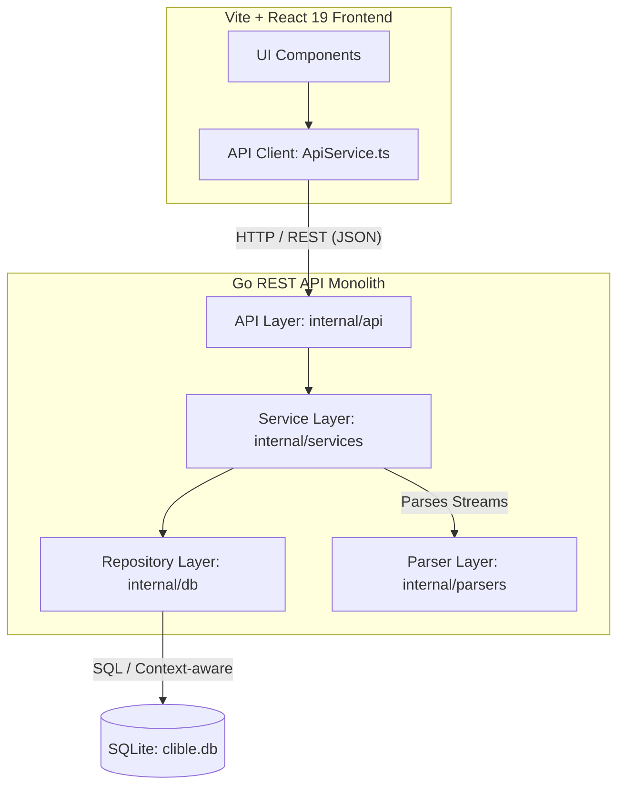
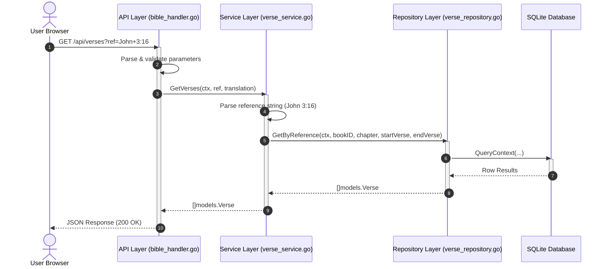

# Architecture Overview & Layers

clible-v3-go is designed as a web-native, stateless client-server application. By separating the user interface from the core data processing and storage engines, the application achieves high performance, clean boundaries, and excellent cloud portability.

---

## High-Level System Architecture

At a high level, the system consists of a web frontend communicating over HTTP with a Go REST API. The Go REST API connects to a local SQLite database that stores all Bible translations, index tables, and user workspace configurations.

---

## Architectural Layers & Responsibilities

The backend codebase is structured into clear layers, each with strict dependency rules.

### 1. API Layer (`internal/api/`)
The entry point for all HTTP requests. It sets up endpoints, parses incoming query parameters, validates JSON payloads, and calls the appropriate services.
- **Responsibilities**: Route matching, parameter parsing/validation, HTTP status code management, CORS, and writing JSON responses.
- **Strict Boundaries**: Forbidden to access databases directly, write SQL queries, or perform file system/network I/O.
- **Optimization**: Maintains $O(1)$ space complexity by streaming uploads directly to the parser layer without loading entire payloads into RAM.

### 2. Service Layer (`internal/services/`)
Orchestrates the business logic of the application. It acts as the bridge between the API handlers, repositories, and utility packages like parsers.
- **Responsibilities**: Implementing search algorithms, coordinating multi-step transactions, managing workspaces (scopes), processing text analytics (like n-gram extraction or lexical diversity calculations), and coordinating translation imports.
- **Strict Boundaries**: Forbidden to interact with HTTP concepts (no `http.ResponseWriter` or `http.Request`). 
- **Optimization**: Employs buffered batching (processing in chunks of 500 records) to write imported verses efficiently.

### 3. Repository Layer (`internal/db/`)
The direct interface to the SQLite database.
- **Responsibilities**: Executing SQL statements, retrieving row results, and scanning them into model structs.
- **Strict Boundaries**: Forbidden to reference services, API handlers, or perform external network I/O. All queries must be parameterized to prevent SQL injection.
- **Cancellation Propagation**: Every repository method accepts a `context.Context` parameter and uses it in SQLite calls (`QueryContext`, `ExecContext`). If a client aborts an HTTP request, the context cancellation instantly propagates to the database, terminating the query execution immediately and preventing CPU resource waste.

### 4. Parser Layer (`internal/parsers/`)
Handles raw translation file parsing.
- **Responsibilities**: Reading structured XML files (USFX, OSIS) and extracting books, chapters, and verses.
- **Strict Boundaries**: Forbidden to access the database, services, repositories, or API layers. It operates strictly on `io.Reader` interfaces.
- **Optimization**: Implements $O(1)$ sequential token tracking using `xml.Decoder`. Instead of loading massive XML trees (often 3–5MB) into memory, it streams tokens and invokes callbacks for each parsed verse.

---

## Boundary Violation Guardrails

The following matrix defines which layers are allowed to import or communicate with other layers. Breaking these rules will fail linter and architectural checks:

| Calling Layer | Allowed Targets | Forbidden Targets |
|---|---|---|
| **API** | Services, Models, Config | Repositories, Parsers, Raw SQL, Direct DB |
| **Services** | Repositories, Parsers, Models | API Handlers, Raw SQL, HTTP Request/Response |
| **Repositories** | Models, SQLite (`*sql.DB`) | Services, API Handlers, Parser, Network I/O |
| **Parsers** | `io.Reader` | Services, Repositories, API, Models |

---

## Typical Request-Response Flow

The sequence diagram below visualizes a verse lookup request (`GET /api/verses?ref=John+3:16`):

