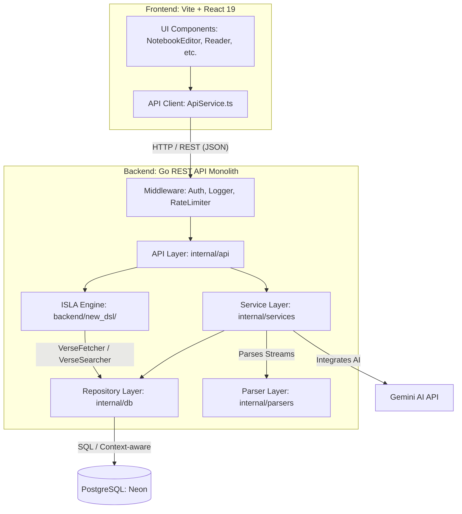
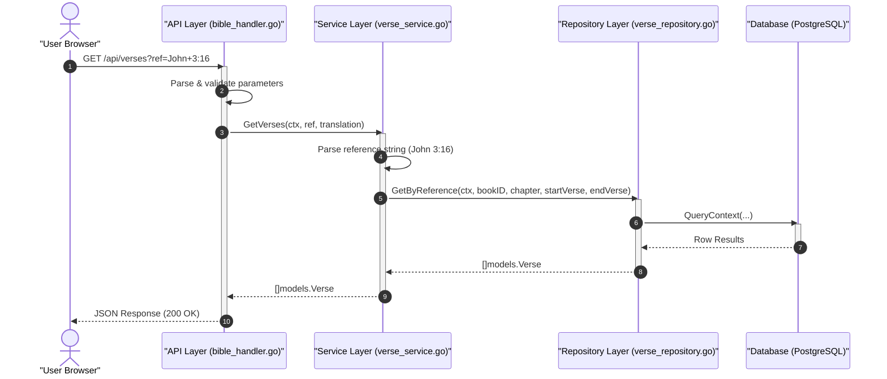
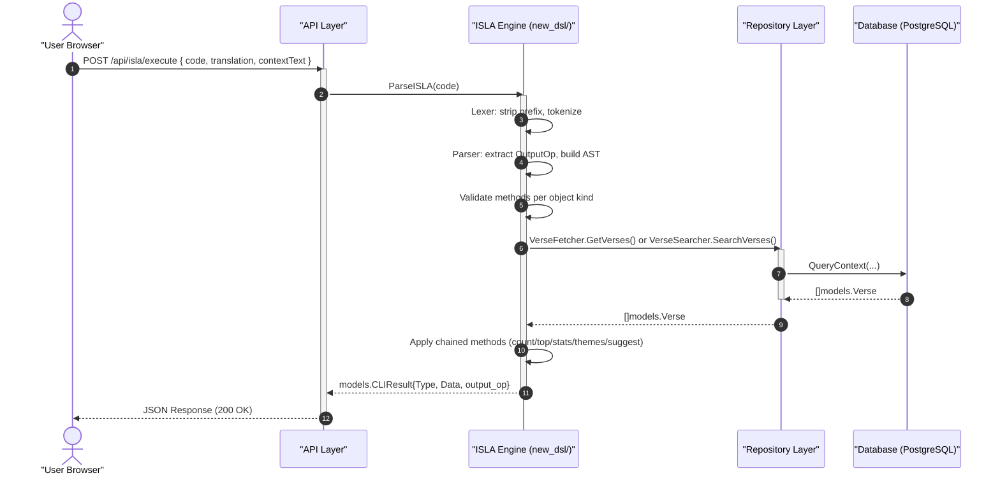

# Architecture Overview & Layers

clible-v3-go is designed as a web-native, stateless client-server application. By separating
the user interface from the core data processing, the ISLA query engine, and the storage
layer, the application achieves clean boundaries, high performance, and excellent cloud
portability.

---

## High-Level System Architecture

At a high level, the system consists of a React web frontend communicating over HTTP with
a Go REST API monolith. The monolith manages user authentication via HTTP-only JWT sessions,
coordinates text analyses, executes ISLA v2 queries, and integrates with the external
Gemini AI API. It connects to a Neon PostgreSQL database for all production persistence.
A local SQLite database is used exclusively for fast in-memory unit tests.

```mermaid
graph TD
    subgraph Frontend_App ["Frontend: Vite + React 19"]
        UI["UI Components: NotebookEditor, Reader, etc."]
        API_CLIENT["API Client: ApiService.ts"]
    end

    subgraph Backend_App ["Backend: Go REST API Monolith"]
        MW_LAYER["Middleware: Auth, Logger, RateLimiter"]
        API_LAYER["API Layer: internal/api"]
        SVC_LAYER["Service Layer: internal/services"]
        ISLA_ENGINE["ISLA Engine: backend/new_dsl/"]
        REP_LAYER["Repository Layer: internal/db"]
        PRS_LAYER["Parser Layer: internal/parsers"]
    end

    DB[("PostgreSQL: Neon")]
    AI["Gemini AI API"]

    UI --> API_CLIENT
    API_CLIENT -->|"HTTP / REST (JSON)"| MW_LAYER
    MW_LAYER --> API_LAYER
    API_LAYER --> SVC_LAYER
    API_LAYER --> ISLA_ENGINE
    SVC_LAYER --> REP_LAYER
    SVC_LAYER -->|"Parses Streams"| PRS_LAYER
    SVC_LAYER -->|"Integrates AI"| AI
    ISLA_ENGINE -->|"VerseFetcher / VerseSearcher"| REP_LAYER
    REP_LAYER -->|"SQL / Context-aware"| DB
```

---

## Architectural Layers & Responsibilities

The backend codebase is structured into five distinct layers, each with strict dependency rules.

### 1. API Layer (`internal/api/`)

The entry point for all HTTP requests. Sets up endpoints, parses query parameters, validates
JSON payloads, and calls the appropriate services or ISLA engine.

- **Responsibilities**: Route matching, parameter parsing/validation, HTTP status code
  management, CORS, and writing JSON responses.
- **Strict Boundaries**: Forbidden to access databases directly, write SQL queries, or
  perform file system/network I/O.
- **Optimization**: Maintains O(1) space complexity by streaming uploads directly to the
  parser layer without loading entire payloads into RAM.

### 2. Service Layer (`internal/services/`)

Orchestrates the business logic of the application. Bridges between the API handlers,
repositories, and utility packages such as parsers and the AI integration.

- **Responsibilities**: Implementing search algorithms, coordinating multi-step transactions,
  managing workspaces (scopes), processing text analytics, and coordinating translation imports.
- **Strict Boundaries**: Forbidden to interact with HTTP concepts (no `http.ResponseWriter`
  or `http.Request`).
- **Optimization**: Employs buffered batching (chunks of 500 records) for efficient
  verse import writes.

### 3. ISLA Engine (`backend/new_dsl/`)

A self-contained Go package implementing the complete ISLA v2 query language.
Processes raw ISLA expressions through a four-stage pipeline and returns structured
`models.CLIResult` values.

- **Responsibilities**: Lexing raw input into tokens, parsing tokens into a typed AST,
  validating method applicability per object type, executing queries via the
  `VerseFetcher` / `VerseSearcher` interfaces, and applying chained method transformations.
- **Strict Boundaries**: The ISLA engine depends **only** on `internal/models` and
  `internal/parsers`. It has no direct dependency on the service or API layers.
  Database access is abstracted through the `VerseFetcher` and `VerseSearcher` interfaces.
- **Performance**: Deterministic LL(1) parser with < 50 µs parse latency. Input is
  limited to 2000 runes (enforced by the lexer) to prevent DoS via pathologically large
  expressions.

For the complete language grammar, AST type reference, and method validation matrix,
see the [ISLA v2 Language Specification](/architecture/isla-specification).

### 4. Repository Layer (`internal/db/`)

The direct interface to the database (supporting both PostgreSQL and SQLite).

- **Responsibilities**: Executing SQL statements, retrieving row results, and scanning
  them into model structs.
- **Strict Boundaries**: Forbidden to reference services, API handlers, or perform external
  network I/O. All queries must be parameterized to prevent SQL injection.
- **Cancellation Propagation**: Every repository method accepts a `context.Context` and uses
  it in all database queries (`QueryContext`, `ExecContext`). Client disconnection instantly
  propagates to the database, terminating query execution and preventing CPU waste.

### 5. Parser Layer (`internal/parsers/`)

Handles raw translation file parsing. Separate from the ISLA engine and the repository.

- **Responsibilities**: Reading structured XML files (USFX, OSIS) and extracting books,
  chapters, and verses.
- **Strict Boundaries**: Forbidden to access the database, services, repositories, or
  API layers. Operates strictly on `io.Reader` interfaces.
- **Optimization**: Implements O(1) sequential token tracking via `xml.Decoder`. Streams
  tokens and invokes callbacks for each parsed verse without loading entire XML trees
  (often 3–5 MB) into memory.

---

## Boundary Violation Guardrails

The following matrix defines which layers are permitted to import or communicate with
other layers. Breaking these rules will fail linter and architectural checks:

| Calling Layer | Allowed Targets | Forbidden Targets |
|---|---|---|
| **API** | Services, ISLA Engine, Models, Config | Repositories, Parsers, Raw SQL, Direct DB |
| **Services** | Repositories, Parsers, Models | API Handlers, ISLA Engine, Raw SQL, HTTP types |
| **ISLA Engine** | Repositories (via interfaces), Models, Parsers (for ref resolution) | Services, API Handlers, direct `*sql.DB` |
| **Repositories** | Models, Database (`*sql.DB`) | Services, API Handlers, Parsers, Network I/O |
| **Parsers** | `io.Reader` | Services, Repositories, API, Models |

---

## Typical Request-Response Flow

The sequence diagram below visualizes a verse lookup request (`GET /api/verses?ref=John+3:16`):

```mermaid
sequenceDiagram
    autonumber
    actor User as "User Browser"
    participant API as "API Layer (bible_handler.go)"
    participant SVC as "Service Layer (verse_service.go)"
    participant DB as "Repository Layer (verse_repository.go)"
    participant SQL as "Database (PostgreSQL)"

    User->>API: GET /api/verses?ref=John+3:16
    activate API
    API->>API: Parse & validate parameters
    API->>SVC: GetVerses(ctx, ref, translation)
    activate SVC
    SVC->>SVC: Parse reference string (John 3:16)
    SVC->>DB: GetByReference(ctx, bookID, chapter, startVerse, endVerse)
    activate DB
    DB->>SQL: QueryContext(...)
    activate SQL
    SQL-->>DB: Row Results
    deactivate SQL
    DB-->>SVC: []models.Verse
    deactivate DB
    SVC-->>API: []models.Verse
    deactivate SVC
    API-->>User: JSON Response (200 OK)
    deactivate API
```

## ISLA Query Request Flow

For an ISLA execution request (`POST /api/isla/execute`):

```mermaid
sequenceDiagram
    autonumber
    actor User as "User Browser"
    participant API as "API Layer"
    participant ISLA as "ISLA Engine (new_dsl/)"
    participant DB as "Repository Layer"
    participant SQL as "Database (PostgreSQL)"

    User->>API: POST /api/isla/execute { code, translation, contextText }
    activate API
    API->>ISLA: ParseISLA(code)
    activate ISLA
    ISLA->>ISLA: Lexer: strip prefix, tokenize
    ISLA->>ISLA: Parser: extract OutputOp, build AST
    ISLA->>ISLA: Validate methods per object kind
    ISLA->>DB: VerseFetcher.GetVerses() or VerseSearcher.SearchVerses()
    activate DB
    DB->>SQL: QueryContext(...)
    SQL-->>DB: []models.Verse
    deactivate DB
    DB-->>ISLA: []models.Verse
    ISLA->>ISLA: Apply chained methods (count/top/stats/themes/suggest)
    ISLA-->>API: models.CLIResult{Type, Data, output_op}
    deactivate ISLA
    API-->>User: JSON Response (200 OK)
    deactivate API
```
