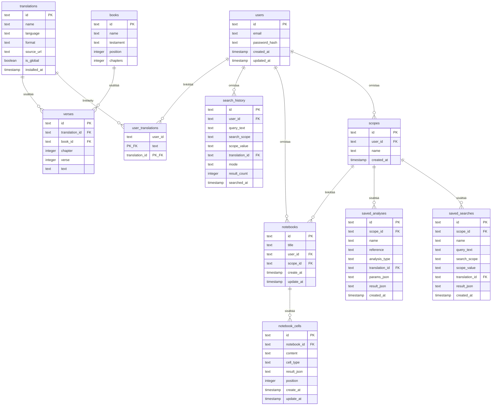

# Tietokanta-arkkitehtuuri ja kokotekstihaku (FTS)

clible-v3-go hyödyntää kaksoistietokanta-arkkitehtuuria. Se on suunniteltu ajettavaksi **PostgreSQL**:ssä (erityisesti **Neon PostgreSQL** -pilvipalvelussa kehitys- ja tuotantoympäristöissä) ensisijaisena relaatiomoottorina, tarjoten vankan pilvitallennuksen ja pistepalautuksen (Point-in-Time Recovery).

Yksikkö- ja integraatiotesteissä sovellus käyttää automaattisesti muistipohjaista **SQLite 3** -tietokantaa pitääkseen testit nopeina, eristettyinä ja itsenäisinä.

---

## ER-kaavio (Entity-Relationship Diagram)

Tietokantarakenne jakautuu kahteen pääalueeseen: staattisiin raamatunkäännöstauluihin ja dynaamisiin, käyttäjän tuottamiin työtila- ja historiatauluihin.



---

## Keskeiset tietokantataulut

### 1. `books`

Sisältää Raamatun 66 kanonisen kirjan metatiedot:
- `id` (TEXT, PK): Kanoninen kirjalyhenne (esim. `GEN`, `EXO`, `JHN`).
- `name` (TEXT): Kirjan virallinen nimi.
- `testament` (TEXT): Testamentti (`OT` tai `NT`).
- `position` (INTEGER): Järjestysnumero kaanonissa (1–66).
- `chapters` (INTEGER): Lukujen kokonaismäärä kirjassa.

### 2. `translations`

Tallentaa käännöskatalogin metatiedot:
- `id` (TEXT, PK): Uniikki slug (esim. `kr92`, `kr38`, `web`, `kjv`).
- `name` (TEXT): Näyttönimi (esim. *Pyhä Raamattu 1992*).
- `language` (TEXT): 3-kirjaiminen kielikoodi (`FIN`, `ENG`).
- `is_global` (BOOLEAN): Tieto siitä, onko käännös kaikkien käytettävissä.

### 3. `verses`

Sisältää kaikki yksittäiset raamatunjakeet:
- `id` (TEXT, PK): Yhdistelmätunnus `translation:book:chapter:verse`.
- `translation_id` (TEXT, FK): Viittaus `translations.id`-kenttään.
- `book_id` (TEXT, FK): Viittaus `books.id`-kenttään.
- `chapter` (INTEGER): Luvun numero.
- `verse` (INTEGER): Jakeen numero.
- `text` (TEXT): Jakeen tekstisisältö.

---

## Kokotekstihaku (Dual FTS)

### PostgreSQL GIN -indeksointi

Tuotantoympäristössä nopea kokotekstihaku perustuu PostgreSQL:n natiiviin `tsvector`-vektoriin ja GIN-indeksiin:

```sql
CREATE INDEX idx_verses_fts ON verses 
USING gin(to_tsvector('simple', text));
```

Hakukyselyt suoritetaan parametrisoidusti `to_tsquery('simple', ...)` -funktiolla, mikä mahdollistaa alimillisekunnin haut ilman ulkoisia hakupalvelimia.

### SQLite FTS5 -varajärjestelmä testeissä

Muistissa ajettavia yksikkötestejä varten luodaan FTS5-virtuaalitaulu triggereineen:

```sql
CREATE VIRTUAL TABLE verses_fts USING fts5(
    text,
    content='verses',
    content_rowid='rowid'
);
```
