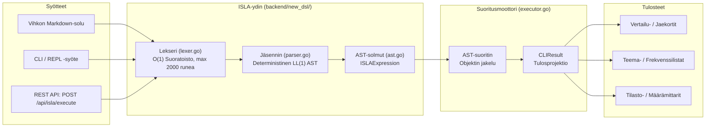
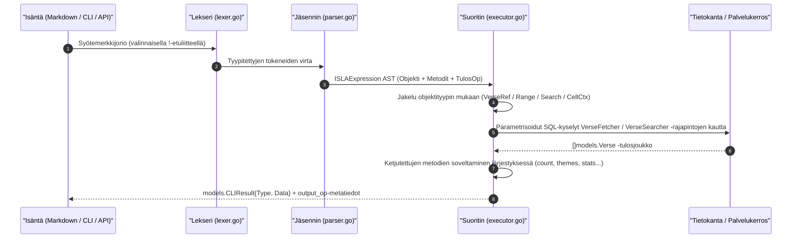

# ISLA v2 -kielioppimäärittely ja arkkitehtuuri

> **ISLA** — *Inline Structure & Logic Architecture*
> *(Myös: Interactive Scripture & Layout Analyzer)*
>
> Omistettu rakkaudella Isla Auroralle.

---

## 1. Johdanto ja tiivistelmä

**ISLA v2** on helppokäyttöinen, deterministinen kyselykieli (DSL) tekstien rakenteelliseen tutkimiseen, vertailuun ja kyselyiden upottamiseen dokumentteihin. Se on toteutettu Go-pakettina (`backend/new_dsl/`) ilman ulkoisia riippuvuuksia.

ISLA v2:n **objekti–metodi-rakenteessa** lauseke koostuu tyypitetystä lähdeobjektista, valinnaisista ketjutetuista metodeista ja pakollisesta tulosoperaattorista. Rakenne on deterministinen ja LL(1)-jäsennettävä. Se muunnetaan muuttumattomaksi abstraktiksi syntaksipuuksi (AST) alle 50 mikrosekunnissa.



---

## 2. Keskeiset suunnitteluperiaatteet

1. **Yhtenäinen objekti–metodi-rakenne**: Jokainen lauseke noudattaa muotoa `Objekti.Metodi*().TulosOp`. Kielioppi ei ole moniselitteinen, eikä jäsennin tarvitse peruutusta (backtracking).
2. **Deterministinen ja kontekstiton**: Kielioppi on puhtaasti LL(1) / Pratt-jäsennettävä, mikä takaa huippunopean jäsennyksen (< 100 µs) ilman keon muistiallokaatioita kuumalla polulla.
3. **Metodien ketjutettavuus**: Metodeja voidaan ketjuttaa vasemmalta oikealle. Kukin metodi muuntaa tai täydentää edellisen vaiheen tulosta.
4. **Tulosoperaattori ensiluokkaisena osana**: Tulosoperaattori (`=>`, `>`, `>>`) on pakollinen ja se erotetaan token-virran hännästä ennen varsinaista lausekejäsennystä, mikä erottaa laskennan renderöintikohteesta.
5. **Alustariippumaton upotettavuus**: `!`- ja `isla `-laukaisimet poistetaan läpinäkyvästi lekserissä, joten ISLA-lausekkeet toimivat identtisesti Markdown-soluissa, CLI-päätteessä ja REST API -kutsuissa.
6. **Metodien tarkistus**: Jäsennin tarkistaa jo jäsennysvaiheessa, voiko metodia käyttää kyseisen objektityypin kanssa. Virheestä ilmoitetaan ennen tietokantatoimintoja.

---

## 3. Formaali syntaksi ja kielioppi (EBNF)

Seuraava kielioppimäärittely vastaa täsmällisesti toteutusta tiedostossa `backend/new_dsl/parser.go`:

```ebnf
ISLAExpression  ::= Object Method* OutputOp?

Object          ::= VerseRef
                  | RangeExpr
                  | SearchExpr
                  | CellCtxExpr
                  | VariableRef

VerseRef        ::= "@(" Citation ")"

RangeExpr       ::= "range(" RangePart ("," | "..") RangePart ")"
                  | "(" RangePart ".." RangePart ")"
                  | "@(" RangePart ".." RangePart ")"
RangePart       ::= (* kaikki tokenit pilkkuun, sulkuun tai .. asti *)

SearchExpr      ::= ("search(" | "?") SearchBody
SearchBody      ::= StringLiteral
                  | RegexLiteral
                  | BooleanExpr
                  | NamedParamExpr

BooleanExpr     ::= SearchTerm { ("AND" | "OR" | "&" | "|") SearchTerm }
SearchTerm      ::= StringLiteral | Ident

RegexLiteral    ::= "/" (* regex-merkit *) "/"

CellCtxExpr     ::= "^" [ Number | "all" ]

VariableRef     ::= "#" Ident

Method          ::= "." MethodName "(" MethodArgs? ")"

MethodName      ::= "use" | "vs" | "at" | "refs" | "themes"
                  | "suggest" | "count" | "top" | "stats" | "limit"
                  | "ngrams" | "categorize" | "lemma" | "cluster"

MethodArgs      ::= Arg { "," Arg }
Arg             ::= StringLiteral | Ident | Number

OutputOp        ::= "=>" [ VarName ]     (* OutputInline: nykyiseen soluun *)
                  | ">" [ CellName ]     (* OutputNewCellAbove *)
                  | ">>" [ CellName ]    (* OutputNewCellBelow *)

VarName         ::= "#" Slug             (* #slug-muuttujatunniste *)

CellName        ::= "#" Slug             (* #slug-tunniste *)
                  | StringLiteral        (* "lainattu otsikko" *)
                  | Ident { Ident }      (* vapaamuotoiset otsikkosanat *)

Citation        ::= BookRef [ Chapter [ ":" VerseRange ] ]
VerseRange      ::= Number [ "-" Number ]
```

> [!NOTE]
> Lekseri (`NewLexer()`) poistaa automaattisesti `!`- ja `isla `-laukaisinetuliitteet ennen jäsentimen työtä. Syötteen enimmäispituus on **2000 runea** (tarkistetaan lekserissä).

---

## 4. AST-solmutyypit (Abstract Syntax Tree)

Jäsennin tuottaa tyypitetyn `ISLAExpression`-juurisolmun, joka sisältää yhden viidestä konkreettisesta objektityypistä. Tyypit on määritelty tiedostossa `backend/new_dsl/ast.go`.

### `ISLAExpression` — Juurisolmu

```go
type ISLAExpression struct {
    Object  Object       // Pakollinen: yksi viidestä objektityypistä
    Methods []MethodCall // Nolla tai useampi ketjutettu metodikutsu järjestyksessä
    Output  OutputOp     // Populoitu AST:hen; oletuksena OutputInline
}
```

### Objektityypit

| AST-tyyppi | Syntaksi | ObjectKind-vakio |
|---|---|---|
| `VerseRefNode` | `@(Joh 3:16)` | `ObjectVerseRef` |
| `RangeNode` | `range(GEN, DEU)` / `(MAT .. JOH)` | `ObjectRange` |
| `SearchNode` | `search("armo")` / `? "rauha"` | `ObjectSearch` |
| `CellCtxNode` | `^` / `^3` / `^all` | `ObjectCellCtx` |
| `VariableNode` | `#muuttuja` | `ObjectVariable` |

### `MethodCall` — Ketjutettu muunnos

```go
type MethodCall struct {
    Name string   // "use", "vs", "at", "refs", "count", "top", "stats", "themes", "suggest", "limit", "ngrams", "categorize", "lemma", "cluster"
    Args []string // Merkkijonoargumentit, esim. ["KR92"], ["KR92", "KJV"], ["5"]
}
```

### `OutputOp` — Tulosohje

```go
type OutputOp struct {
    Kind OutputKind // OutputInline | OutputNewCellAbove | OutputNewCellBelow
    Name string     // "" | "#slug" | "vapaa otsikko"
}
```

---

## 5. Metodivalidointimatriisi

Jäsennin tarkistaa metodien soveltuvuuden lausekkeen objektityypille jäsennysaikana. Kielletyn metodin kutsuminen palauttaa virheen välittömästi ennen tietokantahakua:

| Metodi | `@()` | `range()` | `search()` | `^` | `#var` |
|---|---|---|---|---|---|
| `.use(trans)` | ✅ | ✅ | ✅ | ❌ | ✅ |
| `.vs(t1, t2)` | ✅ | ❌ | ❌ | ❌ | ✅ |
| `.refs(n)` | ✅ | ❌ | ❌ | ❌ | ✅ |
| `.at(scope)` | ❌ | ❌ | ✅ | ❌ | ❌ |
| `.limit(n)` | ❌ | ❌ | ✅ | ❌ | ❌ |
| `.count([unit])` | ✅ | ✅ | ✅ | ✅ | ✅ |
| `.top(n)` | ✅ | ✅ | ✅ | ✅ | ✅ |
| `.ngrams(size, [limit])` | ✅ | ✅ | ✅ | ✅ | ✅ |
| `.stats()` | ✅ | ✅ | ✅ | ✅ | ✅ |
| `.themes(n)` | ✅ | ✅ | ✅ | ✅ | ✅ |
| `.suggest(n)` | ✅ | ✅ | ✅ | ✅ | ✅ |
| `.categorize([n])` | ✅ | ✅ | ✅ | ✅ | ✅ |
| `.lemma()` | ✅ | ✅ | ✅ | ✅ | ✅ |
| `.cluster([n])` | ✅ | ✅ | ✅ | ✅ | ✅ |

---

## 6. Suoritusputki (Execution Pipeline)

ISLA-lausekkeet käsitellään neljässä selkeästi eritetyssä vaiheessa paketin `backend/new_dsl/` sisällä:



1. **Tokenisointi (Lekseri)**: Poistaa `!`-laukaisimen, skannaa syötteen rune-merkit sijaintitokeneiksi (`TokenAtOpen`, `TokenSearch`, `TokenCaret`, `TokenDot` jne.) yhdellä O(1) lineaarisella läpikäynnillä.
2. **Tulosoperaattorin erotus**: Ennen lausekerungon jäsennystä jäsennin etsii token-virran lopusta tulosoperaattorin (`=>`, `>`, `>>`). Tämä tekee syntaksista yksiselitteisen.
3. **Syntaksianalyysi (Jäsennys)**: Muuntaa jäljelle jääneet tokenit tyypitetyksi `ISLAExpression`-syntaksipuuksi ja tarkistaa metodien sallittavuuden.
4. **Suoritus (AST-moottori)**: Suorittaa haun objektityypin mukaan, valitsee käännöksen (älykkäät rajaukset), tekee tietokantakyselyt ja soveltaa analyysimetodit tuloksiin.

---

## 7. ISLAEditor — Frontend IntelliSense -moottori

Frontend tarjoaa rikkaan kieliälykerroksen ISLA-komentojen kirjoittamiseen vihkoeditorissa:

| Moduuli | Tiedosto | Vastuualue |
|---|---|---|
| **Lekseri** | `islaLexer.ts` | `tokenizeISLALine()` → tyypitetty tokenvirta syntaksikorostukseen |
| **IntelliSense** | `islaIntellisense.ts` | `getISLASuggestions()`, `getHoverDocumentation()` |
| **Rekisteri** | `islaUtils.ts` | `COMMAND_REGISTRY`, `BIBLE_BOOKS`, `SMART_BOOK_GROUPS` |

Editorikomponentti (`ISLAEditor.tsx`) käyttää **kerrosmallia** (Overlay Pattern) reaaliaikaiseen syntaksikorostukseen ilman raskaita editoririippuvuuksia:

```
┌───────────────────────────────────────────────────────────────┐
│  div.relative (kääre)                                          │
│  ├─ div[aria-hidden] ISLASyntaxLayer  ← ylempi z-indeksi      │
│  │   ├─ <span class="text-amber-400">@(</span>               │
│  │   ├─ <span class="text-cyan-300">Joh 3:16</span>          │
│  │   └─ <span class="text-fuchsia-400">.vs</span>            │
│  └─ <textarea>                        ← alempi z-indeksi      │
│      color: transparent; caret-color: amber                   │
└───────────────────────────────────────────────────────────────┘
```

`<textarea>` käsittelee näppäimistösyötteen ja kohdistimen sijainnin. Sen alla oleva `aria-hidden`-kerros piirtää identtisen tekstin värikoodattuina `<span>`-elementteinä samoilla fontti-, koko- ja rivivälimäärityksillä.

---

## 8. Laatu- ja suorituskykytavoitteet

| Mittari | Tavoite | Mittaustapa |
|---|---|---|
| **Lekserin allokaatiotaso** | 0 allokaatiota/op yksirivisille kyselyille | Go `testing.B` ja `AllocsPerRun` |
| **Jäsentimen latenssi** | < 50 µs per kysely | Yhden läpikäynnin deterministinen jäsennys |
| **Syötteen enimmäispituus** | 2000 runea | Valvotaan `NewLexer()`-funktiossa |
| **AST-muuttumattomuus** | 100 % säieturvallinen | Arvovastaanottajat ja Copy-on-write-solmut |
| **Binaarikoko** | < 500 KB itsenäisenä | Staattinen Go-käännös, ei cgo:ta |

---

## 9. Nimi ja omistus

Nimi **ISLA** kunnioittaa *Isla Auroraa*, symboloiden kirkkautta, selkeyttä ja eleganttia rakennetta.

Jokainen moottorin jäsentämä lauseke on sitoumus puhtaaseen arkkitehtuuriin, ohjelmoinnin iloon ja kestävään avoimen lähdekoodin arvoon.
