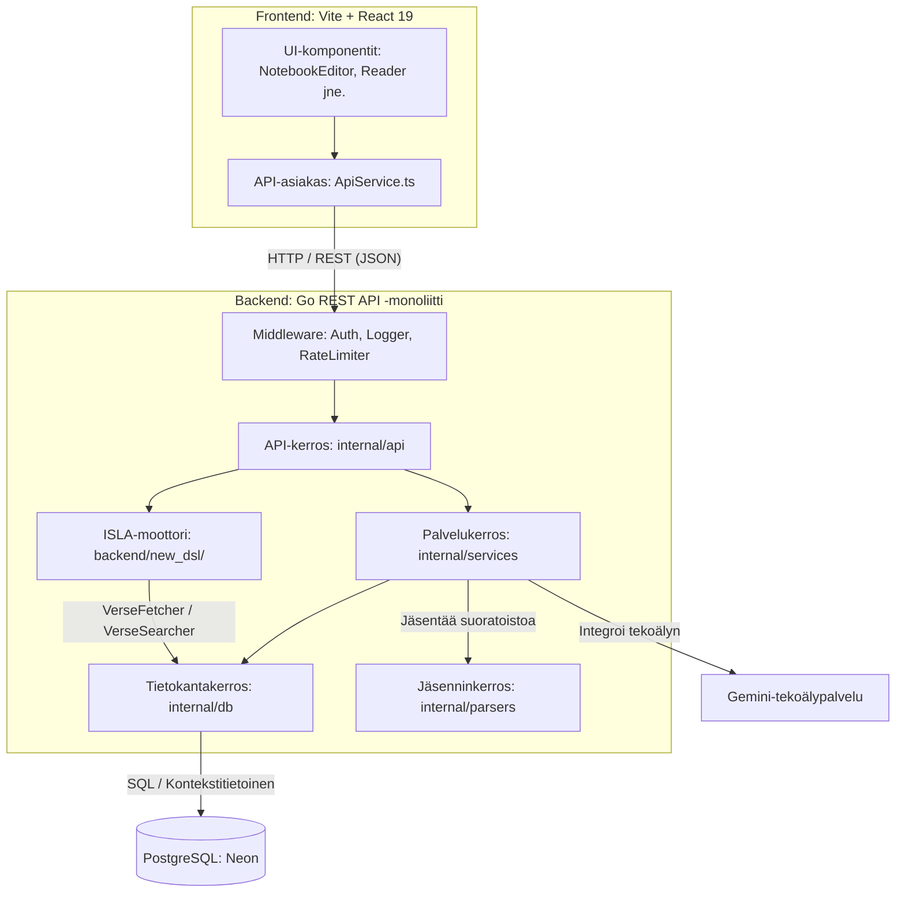

# Arkkitehtuurin yleiskatsaus ja kerrokset

clible-v3-go on verkkopohjainen, tilaton asiakas-palvelinsovellus. Käyttöliittymän, tietojen käsittelyn, ISLA-kyselymoottorin ja tallennuksen erottaminen toisistaan selkeyttää vastuita, parantaa suorituskykyä ja helpottaa sovelluksen siirtämistä pilviympäristöstä toiseen.

---

## Järjestelmäarkkitehtuuri

Järjestelmä koostuu React-käyttöliittymästä ja Go REST API -taustapalvelusta, jotka viestivät HTTP:n välityksellä. Taustapalvelu huolehtii käyttäjien todennuksesta HTTP-only JWT -istunnoilla, koordinoi tekstianalyysejä, suorittaa ISLA v2 -kyselyitä ja käyttää Gemini-tekoälypalvelua. Tuotantotiedot tallennetaan Neon PostgreSQL -tietokantaan. Yksikkötesteissä käytetään eristettyä, muistissa toimivaa SQLite-tietokantaa.

---

## Arkkitehtuurikerrokset ja vastuut

Backend on jäsennelty viiteen kerrokseen, joilla on tiukat riippuvuussäännöt.

### 1. API-kerros (`internal/api/`)

HTTP-pyyntöjen sisääntulokerros. Se määrittää rajapintareitit, jäsentää parametrit, validoi JSON-pyynnöt ja kutsuu tarvittavia palveluita tai ISLA-moottoria.

- **Vastuut**: Reititys, parametrien validointi, HTTP-tilakoodit, CORS ja JSON-vastausten muodostaminen.
- **Rajat**: Ei saa ottaa suoria tietokantayhteyksiä, kirjoittaa SQL-kyselyitä tai tehdä tiedostojärjestelmä-/verkkotoimintoja.
- **Optimointi**: Ylläpitää O(1) tilakompleksisuuden suoratoistamalla tiedostojen lataukset suoraan jäsenninkerrokselle ilman muistipuskurointia.

### 2. Palvelukerros (`internal/services/`)

Koordinoi sovelluksen liiketoimintalogiikkaa ja yhdistää API-käsittelijät, tietokantakerroksen sekä apupaketit, kuten XML-jäsentimet ja tekoälyintegraation.

- **Vastuut**: Hakualgoritmit, monivaiheiset transaktiot, tutkimustyötilojen hallinta, tekstianalytiikka ja käännösten tuonti.
- **Rajat**: Ei saa käsitellä HTTP-käsitteitä (ei `http.ResponseWriter`- tai `http.Request`-viitteitä).
- **Optimointi**: Käyttää 500 jakeen puskuroituja erälisäyksiä tehokkaaseen tietokantatallennukseen.

### 3. ISLA-moottori (`backend/new_dsl/`)

Itsenäinen Go-paketti, joka toteuttaa täyden ISLA v2 -kyselykielen. Käsittelee raa'at ISLA-lausekkeet nelivaiheisessa putkessa ja palauttaa jäsennellyt `models.CLIResult`-arvot.

- **Vastuut**: Syötteen jakaminen tokeneiksi, jäsentäminen tyypitetyksi AST:ksi, metodien kelpoisuuden tarkistaminen ja kyselyiden suorittaminen `VerseFetcher`- ja `VerseSearcher`-rajapintojen kautta.
- **Rajat**: Riippuu **vain** paketeista `internal/models` ja `internal/parsers`. Ei suoraa riippuvuutta palvelu- tai API-kerroksiin.
- **Suorituskyky**: Deterministinen LL(1)-jäsennin alle 50 µs latenssilla. Syötteen pituus rajoitettu 2000 rune-merkkiin DoS-hyökkäysten estämiseksi.

Katso tarkempi kielioppi ja arkkitehtuuri sivulta [ISLA v2 -kielioppimäärittely](/fi/architecture/isla-specification).

### 4. Tietokantakerros (`internal/db/`)

Suora rajapinta tietokantaan (tukee sekä PostgreSQL:ää että SQLiteä).

- **Vastuut**: SQL-lauseiden suoritus, tulosrivien luku ja skannaus mallirakenteisiin.
- **Rajat**: Ei saa viitata palveluihin tai API-käsittelijöihin. Kaikki kyselyt ovat tiukasti parametrisoituja SQL-injektioiden estämiseksi.
- **Peruutussignaalin välitys**: Jokainen metodi ottaa vastaan `context.Context`-olion ja käyttää sitä kyselyissä (`QueryContext`, `ExecContext`). Asiakkaan katkaistessa yhteyden kysely keskeytetään tietokannassa välittömästi.

### 5. Jäsenninkerros (`internal/parsers/`)

Käsittelee raakojen käännöstiedostojen lukemisen.

- **Vastuut**: Rakenteellisten XML-tiedostojen (USFX, OSIS) luku ja kirjojen, lukujen ja jakeiden erottelu.
- **Rajat**: Ei yhteyksiä tietokantaan, palveluihin tai API-kerrokseen. Toimii ainoastaan `io.Reader`-rajapintaa vasten.
- **Optimointi**: O(1) suoratoistojäsennys `xml.Decoder`-työkalulla ilman koko tiedoston lataamista muistiin.

---

## Kerrosrajojen vartiointi

| Kutsuva kerros | Sallitut kohteet | Kielletyt kohteet |
|---|---|---|
| **API** | Palvelut, ISLA-moottori, Mallit, Konfiguraatio | Tietokanta, Jäsentimet, Raaka SQL |
| **Palvelut** | Tietokanta, Jäsentimet, Mallit | API-käsittelijät, ISLA-moottori, Raaka SQL, HTTP-tyypit |
| **ISLA-moottori** | Tietokanta (rajapintojen kautta), Mallit, Jäsentimet | Palvelut, API-käsittelijät, suora `*sql.DB` |
| **Tietokanta** | Mallit, Tietokantayhteys (`*sql.DB`) | Palvelut, API-käsittelijät, Jäsentimet, Verkko-I/O |
| **Jäsentimet** | `io.Reader` | Palvelut, Tietokanta, API, Mallit |
