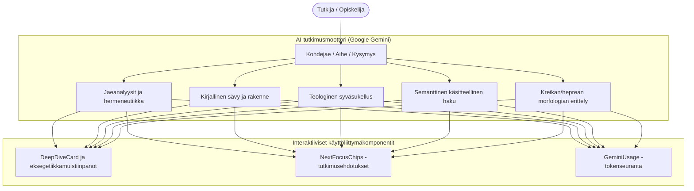

# Teologiset AI-työkalut

clible-v3 integroi Google Gemini AI -tekoälyn tarjoamaan hermeneuttista tukea, käsitteellistä hakua ja alkukielten eksegetiikkaa suoraan tutkimusprosessiisi.

---

## 1. Keskeiset tekoälyominaisuudet

Tekoälymoottori on räätälöity nimenomaan teologiseen tekstianalyysiin, kieliopilliseen jäsennykseen ja historialliseen taustoitukseen:

---

## 2. Jaeanalyysit ja liittohermeneutiikka

Valitse mikä tahansa raamatunkohta ja pyydä AI-analyysi haluamallasi painotuksella:

- **Liittokonteksti**: Tarkastelee, miten tekstijakso kytkeytyy Raamatun liittoihin (Abrahamin, Mooseksen, Daavidin ja Uusi liitto).
- **Kirjallinen sävy ja rakenne**: Erittelee retoriset keinot, heprealaisen runouden parallelismit ja kiasmirakenteet.
- **Historiallis-kieliopillinen eksegetiikka**: Valottaa kulttuuritapoja, muinaisen Lähi-idän ilmauksia ja kreikkalais-roomalaista taustaa.

---

## 3. Semanttinen käsitteellinen haku

Toisin kuin perinteinen sanahaku, joka vaatii täsmälliset hakusanat, **Semanttinen haku** ymmärtää teologisia käsitteitä ja luonnollisen kielen kysymyksiä:

- *"Missä Paavali kuvaa Jumalan taisteluvarustusta?"* → Löytää Efesolaiskirje 6:10–18.
- *"Kohdat, joissa usko ilman tekoja sanotaan kuolleeksi"* → Löytää Jaakobin kirje 2:14–26.
- *"Jeesus tyynnyttää myrskyn opetuslasten kanssa"* → Löytää Markuksen evankeliumi 4:35–41 rinnakkaispaikkoineen.

---

## 4. Interaktiiviset eksegetiikkakomponentit

### NextFocusChips

Jokainen tekoälyvastaus generoi automaattisesti interaktiiviset **NextFocusChips**-ehdotusnapit. Napin klikkaaminen haarauttaa tutkimuksesi välittömästi jatkotutkimukseen (kuten rinnakkaisviitteisiin, historiallisiin konteksteihin tai kielioppivivahteisiin).

### DeepDiveCard

Kattavat eksegeettiset tutkielmat ja monikohdalliset jäsennykset esitetään laajennettavissa `DeepDiveCard`-laatikoissa, mikä pitää päänäkymän selkeänä samalla kun laaja aineisto on heti avattavissa.

---

## 5. Yksityisyys, kiintiöt ja turvallisuus

- **Ei aineistojen koulutuskäyttöä**: Henkilökohtaisia tutkimusmuistiinpanojasi, työtilojasi tai hakujasi ei koskaan käytetä ulkoisten tekoälymallien kouluttamiseen.
- **Tiukka pyyntörajoitus**: Palvelin valvoo IP-kohtaista Token Bucket -kiintiötä (15 pyyntöä/tunti 5 pyynnön puskurilla) kiintiöiden tahattoman ylittymisen estämiseksi.
- **Täysin valinnainen**: Mikäli palvelimelle ei ole määritetty `GEMINI_API_KEY`-avainta, tekoälyominaisuudet kytkeytyvät pois siististi samalla kun koko muu alusta (lukutila, haku, vertailu, 2D Canvas -vihkot, ISLA DSL) toimii 100 % normaalisti.
