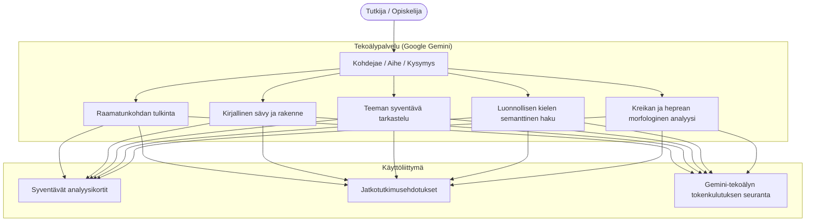

# Teologiset tekoälytyökalut

clible-v3 hyödyntää Google Gemini -tekoälyä raamatunkohtien tulkinnan, teemahaun ja alkukielten tutkimisen tukena.

---

## 1. Tekoälyominaisuudet

Tekoälytyökalut auttavat tarkastelemaan raamatuntekstejä teologisesta, kielellisestä ja historiallisesta näkökulmasta:

---

## 2. Jaeanalyysit ja liittohermeneutiikka

Valitse raamatunkohta ja pyydä analyysi haluamastasi näkökulmasta:

- **Liittokonteksti**: Tarkastelee, miten tekstijakso liittyy Raamatun liittoihin (Abrahamin, Mooseksen ja Daavidin liittoon sekä uuteen liittoon).
- **Kirjallinen sävy ja rakenne**: Tunnistaa retorisia keinoja, heprealaisen runouden rinnakkaisrakenteita ja kiasmeja.
- **Historiallis-kieliopillinen tulkinta**: Taustoittaa tekstin ajan kulttuuria, muinaisen Lähi-idän ilmauksia ja kreikkalais-roomalaista maailmaa.

---

## 3. Semanttinen haku luonnollisella kielellä

Semanttisessa haussa voit kuvailla aihetta tai esittää kysymyksen omin sanoin sen sijaan, että etsisit vain tiettyä sanaa. Haku toimii tekoälyn ja kokotekstihaun yhteistyönä: Google Gemini muuntaa kysymyksen hakusuunnitelmaksi, jonka perusteella palvelu etsii osumia valitun käännöksen tekstistä.

- *"Missä Paavali kuvaa Jumalan taisteluvarustusta?"* → voi tuottaa haun Efesolaiskirjeeseen 6:10–18.
- *"Usko ilman tekoja on kuollut"* → voi tunnistaa Jaakobin kirjeen 2:14–26.
- *"Jeesus tyynnyttää myrskyn opetuslasten kanssa"* → voi tunnistaa Markuksen evankeliumin 4:35–41.

Jos Gemini tunnistaa kysymyksestä tunnetun raamatunkohdan, palvelu hakee myös kyseisen kohdan jakeet. Ne täydentävät kokotekstihaun osumia, joten tuloksiin voi tulla koko tunnistettu kohta, vaikka kaikki sen jakeet eivät sisältäisi haun sanoja. Tuloksista näet hakusuunnitelman, osumajakeet ja niihin perustuvan tiivistelmän. Voit avata tunnistetun kohdan lukutilassa.

> [!NOTE]
> Semanttinen haku ei etsi lähimpiä osumia vektoriupotusten avulla. Gemini muodostaa kysymyksestä hakusanoja ja kokotekstihaun rajauksia, minkä lisäksi se voi täydentää tuloksia tunnistamallaan raamatunkohdalla. Siksi tulokset riippuvat valitusta käännöksestä ja haun muodostuksesta; kokeile tarvittaessa toista sanamuotoa tai käännöstä.

### Näin käytät semanttista hakua

1. Avaa sovelluksen **Haku**-näkymä ja valitse tutkittava raamatunkäännös.
2. Kirjoita aihe tai kysymys omin sanoin, esimerkiksi *"Missä puhutaan anteeksiannosta?"*.
3. Käynnistä semanttinen haku ja tarkastele Gemini-tekoälyn muodostamia hakusanoja, hakusuunnitelmaa ja löytyneitä jakeita.
4. Avaa kiinnostava jae tai tunnistettu raamatunkohta lukutilassa. Aktiivisessa tutkimustyötilassa voit myös tallentaa haun myöhempää käyttöä varten.

Gemini muodostaa tiivistelmän hakutuloksista; tiivistelmä perustuu enintään 15 haetun jakeen tekstikatkelmaan. Tarkista viitteet ja tulkinnat aina itse alkuperäisestä tekstistä.

---

## 4. Jatkotutkimusehdotukset ja syventävät analyysit

Tekoälyn analyysien yhteydessä näkyvät jatkotutkimusehdotukset auttavat jatkamaan aiheeseen liittyvien rinnakkaisviitteiden, historiallisen taustan tai kieliopillisten yksityiskohtien tarkastelua. Laajat analyysit esitetään avattavissa korteissa, jotta näkymä säilyy selkeänä.

---

## 5. Yksityisyys, kiintiöt ja turvallisuus

- **Ei aineistojen koulutuskäyttöä**: Henkilökohtaisia tutkimusmuistiinpanojasi, työtilojasi tai hakujasi ei koskaan käytetä ulkoisten tekoälymallien kouluttamiseen.
- **Pyyntöjen rajoitus**: Palvelin rajoittaa pyyntömäärää IP-osoitteen perusteella. Rajoitus on 15 pyyntöä tunnissa, ja lyhytaikainen puskuri sallii enintään viisi lisäpyyntöä.
- **Valinnainen ominaisuus**: Jos palvelimelle ei ole määritetty `GEMINI_API_KEY`-avainta, tekoälyominaisuudet eivät ole käytettävissä. Lukutila, haku, vertailu, 2D Canvas -tutkimusvihkot ja ISLA toimivat silti normaalisti.
