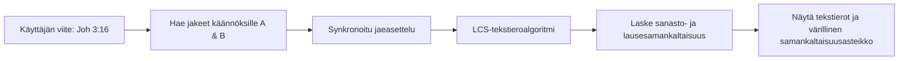

# Käännösvertailu ja tekstierot

**Käännösvertailumatriisi** (`/compare`) auttaa tarkastelemaan eri raamatunkäännösten sanavalintoja, tyyliä ja merkityseroja.

---

## 1. Rinnakkaisasettelu ja tekstierojen korostus

Kahden käännöksen rinnakkainen vertailu auttaa havaitsemaan sanavalintojen ja lauserakenteiden eroja:



### Tekstierojen korostukset

Vertailutoiminto laskee pisimmän yhteisen alijonon (**Longest Common Subsequence, LCS**) kahden käännöstekstin välillä:

- **Samat sanat**: Esitetään normaalilla leipätekstillä.
- **Eroavat sanat ja ilmaisut**: Korostetaan pehmeillä korostusväreillä, jolloin erot erottuvat silmälle välittömästi.
- **Värillinen samankaltaisuusasteikko**: Mittari näyttää tekstien laskennallisen samankaltaisuuden punaisesta (0 %) vihreään (100 %).

```
┌────────────────────────────────────────────────────────────────────────┐
│  ⚖️ Vertailu: Roomalaiskirje 5:1                                       │
│  ────────────────────────────────────────────────────────────────────  │
│  Käännös A: KR92                  │  Käännös B: KR38                   │
│  ─────────────────────────────────┼──────────────────────────────────  │
│  Koska me siis olemme uskosta     │  Koska me siis olemme uskosta      │
│  [vanhurskaiksi tulleet],         │  [vanhurskautetut],                │
│  meillä on rauha Jumalan kanssa   │  niin meillä on rauha Jumalan      │
│  meidän Herramme Jeesuksen        │  kanssa meidän Herramme Jeesuksen  │
│  Kristuksen kautta.               │  Kristuksen kautta.                │
│  ─────────────────────────────────┴──────────────────────────────────  │
│  Samankaltaisuus: 88,5 % [████████████████████░░░]                     │
└────────────────────────────────────────────────────────────────────────┘
```

---

## 2. Tekoälyavusteinen käännösvertailu

Tekstierojen lisäksi clible-v3 voi tuottaa valitusta jakeesta tekoälyavusteisen käännösvertailun:

- **Käännösvivahteiden analyysi**: Selittää, miten eri käännösratkaisut heijastelevat kreikan tai heprean käsikirjoitusperinteitä tai käännösteorioita (kuten dynaaminen vastaavuus vs. formaali vastaavuus).
- **Jatkotutkimusehdotukset (NextFocusChips)**: Ehdotusnapit auttavat tarkastelemaan historiallisia, kieliopillisia tai teologisia kysymyksiä.
- **Syventävät näkökulmakortit**: Laajennettavat osiot, jotka tarjoavat yksityiskohtaisia eksegeettisiä huomioita.

---

## 3. Vertailujen tallentaminen työtiloihin

Voit tallentaa minkä tahansa vertailututkimuksen suoraan aktiiviseen [Tutkimustyötilaasi](/fi/guide/workspaces):

1. Valitse toimintopalkista **Tallenna vertailu työtilaan**.
2. Anna vertailulle kuvaava nimi (esim. *Room 5:1 Vanhurskauttamiskäsitteen vertailu*).
3. Vertailun asetukset, samankaltaisuusluvut, tekstierot ja tekoälyn kommentaari tallentuvat työtilaasi myöhempää tarkastelua varten.
