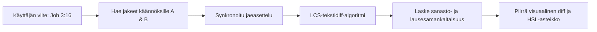

# Käännösvertailu ja visuaalinen diff

**Käännösvertailumatriisi** (`/compare`) on erikoistunut työtila tekstuaalisten poikkeamien, tyylillisten valintojen ja käännösvivahteiden analysointiin eri raamatunversioiden välillä.

---

## 1. Rinnakkaisasettelu ja visuaalinen tekstidiff

Tutkittaessa teologisesti merkittäviä raamatunkohtia kahden eri käännöksen vertaileminen paljastaa sanastolliset painotusvalinnat ja lauserakenteelliset erot:



### Visuaaliset diff-korostukset

Vertailumoottori laskee pisimmän yhteisen alijonon (**Longest Common Subsequence, LCS**) kahden käännetyn tekstin välillä:

- **Samat sanat**: Esitetään normaalilla leipätekstillä.
- **Eroavat sanat ja ilmaisut**: Korostetaan pehmeillä korostusväreillä, jolloin erot erottuvat silmälle välittömästi.
- **Dynaaminen HSL-samankaltaisuusasteikko**: Reaaliaikainen visuaalinen mittari näyttää tekstien yhteneväisyysprosentin liukuen punaisesta (0 % yhteneväisyys) smaragdinvihreään (100 % yhteneväisyys).

```
┌────────────────────────────────────────────────────────────────────────┐
│  ⚖️ Vertailu: Roomalaiskirje 5:1                                       │
│  ────────────────────────────────────────────────────────────────────  │
│  Käännös A: KR92                  │  Käännös B: KR38                   │
│  ─────────────────────────────────┼──────────────────────────────────  │
│  Koska me siis olemme uskosta     │  Koska me siis olemme uskosta      │
│  [vanhurskaiksi tulleet],         │  [vanhurskautetut],                │
│  meillä on rauha Jumalan kanssa   │  niin meillä on rauha Jumalan      │
│  meidän Herramme Jeesuksen        │  kanssa meidän Herramme Jeesuksen  │
│  Kristuksen kautta.               │  Kristuksen kautta.                │
│  ─────────────────────────────────┴──────────────────────────────────  │
│  Samankaltaisuus: 88.5% [████████████████████░░░]                      │
└────────────────────────────────────────────────────────────────────────┘
```

---

## 2. Integroitu teologinen AI-vertailukommentaari

Algoritmisen sanadiffin ohella clible-v3 voi tuottaa tekoälypohjaisen teologisen vertailun valitusta jakeesta:

- **Käännösvivahteiden analyysi**: Selittää, miten eri käännösratkaisut heijastelevat kreikan tai heprean käsikirjoitusperinteitä tai käännösteorioita (kuten dynaaminen vastaavuus vs. formaali vastaavuus).
- **Interaktiiviset tutkimussuositukset (NextFocusChips)**: Klikattavat ehdotusnapit, joilla voit syventyä historiallisiin, kieliopillisiin tai opillisiin kysymyksiin.
- **Syventävät näkökulmakortit**: Laajennettavat osiot, jotka tarjoavat yksityiskohtaisia eksegeettisiä huomioita.

---

## 3. Vertailujen tallentaminen työtiloihin

Voit tallentaa minkä tahansa vertailututkimuksen suoraan aktiiviseen [Tutkimustyötilaasi](/fi/guide/workspaces):

1. Klikkaa ylätoimintopalkista **Tallenna vertailu työtilaan**.
2. Anna vertailulle kuvaava nimi (esim. *Room 5:1 Vanhurskauttamiskäsitteen vertailu*).
3. Vertailun parametrit, samankaltaisuusluvut, visuaalisen diffin tila ja AI-kommentaari tallentuvat työtilaasi välitöntä uudelleenavausta varten.
