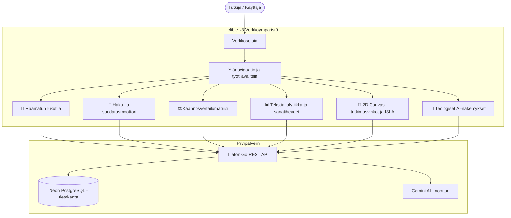

# Yleiskatsaus ja pikaopas

Tervetuloa **clible-v3**-alustalle — moderniin, web-natiiviin Raamatuntutkimuksen ja tekstianalytiikan tutkimusympäristöön.

clible-v3 yhdistää nopean raamatuntekstien selailun, monikäännöksellisen vertailevan eksegetiikan, kvantitatiivisen lingvistisen tekstianalytiikan sekä interaktiivisen **2D Canvas -tutkimusvihkotyötilan**, jota ohjaa **ISLA DSL -kyselymoottori**.

---

## 1. Verkkosovelluksen arkkitehtuuri

Toisin kuin perinteiset työpöytä- tai komentoriviohjelmat, clible-v3 on rakennettu alusta alkaen **pilvinatiiviksi verkkosovellukseksi**:

- **Ei asennusta loppukäyttäjälle**: Käytä tutkimusmateriaalejasi, muistiinpanojasi ja työtilojasi miltä tahansa modernilta verkkoselaimelta tietokoneella, tabletilla tai puhelimella.
- **Turvallinen pilvitallennus**: Työtilat, kiinnitetyt haut, leksikaaliset analyysit ja 2D canvas -vihkot tallentuvat turvallisesti suorituskykyiseen PostgreSQL-tietokantaan.
- **Välitön haku ja eksegetiikka**: Alle millisekunnin kokotekstihaut, säännöllisten lausekkeiden (regex) sovitus ja rinnakkaiset käännösmatriisit piirtyvät viiveettä.
- **Täysi kaksikielisyys**: Käyttöliittymä on kokonaisuudessaan lokalisoitu suomeksi (`fi`) ja englanniksi (`en`), sisältäen sulavat tummat ja vaaleat väriteemat.



---

## 2. Käyttöliittymässä liikkuminen

Näytön yläreunan navigaatiopalkki tarjoaa välittömän pääsyn kaikkiin keskeisiin tutkimustyökaluihin:

| Näkymä | Ikoni / Tunniste | Päätoiminto |
| --- | --- | --- |
| **Lukutila** | 📖 `Lukutila` | Lukunäkymä luvuittain, jakeiden valinta ja käännöksen vaihto. |
| **Haku** | 🔎 `Haku` | Kokoteksti-, lauseke- ja regex-haut rajatuissa kirja- tai testamenttiskoopeissa. |
| **Vertailu** | ⚖️ `Vertailu` | Rinnakkainen käännösvertailu visuaalisella sanadiffillä ja samankaltaisuusasteikolla. |
| **Analytiikka** | 📊 `Analytiikka` | Sanaston monimuotoisuus (TTR), sanamäärät ja frekvenssilistaukset. |
| **Tutkimusvihkot** | 📓 `Vihkot` | 2D-skaalautuvat ruudukkokortit, Markdown-muistiinpanot ja reaktiiviset ISLA-upotukset. |
| **Työtilat** | 🗂️ `Skoopit` | Vaihda aktiivista tutkimusprojektia ja eristä tallennetut haut ja muistiinpanot. |
| **Katalogi** | 📚 `Katalogi` | Ota käyttöön, hallitse tai lataa uusia raamatunkäännöksiä. |
| **Teema / Kieli** | ☀️/🌙 & 🇫🇮/🇬🇧 | Vaihda tumman ja vaalean tilan välillä sekä valitse kieleksi suomi tai englanti. |

---

## 3. Viiden minuutin pikaopas

Seuraa tätä lyhyttä esittelyä tutustuaksesi verkkosovelluksen ydintoimintoihin:

### Vaihe 1: Avaa lukunäkymä ja valitse käännös

1. Klikkaa yläpalkista **Lukutila** (`Reader`).
2. Valitse kirja (esim. *Johannes*) ja luku (*Luku 3*).
3. Käytä käännösvalitsinta vaihtaaksesi aktiivista käännöstä (esim. *KR92*, *KR38*, *World English Bible* tai *King James Version*).
4. Jakeet esitetään selkeällä ja miellyttävällä serif-typografialla, joka on optimoitu häiriöttömään lukemiseen.

### Vaihe 2: Vertaile käännöksiä rinnakkain

1. Siirry **Vertailu**-näkymään (`Compare`).
2. Syötä raamattuviite, kuten `Joh 3:16` tai `Room 5:1`.
3. Valitse kaksi vertailtavaa käännöstä (esim. `KR92` ja `KR38`).
4. Järjestelmä asettaa jakeet rinnakkaisiin sarakkeisiin ja korostaa sanastoerot ja tekstuaaliset poikkeamat väreillä.

### Vaihe 3: Suorita rajattu kokotekstihaku

1. Siirry **Haku**-näkymään (`Search`).
2. Kirjoita hakusana (esim. `armo`).
3. Aseta **Skooppi** arvoon *Uusi testamentti* tai tiettyyn kirjaan, kuten *Roomalaiskirje*.
4. Tarkastele osumajakeita korostettuine hakusanoineen ja klikkaa mitä tahansa tulosta siirtyäksesi suoraan jakeen laajempaan kontekstiin.

### Vaihe 4: Luo oma tutkimustyötila

1. Klikkaa yläpalkin **Skooppivalitsinta** ja valitse **Luo uusi skooppi**.
2. Nimeä työtilasi (esim. `Roomalaiskirjeen eksegetiikka`).
3. Tästä eteenpäin kaikki tallentamasi haut ja analyysit järjestyvät siististi tämän projektin alle.

### Vaihe 5: Laadi interaktiivinen 2D Canvas -tutkimusvihko

1. Siirry **Tutkimusvihkot**-näkymään ja klikkaa **Uusi vihko**.
2. Lisää **Markdown-solu** ja kirjoita omat havaintosi ja kommentaarisi.
3. Upota elävä ISLA-kysely suoraan muistiinpanojesi lomaan:

   ```markdown
   Keskeinen vertailukohta:
   ! @(Joh 3:16).vs(KR92, KJV) =>
   ```

4. Lisää **CLI-luonnoslehtiösolu** (`$ clible`) testataksesi hakuja dynaamisesti:

   ```bash
   clible search "armo" --scope=ROM
   ```

5. Valitse toivotut jakeet valintaruuduilla ja klikkaa **Jäädytä** (Freeze) liittääksesi ne pysyväksi Markdown-jakeeksi.
6. Asettele ja skaalaa vihkon kortteja vapaasti 24 sarakkeen ruudukkokankaalla luodaksesi juuri sinulle sopivan visuaalisen tutkimusnäkymän.

---

## 4. Käyttäjätilit ja tietoturva

- **Käyttäjätilit**: Luo tili sähköpostilla ja salasanalla (**Rekisteröidy** tai **Kirjaudu**).
- **Istunnon suojaus**: Istunnot todennetaan turvallisilla HTTP-only JWT -evästeillä, mikä suojaa muistiinpanosi luvattomalta pääsyltä.
- **Tietojen eristys**: Kaikki työtilat, henkilökohtaiset muistiinpanot, hakuhistoriat ja omat käännökset on suojattu ja eristetty tiukasti omalle käyttäjätilillesi.

---

## 5. Itseisännöinti ja kehittäjäasetukset

Oletko ohjelmistokehittäjä tai järjestelmäylläpitäjä, joka haluaa ajaa clible-v3-alustaa omalla palvelimellaan tai osallistua kehitystyöhön?

Tutustu kattavaan [Itseisännöinti ja asennus](/fi/guide/self-hosting) -oppaaseemme, josta löydät vaiheittaiset ohjeet Docker-konttien pystytykseen, Go-backendin konfigurointiin, PostgreSQL-asetuksiin ja Taskfile-automaatioon.
