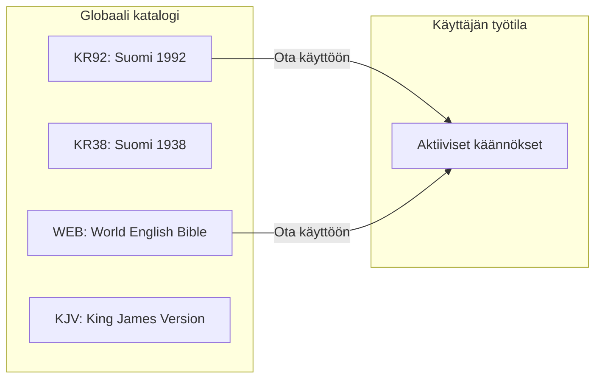
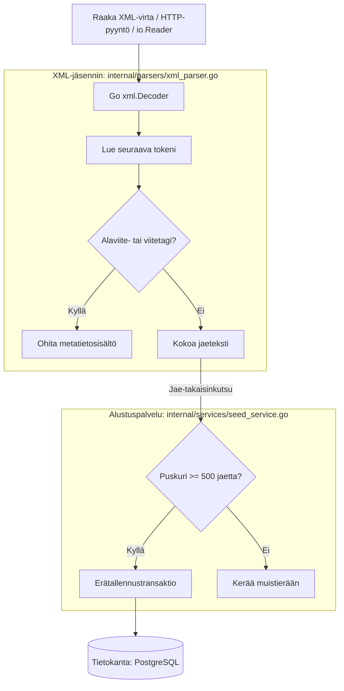

# Käännöskatalogi ja tuontimoottori

clible-v3 tarjoaa monipuolisen raamatunkäännösten hallintajärjestelmän. Käyttäjät voivat ottaa käännöksiä käyttöön globaalista katalogista, ja ylläpitäjät voivat ladata uusia käännöksiä XML-standardimuodoissa suoraan verkkorajapinnan kautta.

---

## 1. Käännösten hallinta käyttöliittymässä

**Käännöskatalogi**-näkymässä (`/translations`) käyttäjät voivat selata ja määrittää saatavilla olevia raamatunversioita:

- **Globaali katalogi**: Esiasennetut vakiokäännökset (kuten suomalaiset KR92 ja KR38, World English Bible ja King James Version) ovat kaikkien käyttäjien saatavilla.
- **Aktivointi ja linkitys**: **Ota käyttöön** -napin klikkaaminen linkittää käännöksen henkilökohtaiseen tiliisi (`POST /api/translations/link`), jolloin se on käytettävissä lukutilassa, haussa, käännösvertailussa ja ISLA-kyselyissä.
- **Käytöstä poisto**: Käännöksen passivointi poistaa sen valitsimista poistamatta itse käännösdataa tietokannasta.



---

## 2. Suorituskykyinen $O(1)$ XML-suoratoistomoottori

Kun uusia käännöksiä tuodaan järjestelmään (`POST /api/translations/import` tai CLI-alustuksen kautta), backend hyödyntää muistitehokasta suoratoistoputkea, joka käsittelee suuretkin XML-tiedostot (3–15+ MB) **$O(1)$ vakioisella muistinkulutuksella**.

### $O(1)$-tuontifilosofia

Perinteiset XML-jäsentimet (kuten DOM-puun rakentajat tai koko tiedoston lukeminen muistiin) kuluttavat helposti 50–100+ MB RAM-muistia, mikä voi kaataa pienimuistiset konttiympäristöt.

clible-v3 käyttää Go-kielen suoratoistavaa tokenijäsennintä (`xml.Decoder`):

- **Peräkkäinen tokenivirta**: Lukee XML-syötettä merkki kerrallaan pitäen muistissa vain nykyisen tagin.
- **Funktionaalinen takaisinkutsukuvio**: Jakeet toimitetaan välittömästi puskuroidulle eräkirjoittimelle.
- **Ei väliaikaistiedostoja levylle**: Suoratoistodata virtaa suoraan HTTP-verkkopyynnöstä tietokantaan.



---

## 3. Tuetut XML-formaatit

Jäsennin tunnistaa automaattisesti kaksi keskeistä avointa raamattustandardia:

### 1. USFX (Unified Scripture Format XML)

Standardi XML-muoto `<v id="1">` -jaetunnisteilla, `<c id="1">` -lukutunnisteilla ja `<ve/>` -päätetunnisteilla:

```xml
<book id="JHN">
  <c id="3"/>
  <v id="16"/>Sillä niin on Jumala maailmaa rakastanut...<ve/>
</book>
```

### 2. OSIS (Open Scriptural Information Standard)

Rakenteellinen teologinen skeema elementtimääritteillä:

```xml
<div type="book" osisID="John">
  <chapter osisID="John.3">
    <verse osisID="John.3.16">For God so loved the world...</verse>
  </chapter>
</div>
```

### Alaviitteiden ja toimituksellisten lisien suodatus

XML-lähdetiedostoissa on usein alaviitteitä (`<f>`) ja ristiviitteitä (`<x>`). Jäsennin ylläpitää `skipDepth`-laskuria:

- Kun havaitaan avaava `<f>` tai `<x>`, laskuri kasvaa ja merkkien keruu keskeytetään.
- Kun havaitaan sulkeva `</f>` tai `</x>`, laskuri pienenee, jolloin indeksoidaan vain puhdas raamatunteksti.

---

## 4. Alustusputki ja puskuroitu erätallennus (500 jaetta)

Palvelukerroksen tuontiputki (`internal/services/seed_service.go`) soveltaa kolmea optimointia:

### 1. Kanonisten kirjojen validointi

Ennen jäsennyksen alkua palvelu lataa 66 kanonisen kirjan määritelmät tietokannasta (`books`-taulu). Ei-kanoniset tekstit (kuten esipuheet tai sanastot) suodatetaan automaattisesti pois.

### 2. Standardoidut kirjalyhenteet

Lähdetiedostoissa käytetään usein kirjavia nimiä (esim. `GENESIS.`, `1KGS`, `JN.`, `ROMA`). Palvelu normalisoi kaikki variantit kanonisiksi 3-kirjaimisiksi ISO-tunnisteiksi (`GEN`, `1KI`, `JHN`, `ROM`).

### 3. Puskuroitu erätallennus (500 jakeen erät)

Kaikkien 31 102 jakeen tallentaminen yksitellen aiheuttaisi vakavaa lukkiutumista ja verkkolatenssia.

Palvelu puskuroi jakeet **500 jakeen ryhmiin** ja suorittaa monirivisiä erälisäyksiä:

- **PostgreSQL**:ssä tämä lyhentää koko Raamatun tuontiajan yli minuutista **alle kahteen sekuntiin**.
- Tiedostovirran päättyessä puskuri tyhjennetään siististi viimeisessä ACID-transaktiossa.

---

## 5. Ylläpidon tuontirajapinta (REST API)

Uuden raamatunkäännöksen lataaminen katalogiin tapahtuu multipart POST -pyynnöllä:

```http
POST /api/translations/import
Content-Type: multipart/form-data
```

### Lomakekentät

- `translationId`: Uniikki slug (esim. `fin-1992`, `kjv`, `vulgate`).
- `name`: Näyttönimi (esim. `Suomi 1992`).
- `language`: 3-kirjaiminen kielikoodi (`FIN`, `ENG`, `LAT`, `GRC`, `HEB`).
- `file`: XML-tiedostoliite.

```bash
# Esimerkki curl-lähetyksestä
curl -X POST http://localhost:8080/api/translations/import \
  -H "Cookie: token=JWT_ISTUNTOSI" \
  -F "translationId=fin-1992" \
  -F "name=Pyhä Raamattu (1992)" \
  -F "language=FIN" \
  -F "file=@/polku/tiedostoon/fin-1992.xml"
```
