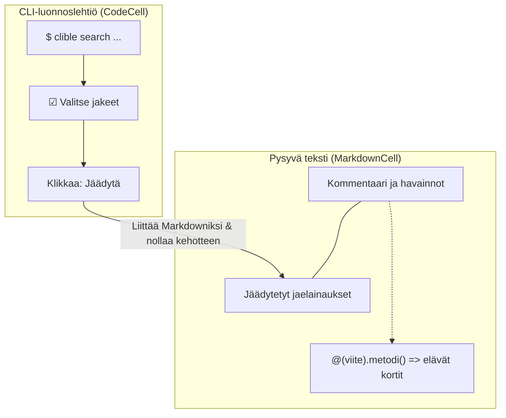

# ISLA v2 -kieliopas

> **ISLA** — *Inline Structure & Logic Architecture*
> *(Myös: Interactive Scripture & Layout Analyzer)*
>
> Täydellinen opas ISLA v2:n objekti–metodi-kyselykieleen — kattaa syntaksin,
> lähdeobjektit, metodit, tulosoperaattorit, älykkäät rajaukset
> ja Monaco/ISLAEditor IntelliSense -kieliälymoottorin.

---

## 1. Yleiskatsaus ja suunnittelufilosofia

ISLA on kyselykieli, jota voi käyttää suoraan Markdown-tutkimusasiakirjoissa. Se yhdistää kaksi tavallista lähestymistapaa:

1. **Staattinen teksti (Markdown)**: Ihanteellinen lukemiseen ja julkaisemiseen, mutta kykenemätön hakemaan tai vertailemaan raamatunkohtia dynaamisesti ilman jatkuvaa leikkaa-liimaa-työtä.
2. **Komentosolut (CLI / REPL)**: Tehokkaita kyselyihin, mutta tuottavat pirstaleisia, solupainotteisia dokumentteja, joita ei voi lukea sujuvana yhtenäisenä kommentaarina.

**ISLA yhdistää nämä lähestymistavat**: kirjoitat Markdownia ja upotat siihen ISLA-komentoja, jotka näyttävät tuloksina jaevertailuja, analyysiyhteenvetoja tai sanapilviä.

### `!` ja `!isla ` -laukaisinetuliitteet

Kun kirjoitat muistiinpanoja tutkimusvihkon **Markdown-soluun**, aloita ISLA-komento etuliitteellä `!` tai `!isla `. Etuliite ilmaisee editorille ja Markdown-muotoilijalle, että kyseessä on suoritettava komento:

```isla
! @(Joh 3:16).vs(KR92, KJV) =>
! search("armo").at(ROM) =>
!isla range(GEN, DEU).count(words) >> Pentateukin sanamäärä
```

> [!TIP]
> Lekseri poistaa `!`- ja `!isla `-etuliitteet ennen AST-jäsennystä. Komennot toimivat näin Markdown-muistiinpanoissa, REST API -rajapinnan kautta ja interaktiivisissa syötekentissä.

### ISLA v2:n objekti-metodi-paradigma

ISLA v2:n kyselyissä käytetään yhtenäistä objekti–metodi-rakennetta:


| Osa-alue | Esimerkissä | Rooli |
|---|---|---|
| **0. Laukaisin** *(valinnainen)* | `!` / `!isla ` | Kertoo suorituksesta Markdown-muistiinpanoissa |
| **1. Objekti** *(pakollinen)* | `@(Joh 3:16)` | Määrittää *mitä* dataa haetaan (`@()`, `range`, `search`, `^`, `#muuttuja`) |
| **2. Metodi(t)** *(valinnainen)* | `.vs(KR92, KJV)` | Muuntaa tai analysoi dataa (`.use`, `.vs`, `.themes`, `.stats`) |
| **3. Tulosoperaattori** *(valinnainen)* | `=> #joh-tutkimus` | Määrittää *minne* tulos sijoitetaan ja tallennetaan (`=>`, `>`, `>>`) |

---

## 2. Viisi esimerkkiä: ISLA ja SQL

ISLA muuntaa kyselyt tietokantatoiminnoiksi. Sen sijaan, että kirjoittaisit SQL-kyselyitä liitoksineen (JOIN), kokotekstihakuineen ja tilastollisine ryhmittelyineen, voit käyttää niitä vastaavia yksirivisiä ISLA-komentoja.

### 1. Rinnakkainen käännösmatriisi: Käännösvertailu
Jakeiden vertaileminen eri kielten tai historiallisten käännösten välillä on ISLA:lla välitöntä, kun taas SQL vaatii monimutkaisia itseliitoksia tai alikyselyitä:

* **ISLA-komento**:
  ```isla
  @(Joh 3:16).vs(KR92, KJV) =>
  ```
* **Vastaava generoitu SQL**:
  ```sql
  SELECT
    v1.verse,
    v1.text AS text_kr92,
    v2.text AS text_kjv
  FROM verses v1
  JOIN verses v2
    ON v1.book_id = v2.book_id
   AND v1.chapter = v2.chapter
   AND v1.verse = v2.verse
  WHERE v1.translation_id = 'kr92'
    AND v2.translation_id = 'kjv'
    AND v1.book_id = 'joh'
    AND v1.chapter = 3
    AND v1.verse = 16;
  ```

### 2. Rajattu sanahaku järjestetyllä kokotekstihaulla (FTS)
Teologisten käsitteiden etsiminen tietyistä tekstiryhmistä (kuten Paavalin kirjeistä) PostgreSQL:n `tsvector`- ja `ts_rank`-relevanssijärjestyksellä:

* **ISLA-komento**:
  ```isla
  search("armo" AND "rauha").at(epistolat).limit(10) =>
  ```
* **Vastaava generoitu SQL**:
  ```sql
  SELECT id, translation_id, book_id, chapter, verse, text
  FROM verses
  WHERE translation_id = 'kr92'
    AND book_id IN ('rom', '1kor', '2kor', 'gal', 'ef', 'fil', 'kol', '1tes', '2tes', '1tim', '2tim', 'tit', 'flm')
    AND to_tsvector('finnish', text) @@ to_tsquery('finnish', 'armo & rauha')
  ORDER BY ts_rank(to_tsvector('finnish', text), to_tsquery('finnish', 'armo & rauha')) DESC
  LIMIT 10;
  ```

### 3. Määrällinen sanastoanalyysi (TTR ja sanatiheys)
Laske sanojen kokonaismäärä, sanaston monimuotoisuus (Type-Token Ratio) ja sanojen yleisyys koko kirjasta tai tekstijaksosta:

* **ISLA-komento**:
  ```isla
  range(ROM, GAL).stats() =>
  ```
* **Vastaava generoitu SQL- ja suoritusputki**:
  ```sql
  WITH passage_tokens AS (
    SELECT regexp_split_to_table(lower(text), '\s+') AS word
    FROM verses
    WHERE translation_id = 'kr92'
      AND book_id IN (
        SELECT id FROM books WHERE order_index BETWEEN 45 AND 48
      )
  )
  SELECT
    count(*) AS token_count,
    count(DISTINCT word) AS unique_token_count,
    round(count(DISTINCT word)::numeric / count(*), 4) AS type_token_ratio,
    avg(length(word)) AS avg_word_length
  FROM passage_tokens
  WHERE length(word) > 0;
  ```

### 4. Kanoniset rinnakkaisviitteet (Cross-References)
Todennettujen raamatullisten ristiviittausten haku hermeneuttisesta relaatiograafista:

* **ISLA-komento**:
  ```isla
  @(Rom 8:28).refs(5) =>
  ```
* **Vastaava generoitu SQL**:
  ```sql
  SELECT v.id, v.translation_id, v.book_id, v.chapter, v.verse, v.text
  FROM cross_references cr
  JOIN verses v
    ON v.book_id = cr.target_book_id
   AND v.chapter = cr.target_chapter
   AND v.verse >= cr.target_verse_start
   AND v.verse <= cr.target_verse_end
  WHERE cr.source_book_id = 'rom'
    AND cr.source_chapter = 8
    AND cr.source_verse = 28
    AND v.translation_id = 'kr92'
  ORDER BY cr.rank ASC
  LIMIT 5;
  ```

### 5. Moniulotteiset laskurit ja frekvenssit
Sanakohtaisten esiintymismäärien laskenta kirjoittain tai luvuittain ilman monimutkaisia GROUP BY -lausekkeita:

* **ISLA-komento**:
  ```isla
  search("armo").at(UT).count(books) >>
  ```
* **Vastaava generoitu SQL**:
  ```sql
  SELECT count(DISTINCT v.book_id) AS matching_books_count
  FROM verses v
  JOIN books b ON v.book_id = b.id
  WHERE v.translation_id = 'kr92'
    AND b.testament = 'NT'
    AND to_tsvector('finnish', v.text) @@ to_tsquery('finnish', 'armo');
  ```

---

## 3. Viisi lähdeobjektia

### `@(Viite)` — Raamattuviite

Lataa yksittäisen jakeen, jaevälin tai kokonaisen luvun:

```isla
@(Joh 3:16) =>
@(Rom 8:28-30) =>
@(1 Kor 13:4-8) =>
@(Ps 23) =>
```

Sulkeet ovat pakolliset ja voivat sisältää välilyöntejä, kaksoispisteitä ja jaevälejä käyttäen standardia `Kirja luku:jae-jae` -merkintää.

### `range(alku, loppu)` / `(alku .. loppu)` — Jakso- ja kirjaväli

Lataa yhtenäisen tekstijakson alkuviitteestä loppuviitteeseen. Kumpikin argumentti voi olla kirja, luku tai yksittäinen jae:

```isla
range(Joh 1:1, Joh 1:18) =>
(MAT .. JOH) =>
@(GEN .. DEU) =>
range(ROM, GAL) =>
range(Ps 1:1, Ps 23:6) =>
```

### `search("kysely")` / `? "kysely"` — Kokoteksti- ja Boolen haku

Suorittaa kokoteksti- tai regex-haun tietokantaan:

```isla
search("armo") =>
? "rauha" =>
search("armo" AND "rauha") =>
search("kuolema" OR "elämä") =>
search(/vanhurska.*/) =>
```

Monisanaisessa tilassa oletusoperaattori on **AND**, jos sanojen väliin ei ole kirjoitettu nimenomaista operaattoria. Regex-kuviot merkitään `/kauttaviivoilla/`.

### `^[n|all]` — Solukonteksti

Viittaa vihkossa edeltävien solujen tekstisisältöön. Erittäin hyödyllinen analyysien tai kyselyiden ajamiseen omasta jo kirjoitetusta tekstistäsi:

```isla
^ =>          — edellinen yksi solu
^3 =>         — edelliset kolme solua
^all =>       — kaikki tämän vihkon edeltävät solut
```

Solukontekstiolio ratkaistaan palvelinpäässä: vihkon ympäröivä teksti lähetetään API-pyynnössä, puhdistetaan olemassa olevista ISLA-komennoista ja välitetään analyysimoottorille.

### `#muuttuja` — Nimetty muuttujaviite

Viittaa edellisen kyselyn tulokseen, joka on tallennettu nimettyyn muuttujaan käyttäen operaattoria `=> #muuttuja`, `> #muuttuja` tai `>> #muuttuja`.
Muuttuja toimii ensiluokkaisena oliona, johon voit ketjuttaa analyysimetodeja tekemättä uutta tietokantakyselyä:

```isla
search("armo").at(UT) => #armo
#armo.count(words) =>
#armo.top(10) =>
#armo.stats >> #armo-tilastot
```

---

## 4. Metodireferenssi

Metodit ketjutetaan objektin perään pistenotaatiolla: `.metodinNimi(argumentit)`.
Ne suoritetaan järjestyksessä vasemmalta oikealle.

### `.use(käännösID)` — Käännöksen valinta

Pakottaa tietyn raamatunkäännöksen syrjäyttäen älykkään skooppipäättelyn:

```isla
@(Joh 3:16).use(KR92) =>
@(Joh 3:16).use(KJV) =>
search("grace").use(WEB).limit(5) =>
```

**Sallittu objekteille:** `@()`, `range()`, `search()`, `#muuttuja`

### `.vs(käännös1, käännös2)` — Rinnakkainen käännösvertailu

Esittää tekstin kahdesta käännöksestä rinnakkain synkronoidussa vertailumatriisissa:

```isla
@(Joh 3:16).vs(KR92, KJV) =>
@(Rom 5:1).vs(KR92, KR38) =>
@(Ps 23).vs(WEB, KJV) >>
```

**Sallittu objekteille:** `@()`, `#muuttuja`

### `.refs(n)` — Rinnakkaisviitteet (Cross-References)

Hakee jakeelle jopa `n` kanonista rinnakkaisviitettä tietokannasta (oletus: 5):

```isla
@(Joh 3:16).refs(3) =>
@(Rom 8:28).refs() >>
```

**Sallittu objekteille:** `@()`, `#muuttuja`

### `.at(skooppi)` — Haun rajaus

Rajaa haun tiettyyn kirjaan tai tekstiryhmään (katso [Älykkäät rajaukset](#6-älykkäät-rajaukset)):

```isla
search("armo").at(epistolat) =>
search("grace").at(epistles).limit(10) =>
search("kuningas").at(historia) >>
```

**Sallittu objekteille:** Vain `search()`

### `.limit(n)` — Tulosten enimmäismäärä

Rajoittaa tulosjoukon enintään `n` jakeeseen:

```isla
search("valo").at(evankeliumit).limit(5) =>
search("armo").limit(20) >>
```

**Sallittu objekteille:** Vain `search()`

### `.count([yksikkö])` — Määrälaskuri

Laskee osumien määrän. Valinnainen `yksikkö`-parametri ohjaa laskentadimensiota:

| Yksikkö | Aliakset | Mitä lasketaan |
|---|---|---|
| `verses` *(oletus)* | `verse`, `v`, `jakeet`, `jae` | Osumajakeiden kokonaismäärä |
| `words` | `word`, `w`, `sanat`, `sana` | Sanojen kokonaismäärä |
| `unique_words` | `uw`, `uniques`, `uniikit`, `sanasto` | Uniikit sanamuodot |
| `chapters` | `chapter`, `c`, `luvut`, `luku` | Mukana olevien lukujen määrä |
| `books` | `book`, `b`, `kirjat`, `kirja` | Mukana olevien kirjojen määrä |

```isla
search("armo" AND "rauha").at(epistolat).count() =>
range(GEN, DEU).count(words) =>
search("armo").at(UT).count(books) >>
```

**Sallittu objekteille:** Kaikki objektit

### `.top(n)` — Sanatiheyslistaus

Erottaa aineistosta `n` yleisintä sanaa ja palauttaa järjestetyn frekvenssilistan. Sisältää täydelliset analytiikkatiedot: sanamäärä, uniikit sanat ja TTR-arvo.

Oletuksena sanat lasketaan **sellaisenaan** (taivutusmuodot erillään). Voit yhdistää suomen kielen taivutusmuodot perusmuotoonsa lisäämällä lemmatisointimääreen ennen `.top()`-kutsua:

```isla
range(ROM, GAL).top(15) =>
range(ROM, GAL).lemma().top(15) =>
search("armo").at(epistolat).top(10) >>
^all.cluster().top(20) =>
```

**Sallittu objekteille:** Kaikki objektit

### `.ngrams(koko, [raja])` — Bigram- ja trigram-fraasit

Palauttaa yleisimmät peräkkäiset sanaparit tai kolmikot valitusta tekstistä.
Käytä arvoa `2` bigrameille ja `3` trigrameille. Valinnainen `raja` määrittää tulosten enimmäismäärän (oletus: `10`).

```isla
! @(Joh 7).ngrams(2, 3) =>
! @(Joh 7).ngrams(3, 10) =>
! ^.ngrams(2, 10) =>
```

| Argumentti | Sallitut arvot | Esimerkki |
|---|---|---|
| `koko` | `2` (bigramit) tai `3` (trigramit) | `.ngrams(2, 10)` |
| `raja` | Kokonaisluku väliltä `1`–`1000`; oletus `10` | `.ngrams(3, 5)` |

**Sallittu objekteille:** Kaikki objektit

### `.lemma()` / `.categorize()` / `.cluster()` — Suomen kielen lemmatisointi

Nämä kolme **suoritusputkimäärettä** ovat toistensa synonyymejä: mikä tahansa niistä aktivoi suomen kielen morfologisen perusmuotoistuksen seuraavalle `.top(n)` -kutsulle. Määre voi sijaita missä tahansa kohtaa metodiketjua.

| Metodi | Näkökulma | Vaikutus |
|---|---|---|
| `.lemma()` | Lingvistinen | "Lemmatisoi sanat ennen laskentaa" |
| `.categorize()` | Teema | "Ryhmittele taivutusmuodot sanaluokkiin" |
| `.cluster()` | Tilastollinen | "Klusteroi variantit saman sanavartalon alle" |

**Valinnainen totuusarvo:** `.lemma(true)` ottaa käyttöön (oletus), `.lemma(false)` poistaa käytöstä.

```isla
! ^.cluster().top(10)                        — solukonteksti lemmatisoituna
! range(MAT, JOH).lemma().top(15) =>          — jakso lemmatisoituna
! search("armo").at(UT).categorize().top(10)  — haku lemmatisoituna
```

**Ilman lemmatisointia** — taivutusmuodot ovat erillään:
- jeesus (5), jeesuksen (4), kristus (4), kristuksen (4)

**Lemmatisoinnin kanssa (`.lemma()`)** — muodot yhdistyvät:
- Jeesus (9), Kristus (8)

Lemmatisoija hyödyntää kaksivaiheista putkea:
1. **Sanakirjahaku** — yli 300 käsin kuratoitua suomalaista teologista ydinsanaa (Jeesus, Kristus, Jumala, Herra, armo, rakkaus, usko, synti, pelastus, vanhurskaus jne.).
2. **Sääntöpohjainen liitepoisto** — poistaa liitepartikkelit (`-kin`, `-kaan`), omistusliitteet (`-ni`, `-mme`), sijapäätteet (`-ssa`, `-sta`, `-lle`, `-ksi`) ja monikon tunnukset.

**Sallittu objekteille:** Kaikki objektit

### `.stats()` — Leksikaalinen tilastoanalyysi

Laskee kattavat sanastolliset tunnusluvut aineistolle:

| Mittari | Kuvaus |
|---|---|
| `token_count` | Sanojen kokonaismäärä |
| `unique_token_count` | Uniikit sanamuodot |
| `hapax_legomena_count` | Vain kerran esiintyvät sanat |
| `hapax_legomena_ratio` | Hapax-sanat suhteessa kaikkiin sanoihin |
| `type_token_ratio` | Sanaston monimuotoisuus (TTR): uniikit / kaikki |
| `character_count` | Merkkien kokonaismäärä |
| `avg_word_length` | Sanojen keskimääräinen pituus kirjaimina |

```isla
@(Rom 8:1-39).stats() =>
range(GEN, DEU).stats() >>
^all.stats() =>
```

**Sallittu objekteille:** Kaikki objektit (alias: `.ttr()`)

### `.themes(n)` — Teemallisten avainsanojen erottelu

Erottaa tekstistä `n` keskeisintä teema-avainsanaa ja esittää ne tyyliteltynä sanapilvenä:

```isla
@(Joh 3:16).themes(5) =>
range(Joh 1:1, Joh 1:18).themes(8) >>
^all.themes(10) =>
```

**Sallittu objekteille:** Kaikki objektit

### `.suggest(n)` — Kontekstuaaliset raamattusuositukset

Palauttaa jopa `n` aihepiiriltään liittyvää raamatunkohtaa solun tekstin tai hakutulosten avainsanojen perusteella:

```isla
@(Joh 3:16).suggest(3) =>
^.suggest(5) =>
^all.suggest(10) >>
```

**Sallittu objekteille:** Kaikki objektit

---

## 5. Tulosoperaattorit

Jokaisen ISLA-lausekkeen lopussa on tulosoperaattori, joka määrittää, mihin tulos piirtyy.

### `=>` — Saman solun upotus (Inline) ja muuttujasijoitus

Renderöi tuloksen nykyisen muistiinpanosolun sisälle korvaten raa'an komennon lukutilassa. Voi valinnaisesti tallentaa tuloksen nimettyyn muuttujaan tunnuksella `#muuttuja`:

```isla
@(Joh 3:16).vs(KR92, KJV) =>
search("armo").at(epistolat) => #armo
#armo.count(words) =>
```

### `>` — Uusi solu yläpuolelle

Luo uuden tulossolun **suoraan nykyisen solun yläpuolelle**. Operaattorin perään voi kirjoittaa valinnaisen nimen tai `#slug`-tunnisteen:

```isla
range(ROM, GAL).top(15) > Kirjeiden sanatiheydet
@(Joh 3:16).refs() > #joh316-viitteet
search("armo").count(books) >
```

### `>>` — Uusi solu alapuolelle

Luo uuden tulossolun **suoraan nykyisen solun alapuolelle**:

```isla
search("armo" AND "rauha").at(epistolat).stats() >> Kirjeiden analytiikka
^all.themes(10) >> #vihkon-teemat
range(GEN, DEU).count(words) >>
```

> [!TIP]
> Nimetyt solut (esim. `>> #tulokset` tai `>> Analyysini`) näyttävät nimensä tyylikkäänä otsikkotunnisteena tuloskortin yläpuolella, mikä tekee monisoluisista vihkoista helposti luettavia ja navigoitavia.

---

## 6. Älykkäät rajaukset

Kun `.at(skooppi)`-metodille annetaan tunnistettu tekstiryhmä tai sen suomen- tai englanninkielinen nimi, ISLA valitsee ryhmälle sopivan raamatunkäännöksen:

| Rajauksen tunniste | Kirjat | Automaattisesti valittu käännös | Esimerkki |
|---|---|---|---|
| `epistolat` / `kirjeet` | Paavalin ja yleiset kirjeet (ROM..JUD) | **KR92** | `search("armo").at(epistolat)` |
| `epistles` / `letters` | Paavalin ja yleiset kirjeet (ROM..JUD) | **WEB** | `search("grace").at(epistles)` |
| `evankeliumit` / `evankeliumi` | Evankeliumit (MAT, MRK, LUK, JHN) | **KR92** | `search("valkeus").at(evankeliumit)` |
| `gospels` / `gospel` | Evankeliumit (MAT, MRK, LUK, JHN) | **WEB** | `search("light").at(gospels)` |
| `toora` / `laki` | Pentateukki (GEN..DEU) | **KR92** | `search("liitto").at(toora)` |
| `torah` / `law` | Pentateukki (GEN..DEU) | **WEB** | `search("covenant").at(torah)` |
| `viisaus` / `wisdom` | Viisauskirjallisuus (JOB..SNG) | Kielen mukaan | `search("viisaus").at(viisaus)` |
| `profeetat` / `prophets` | Profeetat (ISA..MAL) | Kielen mukaan | `search("herra").at(profeetat)` |
| `historia` / `history` | Historiakirjat (JOS..EST) | Kielen mukaan | `search("kuningas").at(historia)` |
| `VT` / `OT` | Vanha testamentti | Kielen mukaan | `search("armo").at(VT).count()` |
| `UT` / `NT` | Uusi testamentti | Kielen mukaan | `search("armo").at(UT).count()` |

Yksittäiset kirjatunnisteet (`Joh`, `ROM`, `Ps`, `GEN` jne.) toimivat myös rajauksina.

> [!TIP]
> **Käännöksen valinta:** Lisää `.use(käännösID)`-metodi `.at(skooppi)`-metodin perään, jos haluat valita käännöksen itse:
> `search("grace").at(epistolat).use(KJV) =>`

---

## 7. Vihkointegraatio ja hybridityönkulut

ISLA-lausekkeet upotetaan suoraan **Markdown-soluihin** Clible-vihkossa:

```markdown
Paavalin käsitys vanhurskauttamisesta perustuu uskoon:

@(Rom 5:1).vs(KR92, KJV) =>

Sana "armo" hallitsee tätä osiota:

search("armo" AND "rauha").at(epistolat).top(8) >>
```

**Lukutilassa** (muokkaustilan ulkopuolella):
1. **Puhdas typografia**: Raaka ISLA-syntaksi piilotetaan ja sen tilalle piirretään tyylikkäät raamattukortit.
2. **Leijuva tarkastelu**: Hiiren vieminen kortin päälle paljastaa pienen `✦ @(Rom 5:1).vs(KR92, KJV) =>` -tunnuksen oikeassa yläkulmassa.

### CLI-luonnoslehtiön työnkulku

CLI-luonnoslehtiösolu (etuliite `$ clible`) tarjoaa interaktiivisen tutkimusympäristön:

1. Aja komento `$ clible search "armo" --scope=ROM` selataksesi tuloksia.
2. Käytä valintaruutuja merkitäksesi tärkeät jakeet.
3. Klikkaa **Jäädytä** (Freeze) — valitut jakeet liitetään pysyväksi Markdown-soluksi ja CLI-syöte nollautuu heti uutta hakua varten.



---

## 8. ISLAEditor ja kieliäly

**ISLAEditor** tuo reaaliaikaisen kieliälyn solueditoriin kevyellä kerrosmallilla ja automaattisilla kirjoituseleillä:

### Kerrosmalli (Overlay) ja reaaliaikainen korostus

Raskaiden koodieditorikirjastojen sijaan ISLAEditor käyttää suorituskykyistä **kerrosmallia**:

```
┌──────────────────────────────────────────────────────────────────────┐
│ div.relative (kääre)                                                 │
│ ├─ div[aria-hidden] ISLASyntaxLayer  ← väritetty token-kerros        │
│ │   ├─ @(          ← kulta (laukaisin)                               │
│ │   ├─ Joh 3:16   ← syaani (viite)                                   │
│ │   └─ .vs(       ← fuksia (metodi)                                  │
│ └─ <textarea>      ← läpinäkyvä teksti, näkyvä kultainen kohdistin   │
└──────────────────────────────────────────────────────────────────────┘
```

`<textarea>` hoitaa näppäimistösyötteen ja valinnat läpinäkyvällä tekstillä, kun taas `aria-hidden`-kerros piirtää värikoodatut `<span>`-tokenit tarkasti kohdistettuna.

### Älykkäät kirjoituselealyt

1. **Älykäs `!` -komentoele**: Huutomerkin `!` kirjoittaminen tyhjälle riville lisää välilyönnin `! ` ja avaa heti ISLA-mallivalikon.
2. **Älykäs `@` -jaeele**: `@`-merkin kirjoittaminen tuottaa `@()` ja asettaa kohdistimen sulkeiden sisään `@(|)` ehdottaakseen raamatunkirjoja.
3. **Automaattiset sulkuparit**: Merkkien `(`, `"` tai `'` kirjoittaminen lisää sulkuparin ja asettaa kohdistimen merkkien väliin.
4. **Valinnan kääre**: Tekstin maalaaminen ja merkin `@`, `(`, `"` tai `'` painaminen käärii valinnan tuhoamatta tekstiä.
5. **Ylikirjoitusohitus**: Sulkevan merkin kirjoittaminen sulun edessä hyppää sen yli.
6. **Token-parin poisto**: Backspace `@(|)` -rakenteen sisällä poistaa koko tunnisteen kerralla.

### Automaattitäydennyksen laukaisimet

| Kirjoitettu teksti | Tarjottu täydennys |
|---|---|
| `!` | ISLA-juurikyselymallit (`@(Joh 3:16) =>`, `search("armo") =>`) |
| `@(` | Kirjanimiehdotukset (`Joh`, `ROM`, `GEN`, ...) ja genreryhmät |
| `search(` / `?` | Hakupohjat: merkkijonoliteraali, Boolen haku, regex |
| `range(` / `(` | Kirja- ja lukuvälit `..`-syntaksilla |
| `#` | Muuttujapohjat (`! #armo.top(10) =>`) |
| `.` | Kaikki kyseiselle objektille sallitut metodit |
| `.at(` | Kaikki skooppitunnisteet ja kirjanimet |
| `.use(` | Asennettujen käännösten tunnisteet |
| `.vs(` | Kahden käännöksen vertailupohjat |

### Metodien ohjeet ja Levenshtein-korjausehdotukset

Hiiren vieminen minkä tahansa ISLA-avainsanan tai -metodin päälle näyttää tyyppisignatuurin ja esimerkin. Tuntemattomat metodinimet laukaisevat Levenshtein-etäisyyssovituksen:

```
isla: unknown method .cnt()
      Did you mean: .count() ?
```

---

## 9. ISLA v2 -syntaksitiivistelmä

| Kyselymalli | Lauseke | Tulostyyppi |
|---|---|---|
| **Jaehaku, oletuskäännös** | `@(Joh 3:16) =>` | Jaekortti |
| **Pakota tietty käännös** | `@(Joh 3:16).use(KR92) =>` | Jaekortti |
| **Rinnakkainen käännösvertailu** | `@(Joh 3:16).vs(KR92, KJV) =>` | Vertailumatriisi |
| **Tekstijakso** | `range(Joh 1:1, Joh 1:18) =>` | Jaekokoelma |
| **Monen kirjan väli (piste-piste)** | `(MAT .. JOH).count(books) =>` | Lukumäärä |
| **Rinnakkaisviitteet** | `@(Joh 3:16).refs(5) =>` | Jaekokoelma |
| **Teema-avainsanat** | `@(Joh 3:16).themes(5) =>` | Sanapilvi |
| **Kontekstuaaliset suositukset** | `^.suggest(5) =>` | Jaekokoelma |
| **Yksittäinen hakusana** | `search("armo") =>` | Jaelista |
| **Pikahaku** | `? "armo" =>` | Jaelista |
| **Boolen AND -haku** | `search("armo" AND "rauha") =>` | Jaelista |
| **Boolen OR -haku** | `search("kuolema" OR "elämä") =>` | Jaelista |
| **Regex-haku** | `search(/vanhurska.*/).at(ROM) =>` | Jaelista |
| **Rajattu haku** | `search("valo").at(evankeliumit) =>` | Jaelista |
| **Rajattu haku limiitillä** | `search("armo").at(epistolat).limit(5) =>` | Jaelista |
| **Muuttujasijoitus (inline)** | `search("armo").at(UT) => #armo` | Jaelista + `#armo`-merkki |
| **Muuttujan metodiketjutus** | `#armo.count(words) =>` | Lukumäärä |
| **Muuttujan frekvenssit** | `#armo.top(10) =>` | Frekvenssilista |
| **Jaemäärä** | `search("armo").at(UT).count() =>` | Lukumäärä |
| **Sanamäärä** | `range(GEN, DEU).count(words) =>` | Lukumäärä |
| **Leksikaalinen tilastoanalyysi** | `range(ROM, GAL).stats() =>` | Tilastokortti |
| **Sanatiheydet** | `range(ROM, GAL).top(15) =>` | Frekvenssilista |
| **Bigram-fraasit** | `@(Joh 7).ngrams(2, 10) =>` | Frekvenssilista |
| **Trigram-fraasit** | `^.ngrams(3, 10) =>` | Frekvenssilista |
| **Lemmatisoidut frekvenssit** | `range(ROM, GAL).lemma().top(15) =>` | Frekvenssilista (yhdistetyt muodot) |
| **Solukontekstin klusterointi** | `^.cluster().top(10) =>` | Frekvenssilista (yhdistetyt muodot) |
| **Kategorisointi + haku** | `search("armo").at(UT).categorize().top(10) =>` | Frekvenssilista (yhdistetyt muodot) |
| **Tuloste uuteen soluun alapuolelle** | `search("armo").at(epistolat).stats() >>` | Nimetty tulossolu |
| **Tuloste uuteen soluun yläpuolelle** | `@(Joh 3:16).refs() > Rinnakkaisviitteet` | Nimetty tulossolu |
| **Solukontekstin analytiikka** | `^all.themes(10) =>` | Sanapilvi |
| **Monimetodinen ketjutus** | `search("armo").at(epistolat).limit(10).top(5) =>` | Frekvenssilista |

---

## 10. Nimi ja omistus

Nimi **ISLA** kunnioittaa *Isla Auroraa*, symboloiden kirkkautta, selkeyttä ja eleganttia rakennetta.

Jokainen ISLA-moottorin suorittama kysely edustaa sitoutumista puhtaaseen koodiin, ohjelmoinnin iloon ja kestävään avoimen lähdekoodin arvoon.

---

## Katso myös

- [Kirkkovuosikalenteri ja hetkipalvelukset](/fi/guide/liturgical-calendar) — Kirkkovuosiaineisto ja päivittäiset rukoushetket.
- [Haku ja tekstianalytiikka](/fi/guide/search-and-analytics) — Frekvenssianalyysi, teemaerottelu ja tilastolliset mittarit.
