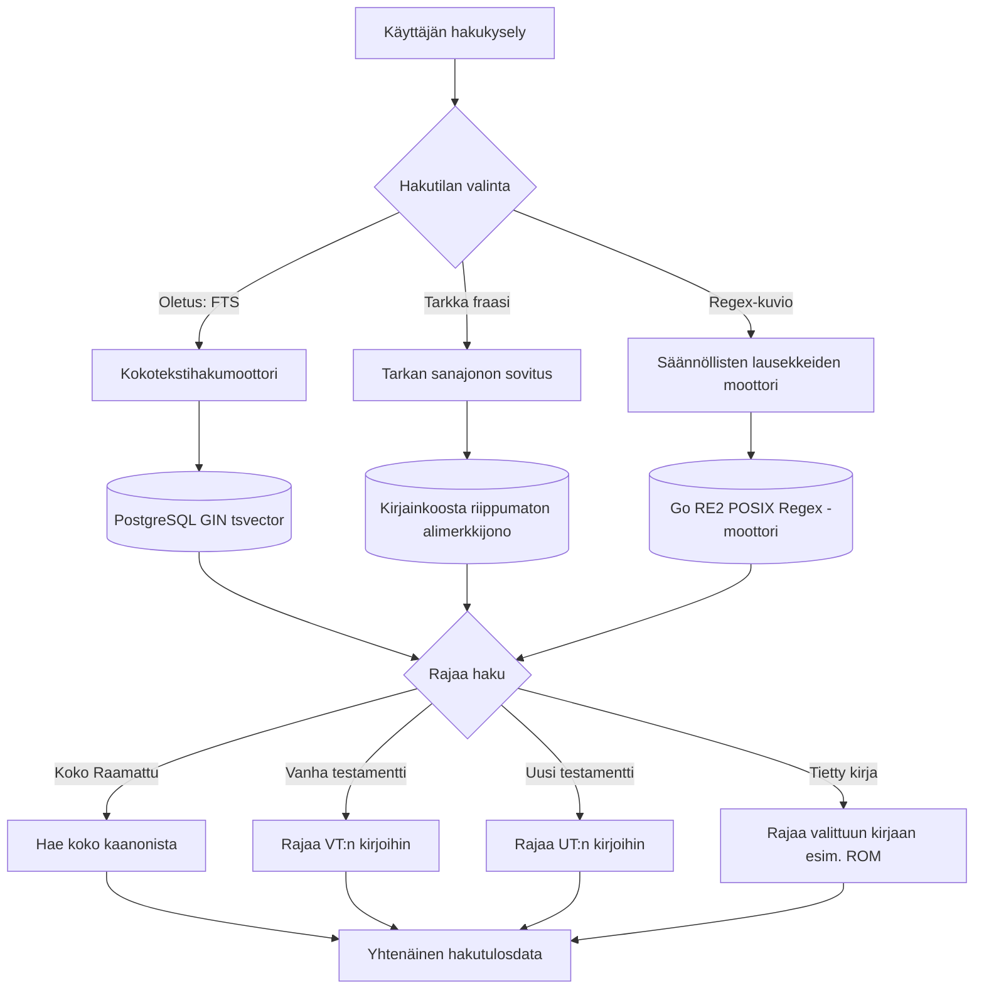

# Haku ja tekstianalyysi

clible-v3 tarjoaa hakutyökaluja yksittäisten jakeiden etsimiseen ja raamatuntekstien kielelliseen tarkasteluun eri käännöksissä.

---

## 1. Hakumoottorin tilat ja ominaisuudet

Alusta tukee kolmea toisistaan erottuvaa hakutilaa:



### Kokotekstihaku (FTS)

- **PostgreSQL**: Haut suoritetaan **GIN-indeksoidulla** `to_tsvector('simple', text) @@ to_tsquery('simple', ...)` -kyselyllä. Indeksi nopeuttaa hakua kymmenientuhansien jakeiden joukosta.
- **SQLite-testit**: Yksikkötesteissä hyödynnetään **FTS5-virtuaalitaulua**, joka synkronoidaan automaattisilla triggereillä.
- **Monisanahaut**: Tukee usean hakusanan yhdistelmiä ja osumien järjestämistä relevanssin mukaan.

### Fraasihaku

Etsii tarkan peräkkäisen sanajonon kirjainkoosta riippumatta:

```text
"vanhurskaaksi uskosta"
"taivasten valtakunta"
"armo ja rauha"
```

### Säännölliset lausekkeet (Regex)

Kielitieteelliseen ja morfologiseen analyysiin voit aktivoida **Regex**-kytkimen hakukentän vierestä. Haut arvioidaan Go-kielen turvallisella `regexp` (RE2) -moottorilla:

- `/vanhurska.*/` — Löytää muodot *vanhurskas*, *vanhurskaus*, *vanhurskauttaa*.
- `/\b(valkeus|valo)\b/` — Etsii täsmälliset sanat *valkeus* tai *valo*.
- `/liitto.*veri/` — Etsii jakeet, joissa sanaa *liitto* seuraa myöhemmin sana *veri*.

---

## 2. Haun rajaus

Voit rajata minkä tahansa haun tiettyyn raamatunosioon hakutulosten tarkentamiseksi:

| Rajaus | Kohdealue | Kuvaus |
|---|---|---|
| **Koko Raamattu (`all`)** | 1. Moos.–Ilm. | Etsii kaikista 66 kanonisesta kirjasta. |
| **Vanha testamentti (`ot`)** | 1. Moos.–Mal. | Rajaa haun heprealaisen kaanonin 39 kirjaan. |
| **Uusi testamentti (`nt`)** | Matt.–Ilm. | Rajaa haun kreikankielisen UT:n 27 kirjaan. |
| **Tietty kirja (`book`)** | esim. `ROM`, `JHN`, `GEN` | Rajaa haun tarkasti vain valittuun kirjaan. |

---

## 3. Hakuhistoria ja nopea uudelleenhaku

Jokainen suoritettu haku tallentuu automaattisesti henkilökohtaiseen **Hakuhistoriaasi**:

- **Aikaleima ja tila**: Tallentaa hakulausekkeen, hakutavan (kokoteksti, fraasi tai regex), käännöksen ja rajauksen.
- **Tulosten määrä**: Näyttää löytyneiden jakeiden lukumäärän yhdellä silmäyksellä.
- **Uusi haku yhdellä napsautuksella**: Valitse historiasta aiempi haku, niin se suoritetaan uudelleen ilman hakutekstin kirjoittamista.
- **Synkronoitu istuntojen yli**: Hakuhistoria tallentuu tietokantaan ja kulkee mukanasi eri laitteilla.

---

## 4. Tekstianalytiikkamoottori

**Analytiikka**-näkymä (`/analytics`) tarjoaa numeerisia ja tilastollisia näkökulmia raamatuntekstin sanastoon, kielelliseen monimuotoisuuteen ja tyylillisiin piirteisiin.

```
┌────────────────────────────────────────────────────────────────────────┐
│  Tekstianalytiikka: Johannes 3 (Pyhä Raamattu 1992)                    │
│  ────────────────────────────────────────────────────────────────────  │
│  Sanoja yhteensä  │  Uniikkeja sanoja │  Sanaston rikkaus (TTR)        │
│  789              │  210              │  0.266 (26.6%)                 │
│  ─────────────────┴───────────────────┴──────────────────────────────  │
│  Yleisimmät sanat:                                                     │
│  1. Jumala (14)    2. elämä (11)    3. uskoa (9)    4. valo (8)        │
└────────────────────────────────────────────────────────────────────────┘
```

### 1. Sanaston rikkaus ja sanastolliset mittarit

- **Sanoja yhteensä**: Valitun luvun tai jakson kokonaissanamäärä.
- **Uniikit sanat**: Esiintyvien eri sanamuotojen määrä.
- **Sanaston rikkaus (Type-Token Ratio / TTR)**:
  $$\text{TTR} = \frac{\text{Uniikit sanat}}{\text{Kaikki sanat}}$$
  Korkeampi suhdeluku viittaa rikkaaseen ja vaihtelevaan sanastoon (tyypillistä kirjekirjallisuudelle kuten Heprealaiskirjeelle), kun taas matalampi luku kertoo toistuvasta, teemallisesta sanastosta (tyypillistä Johanneksen teksteille).
- **Hapax legomena**: Laskee sanat, jotka esiintyvät tekstijaksossa vain kerran. Täydentää TTR-arvoa nostamalla esiin harvinaiset sanat.

### 2. Sanatiheydet ja frekvenssilistat

- Erittelee tekstin yleisimmät sanat poistaen välimerkit ja normalisoiden kielen.
- Piirtää interaktiiviset pylväsdiagrammit ja sanajakaumataulukot.

### 3. Käännösvertailumatriisi

Vertailee samaa tekstijaksoa kahdesta eri käännöksestä rinnakkain:

- **Samankaltaisuusasteikko**: Laskettu leksikaalinen vastaavuus käännösten välillä.
- **Tekstierojen korostus**: Korostaa käännösten lisäykset, poistot ja ilmaisuerot (esim. KR92:n ja KR38:n tai KJV:n ja WEB:n välillä).

---

## 5. Tekoälyavusteiset tutkimustyökalut

Kun palvelimelle on määritetty Google Gemini API -avain, clible-v3 tarjoaa tekoälyavusteisia tutkimustyökaluja käyttöliittymässä:

- **Teologiset näkökulmat**: Tuottaa huomioita esimerkiksi liitoista, historiallisesta taustasta ja kirjallisista teemoista.
- **Alkukielten analyysit**: Kreikan ja heprean kantasanajakaumat, kieliopillinen morfologia ja sanakirjalinkitykset.
- **Semanttinen haku**: Esitä aiheesta kysymys omin sanoin ja hae siihen liittyviä jakeita. Gemini muodostaa kysymyksestä kokotekstihaun; haku voi lisäksi täydentyä tunnistetun raamatunkohdan jakeilla. [Lue lisää semanttisesta hausta](/fi/guide/ai-study-tools).
- **Käännösvertailu tekoälyn avulla**: Tarkastele kahden käännöksen teologisia sävyeroja.
