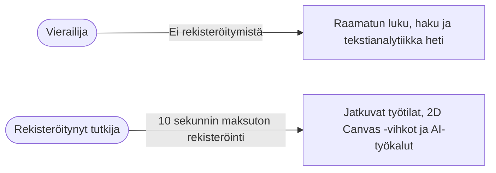

# Käyttöehdot ja tietosuojaseloste

*Päivitetty viimeksi: 31. elokuuta 2026*

Tervetuloa käyttämään **Clible**-alustaa (`clible-v3`) — avointa, web-natiivia ympäristöä raamatuntutkimukseen, leksikaaliseen analytiikkaan ja 2D canvas -tutkimusvihkoihin.

Uskomme, että tutkimustyökalujen tulee olla läpinäkyviä, kunnioittaa käyttäjän yksityisyyttä ja olla vapaita kaupallisesta datankalastelusta. Tämä asiakirja kuvaa käyttöehtomme ja tietosuojakäytäntömme.

---

## 1. Soveltamisala ja hyväksyminen

Käyttämällä Clibleä (joko **Vierastilassa** tai **Rekisteröityneenä käyttäjänä**) sitoudut näihin käyttöehtoihin ja tietosuojaselosteeseen. Mikäli et hyväksy ehtoja, voit vapaasti jättää palvelun käyttämättä.

---

## 2. Käyttäjätilit ja reilu käyttö

### Vaivaton rekisteröityminen

* Tilin luominen vaatii ainoastaan toimivan **sähköpostiosoitteen** ja turvallisen **salasanan**.
* Emme kerää puhelinnumeroita, oikeita nimiä, luottokortteja tai tarpeettomia profiilitietoja.
* Rekisteröityminen vie alle 10 sekuntia ja avaa pääsyn työtilojen pilvitallennukseen, vihkojen synkronointiin ja teologisiin AI-ominaisuuksiin.

### Tilin tietoturva ja salasanat

* Kaikki salasanat suojataan vahvalla **bcrypt**-tiivistyksellä ennen tallennusta.
* Salasanoja ei koskaan tallenneta selväkielisenä, eivätkä palvelimen ylläpitäjät voi nähdä niitä.

### Tilin sulkeminen ja tietojen poisto

* Omistat omat tietosi ja voit pyytää tilisi poistamista milloin tahansa.
* Tilin poistaminen hävittää pysyvästi käyttäjäprofiilisi, liitetyt käännöksesi, yksityiset työtilasi ja hakuhistoriasi tietokannasta.

---

## 3. Tietosuojaseloste (GDPR-yhdenmukainen)

Noudatamme tiukasti sisäänrakennetun yksityisyyden (Privacy by Design) periaatetta:

### Mitä tietoja tallennamme

| Tietotyyppi | Käyttötarkoitus | Säilytys ja suojaus |
| :--- | :--- | :--- |
| **Sähköpostiosoite** | Tilin tunnistaminen ja istunnon todennus | PostgreSQL `users`-taulu |
| **Salasanatiiviste** | Turvallinen kirjautumisen varmennus | Kryptografinen bcrypt-tiiviste |
| **Tutkimustyötilat** | Projektien, tallennettujen hakujen ja analyysien säilytys | PostgreSQL `scopes`- ja `saved_*`-taulut |
| **2D Canvas -tutkimusvihkot** | Tutkimusmuistiinpanojen, korttien ja ISLA-skriptien säilytys | PostgreSQL `notebooks`- ja `cells`-taulut |
| **Hakuhistoria** | Aiempien hakujen nopea uudelleenavaus | PostgreSQL `search_history` (käyttäjäeristetty) |

### Mitä emme KOSKAAN tee

* ❌ **Ei kolmannen osapuolen mainosseurantaa**: Emme käytä Google Analyticsia, mainosevästeitä tai käyttäytymisen seurantajärjestelmiä.
* ❌ **Ei tietojen myyntiä**: Emme koskaan myy, vuokraa tai luovuta henkilö- tai tutkimustietojasi kolmansille osapuolille.
* ❌ **Ei AI-koulutusta muistiinpanoillasi**: Yksityisiä tutkimusmuistiinpanojasi ei koskaan käytetä julkisten kaupallisten AI-mallien koulutukseen.

---

## 4. Raamatuntekstit ja immateriaalioikeudet

### Käännösoikeudet

* Cliblessä saatavilla olevat raamatunkäännökset (kuten suomalaiset KR92, KR38, 1776, World English Bible, SBLGNT ja heprealainen MT) on tarkoitettu henkilökohtaiseen opiskeluun, tutkimukseen ja ei-kaupalliseen opetuskäyttöön.
* Yksityiskohtaiset lähdetiedot ja tekijänoikeudet löytyvät arkiston [`NOTICE.md`](https://github.com/mvirtai/clible-v3-go) -tiedostosta.

### Käyttäjän oma sisältö

* Omistat **100 % immateriaalioikeudet** kaikkiin omiin tutkimusmuistiinpanoihisi ja eksegeettisiin kortteihisi.
* Clible ei vaadi mitään tekijänoikeuksia tai kaupallisia oikeuksia käyttäjien tuottamiin aineistoihin.

---

## 5. Teologiset AI-työkalut ja vastuuvapauslauseke

Clible tarjoaa Google Gemini AI -tekoälyn tukemaa leksikaalista älyä eksegetiikan apuvälineeksi.

> [!IMPORTANT]
> **Vastuuvapauslauseke**:
> Tekoälyn tuottamat analyysit ovat laskennallisia tiivistelmiä ja apuvälineitä. Ne **eivät** edusta virallista kirkollista oppia tai erehtymätöntä teologista tulkintaa. Tutkijoita kehotetaan aina varmentamaan havainnot alkukielten käsikirjoituksista ja tieteellisistä sanakirjoista (kuten BDAG, HALOT).

---

## 6. Avoin lähdekoodi ja lisenssi

Cliblen lähdekoodi on julkaistu **PolyForm Noncommercial License 1.0.0** -lisenssillä. Lisenssi sallii vapaan käytön, muokkauksen ja jakelun ei-kaupallisiin tarkoituksiin. Katso täydet lisenssiehdot [`LICENSE`](https://github.com/mvirtai/clible-v3-go/blob/main/LICENSE) -tiedostosta.
