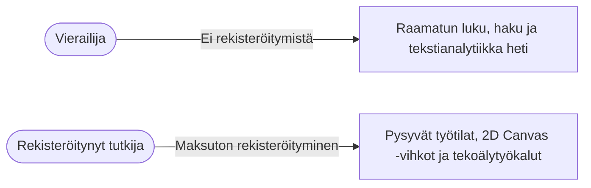

# Käyttöehdot ja tietosuojaseloste

*Päivitetty viimeksi: 31. elokuuta 2026*

Tervetuloa käyttämään **Clible**-alustaa (`clible-v3`) — verkkopohjaista ympäristöä Raamatun tutkimiseen, sanastoanalyysiin ja 2D Canvas -tutkimusvihkoihin.

Tutkimustyökalujen tulee olla läpinäkyviä ja kunnioittaa käyttäjien yksityisyyttä. Tämä asiakirja kuvaa käyttöehtomme ja tietosuojakäytäntömme.

---

## 1. Soveltamisala ja hyväksyminen

Käyttämällä Clibleä vierastilassa tai rekisteröityneenä käyttäjänä hyväksyt nämä käyttöehdot ja tietosuojaselosteen. Jos et hyväksy ehtoja, älä käytä palvelua.

---

## 2. Käyttäjätilit ja reilu käyttö

### Vaivaton rekisteröityminen

* Tilin luomiseen tarvitaan toimiva **sähköpostiosoite** ja turvallinen **salasana**.
* Emme kerää puhelinnumeroita, oikeita nimiä, luottokortteja tai tarpeettomia profiilitietoja.
* Rekisteröityminen avaa pääsyn työtilojen pilvitallennukseen, vihkojen synkronointiin ja teologisiin tekoälyominaisuuksiin.

### Tilin tietoturva ja salasanat

* Salasanat suojataan ennen tallentamista vahvalla **bcrypt**-tiivisteellä.
* Salasanoja ei tallenneta selväkielisinä, eivätkä palvelimen ylläpitäjät voi nähdä niitä.

### Tilin sulkeminen ja tietojen poisto

* Omistat omat tietosi ja voit pyytää tilisi poistamista milloin tahansa.
* Tilin poistaminen hävittää pysyvästi käyttäjäprofiilisi, liitetyt käännöksesi, yksityiset työtilasi ja hakuhistoriasi tietokannasta.

---

## 3. Tietosuojaseloste (GDPR-yhdenmukainen)

Noudatamme tiukasti sisäänrakennetun yksityisyyden (Privacy by Design) periaatetta:

### Mitä tietoja tallennamme

| Tietotyyppi | Käyttötarkoitus | Säilytys ja suojaus |
| :--- | :--- | :--- |
| **Sähköpostiosoite** | Tilin tunnistaminen ja istunnon todennus | PostgreSQL `users`-taulu |
| **Salasanatiiviste** | Turvallinen kirjautumisen varmennus | Kryptografinen bcrypt-tiiviste |
| **Tutkimustyötilat** | Projektien, tallennettujen hakujen ja analyysien säilytys | PostgreSQL `scopes`- ja `saved_*`-taulut |
| **2D Canvas -tutkimusvihkot** | Tutkimusmuistiinpanojen, korttien ja ISLA-skriptien säilytys | PostgreSQL `notebooks`- ja `cells`-taulut |
| **Hakuhistoria** | Aiempien hakujen nopea uudelleenavaus | PostgreSQL `search_history` (käyttäjäeristetty) |

### Mitä emme KOSKAAN tee

* ❌ **Ei kolmannen osapuolen mainosseurantaa**: Emme käytä Google Analyticsia, mainosevästeitä tai käyttäytymisen seurantajärjestelmiä.
* ❌ **Ei tietojen myyntiä**: Emme koskaan myy, vuokraa tai luovuta henkilö- tai tutkimustietojasi kolmansille osapuolille.
* ❌ **Muistiinpanojasi ei käytetä tekoälymallien koulutukseen**: Yksityisiä tutkimusmuistiinpanojasi ei käytetä julkisten kaupallisten tekoälymallien koulutukseen.

---

## 4. Raamatuntekstit ja immateriaalioikeudet

### Käännösoikeudet

* Cliblessä saatavilla olevat raamatunkäännökset (kuten suomalaiset KR92, KR38, 1776, World English Bible, SBLGNT ja heprealainen MT) on tarkoitettu henkilökohtaiseen opiskeluun, tutkimukseen ja ei-kaupalliseen opetuskäyttöön.
* Yksityiskohtaiset lähdetiedot ja tekijänoikeudet löytyvät arkiston [`NOTICE.md`](https://github.com/mvirtai/clible-v3-go) -tiedostosta.

### Käyttäjän oma sisältö

* Sinulla säilyvät kaikki oikeudet omiin tutkimusmuistiinpanoihisi ja eksegeettisiin kortteihisi.
* Clible ei vaadi tekijänoikeuksia tai kaupallisia oikeuksia käyttäjien tuottamiin aineistoihin.

---

## 5. Teologiset tekoälytyökalut ja vastuuvapauslauseke

Clible tarjoaa Google Gemini -tekoälyn avulla tukea raamatuntekstien tulkintaan ja sanastojen tutkimiseen.

> [!IMPORTANT]
> **Vastuuvapauslauseke**:
> Tekoälyn tuottamat analyysit ovat laskennallisia tiivistelmiä ja apuvälineitä. Ne **eivät** edusta virallista kirkollista oppia tai erehtymätöntä teologista tulkintaa. Tarkista havainnot aina alkukielisistä teksteistä ja tieteellisistä sanakirjoista, kuten BDAG:sta ja HALOT:sta.

---

## 6. Avoin lähdekoodi ja lisenssi

Cliblen lähdekoodi on julkaistu **PolyForm Noncommercial License 1.0.0** -lisenssillä. Lisenssi sallii vapaan käytön, muokkauksen ja jakelun ei-kaupallisiin tarkoituksiin. Katso täydet lisenssiehdot [`LICENSE`](https://github.com/mvirtai/clible-v3-go/blob/main/LICENSE) -tiedostosta.
