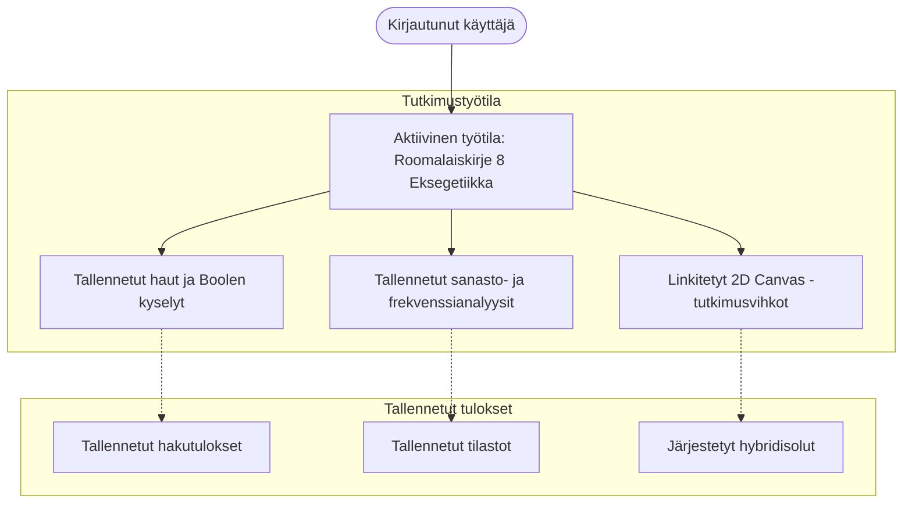

# Tutkimustyötilat ja rajaukset

clible-v3:n **tutkimustyötilat (Scope)** kokoavat kirjanmerkit, haut ja muistiinpanot projektikohtaisiksi kokonaisuuksiksi.

---

## Mikä on tutkimustyötila?

**Tutkimustyötila** on oma tutkimuskontekstinsa. Se kokoaa yhteen esimerkiksi aiheeseen, saarnasarjaan, Raamatun kirjan analyysiin tai tieteelliseen artikkeliin liittyvät materiaalit.

Aktiivisessa työtilassa voit:

- **Tallentaa hakuja**: Säilytä kokoteksti- ja regex-haut tuloksineen myöhempää tarkastelua varten.
- **Tallentaa tekstianalyysejä**: Säilytä leksikaaliset tilastot, sanatiheysjakaumat ja käännösvertailut.
- **Linkittää 2D Canvas -tutkimusvihkoja**: Liitä interaktiiviset muistiinpanot suoraan työtilaan.
- **Vaihtaa tutkimusprojektia**: Siirry yläpalkin valitsimesta toiseen työtilaan.



---

## Työtilojen hallinta käyttöliittymässä

### 1. Työtilan luominen

1. Avaa ylänavigaatiopalkin **Skooppivalitsin** (Scope Selector).
2. Valitse **Luo uusi skooppi** tai napsauta `+`-painiketta.
3. Anna tutkimusprojektillesi kuvaava nimi (esim. *Paavalilainen armokäsitys*, *Vuorisaarna*, *Heprealaiskirje 11 Usko*).
4. Valitse **Tallenna**. Uusi työtila luodaan ja otetaan käyttöön.

### 2. Työtilojen välillä vaihtaminen

Skooppivalitsimen avaaminen näyttää tutkimusprojektisi pudotusvalikossa:

- Työtilan valitseminen lataa sen tallennetut haut, analyysit ja vihkot.
- Valitsemalla **Yleinen (Ei skooppia)** voit tehdä hakuja liittämättä niitä tiettyyn projektiin.

### 3. Työtilojen nimeäminen ja poistaminen

- **Nimen muokkaus**: Napsauta aktiivisen työtilan nimen vieressä olevaa kynäkuvaketta.
- **Poistaminen**: Työtilan poistaminen poistaa siihen liitetyt haut ja analyysit tietokannasta (`ON DELETE CASCADE`).

> [!IMPORTANT]
> **Henkilökohtaisten muistiinpanojen suoja**: Työtilaan liitettyjä tutkimusvihkoja ei poisteta työtilan mukana. Tietokanta asettaa `notebooks.scope_id`-kentän arvoksi `NULL` (`ON DELETE SET NULL`), joten muistiinpanosi, korttisi ja luonnoksesi säilyvät pääkirjastossasi.

---

## Tallennetut haut

Tehdessäsi syvällistä sanastotutkimusta käännösten yli tarkennat kyselyitä usein tarkoilla rajauksilla (kuten etsimällä sanaa `"armo"` KR92-käännöksen kirjeistä tai `"grace" AND "peace"` WEB-käännöksestä).

### Haun tallentaminen työtilaan

1. Suorita kysely **Haku**-näkymässä.
2. Valitse tulospalkista **Tallenna työtilaan**.
3. Anna haulle tunnistettava nimi (esim. *Armo-sanan esiintymät Roomalaiskirjeessä*).
4. Haku tallentuu kaikkine asetuksineen:
   - Hakulauseke ja tila (fraasi, kokoteksti tai regex).
   - Hakuskooppi (koko Raamattu, VT, UT tai tietty kirjakoodi).
   - Kohdekäännös.
   - Tallennettu tulosdata, jotta hakutuloksia ei tarvitse hakea uudelleen.

---

## Tallennetut analyysit

**Analytiikka**-näkymä laskee leksikaalisen tiheyden, sanatiheydet ja käännösten vastaavuudet.

### Analyysin tallentaminen

1. Suorita analyysi tietylle luvulle tai jaksolle (esim. *Roomalaiskirje 8 Sanastoanalyysi*).
2. Valitse **Tallenna analyysi työtilaan**.
3. Anna nimi ja vahvista.
4. Tarkat parametrit ja lasketut tilastolliset tulokset (kokonaissanamäärä, uniikit sanat, TTR-suhdeluku ja frekvenssitaulukot) tallentuvat työtilaasi.

---

## Työtilan tietojen lataaminen yhdellä pyynnöllä

Taustapalvelu tarjoaa yhden rajapintareitin, jolla työtilan tiedot voi hakea:

```http
GET /api/scopes/workspace?id={scopeId}
```

Go-rajapinta palauttaa työtilan metatiedot, tallennetut haut ja analyysit sekä siihen liitetyt vihkot yhdessä JSON-vastauksessa:

```json
{
  "id": "7bc751d3-3b1a-4712-8df7-e62a98e82110",
  "name": "Roomalaiskirje 8 Eksegetiikka",
  "createdAt": "2026-07-09T07:00:00Z",
  "savedSearches": [
    {
      "id": "search-uuid-1",
      "name": "Haku sanalle 'armo'",
      "queryText": "armo",
      "searchScope": "book",
      "scopeValue": "ROM",
      "translationId": "kr92",
      "resultJson": "[...]"
    }
  ],
  "savedAnalyses": [
    {
      "id": "analysis-uuid-1",
      "name": "Roomalaiskirje 8 Sanastofrekvenssit",
      "reference": "Romans 8",
      "analysisType": "single_stats",
      "translationId": "kr92",
      "resultJson": "{\"totalWords\":540,\"uniqueWords\":210,...}"
    }
  ],
  "notebooks": [
    {
      "id": "nb-uuid-1",
      "title": "Roomalaiskirje 8 Kommentaari",
      "createdAt": "2026-07-09T07:12:00Z"
    }
  ]
}
```

Näin käyttöliittymä saa työtilan tiedot yhdellä vastauksella.
