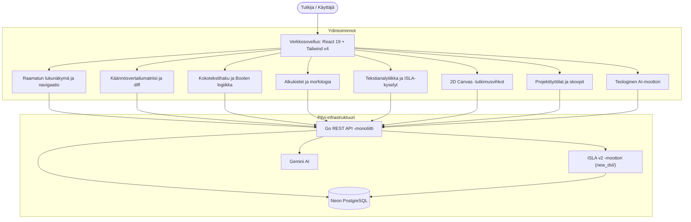

## Järjestelmäarkkitehtuuri pähkinänkuoressa

clible-v3 on suunniteltu web-natiiviksi tutkimusympäristöksi, jota käytetään suoraan selaimessa.
ISLA-kyselymoottori toimii palvelinpuolella itsenäisenä Go-pakettina ja suorittaa lausekkeet
alle 50 mikrosekunnissa lekseristä tulosprojektioon:

---

## Dokumentaatiokartta

| Mitä haluat tehdä? | Aloita tästä |
|---|---|
| Opi liikkumaan ja käyttämään verkkokäyttöliittymää | [Yleiskatsaus ja pikaopas](/fi/guide/getting-started) |
| Lue raamatuntekstejä ja selaa kaanonia | [Raamatun lukunäkymä ja navigaatio](/fi/guide/reader) |
| Kirkkovuosikalenteri ja päivän hetkipalvelukset | [Kirkkovuosikalenteri ja hetkipalvelukset](/fi/guide/liturgical-calendar) |
| Vertaile käännöksiä rinnakkain visuaalisella sanadiffillä | [Käännösvertailu ja diff](/fi/guide/compare-and-diff) |
| Hallitse kokoteksti- ja regex-haku sekä sanastoanalytiikka | [Haku ja tekstianalytiikka](/fi/guide/search-and-analytics) |
| Tutki kreikan ja heprean alkukieliä ja morfologiaa | [Alkukielet ja morfologia](/fi/guide/original-languages) |
| Hyödynnä teologisia AI-työkaluja ja semanttista hakua | [Teologiset AI-työkalut](/fi/guide/ai-study-tools) |
| Järjestä tutkimuksesi skoopeihin ja tallennettuihin hakuihin | [Työtilat ja skoopit](/fi/guide/workspaces) |
| Luo 2D canvas -muistiinpanoja ja jäädytä CLI-kyselyitä | [2D Canvas -tutkimusvihkot](/fi/guide/notebooks) |
| Opi ISLA v2 -kyselykielen syntaksi ja komennot | [ISLA v2 -kieliopas](/fi/guide/isla-guide) |
| Hallitse käännöskatalogia ja XML-suoratoistotuontia | [Käännökset ja tuonti](/fi/guide/import-and-seeding) |
| Asenna sovellus omalle palvelimelle tai kehitä paikallisesti | [Itseisännöinti ja asennus](/fi/guide/self-hosting) |
| Ymmärrä Go + React -kerrosarkkitehtuuria | [Arkkitehtuurin yleiskatsaus](/fi/architecture/overview) |
| Tutustu PostgreSQL GIN- ja SQLite FTS5 -skeemoihin | [Tietokanta ja kaksois-FTS](/fi/architecture/database) |
| Lue ISLA v2:n formaali kielioppimäärittely ja EBNF | [ISLA v2 -kielioppimäärittely](/fi/architecture/isla-specification) |
| Selaa kattavaa REST API -rajapintaviitettä | [Web API -viite](/api/reference) |
