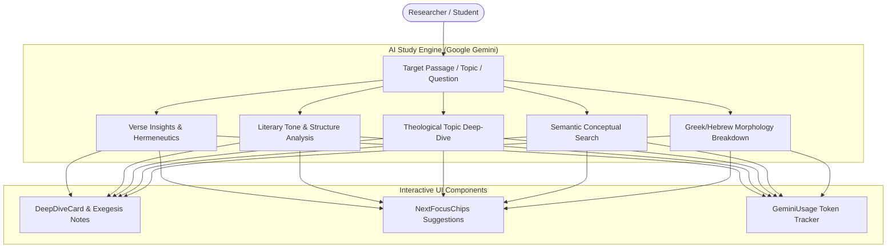

# Theological AI Study Tools

clible-v3 integrates Google Gemini AI to provide intelligent hermeneutical assistance, conceptual search, and original language exegesis directly within your study workflow.

---

## 1. Core AI Capabilities

The AI engine is tailored specifically for theological analysis, grammatical parsing, and historical context:

---

## 2. Verse Insights & Covenantal Hermeneutics

Select any passage and request an AI Insight with customizable hermeneutical focus:

- **Covenantal Context**: Explores how the passage relates to biblical covenants (Abrahamic, Mosaic, Davidic, New Covenant).
- **Literary Tone & Structure**: Breaks down rhetorical devices, poetic parallelisms, and chiasms.
- **Historical-Grammatical Exegesis**: Illuminates cultural customs, ancient Near Eastern idioms, and Greco-Roman background.

---

## 3. Semantic & Conceptual Natural Language Search

Unlike traditional keyword search which requires exact matching words, **Semantic Search** understands theological concepts and thematic queries:

- *"Where does Paul describe the armor of God?"* → Resolves to Ephesians 6:10–18.
- *"Scriptures on faith without works being dead"* → Resolves to James 2:14–26.
- *"Jesus calming the sea with his disciples"* → Resolves to Mark 4:35–41 and parallels.

---

## 4. Interactive Exegesis Components

### NextFocusChips

Every AI response automatically generates interactive **NextFocusChips** pills. Clicking a chip immediately branches your research into a deeper follow-up study (such as exploring related cross-references, historical contexts, or grammatical nuances).

### DeepDiveCard

Comprehensive exegesis essays and multi-point outlines are displayed in expandable `DeepDiveCard` containers, keeping your main workspace clean while providing deep reference material when needed.

---

## 5. Privacy, Rate Limiting & Safety Controls

- **Zero Data Training**: Your personal study notes, private workspaces, and search queries are never used to train external AI models.
- **Strict Rate Limiting**: The backend enforces per-IP token bucket rate limiting (15 requests/hour with a burst buffer of 5) to prevent accidental quota exhaustion.
- **Optional Feature**: If the `GEMINI_API_KEY` is not provided in the server environment, all AI features disable gracefully while the core platform (Reader, Search, Comparison Matrix, 2D Canvas Notebooks, ISLA DSL) remains 100% functional.
