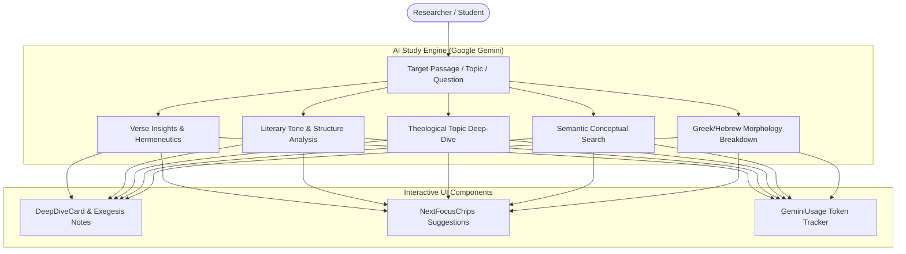

# Theological AI Study Tools

clible-v3 integrates Google Gemini AI to provide intelligent hermeneutical assistance, conceptual search, and original language exegesis directly within your study workflow.

---

## 1. Core AI Capabilities

The AI engine is tailored specifically for theological analysis, grammatical parsing, and historical context:

```mermaid
graph TD
    User(["Researcher / Student"]) --> Query["Target Passage / Topic / Question"]
    
    subgraph AI_Engine ["AI Study Engine (Google Gemini)"]
        Query --> Insight["Verse Insights & Hermeneutics"]
        Query --> Tone["Literary Tone & Structure Analysis"]
        Query --> Deep["Theological Topic Deep-Dive"]
        Query --> Semantic["Semantic Conceptual Search"]
        Query --> Original["Greek/Hebrew Morphology Breakdown"]
    end
    
    subgraph UI_Components ["Interactive UI Components"]
        Insight & Tone & Deep & Semantic & Original --> Cards["DeepDiveCard & Exegesis Notes"]
        Insight & Tone & Deep & Semantic & Original --> Chips["NextFocusChips Suggestions"]
        Insight & Tone & Deep & Semantic & Original --> Usage["GeminiUsage Token Tracker"]
    end
```

---

## 2. Verse Insights & Covenantal Hermeneutics

Select any passage and request an AI Insight with customizable hermeneutical focus:

- **Covenantal Context**: Explores how the passage relates to biblical covenants (Abrahamic, Mosaic, Davidic, New Covenant).
- **Literary Tone & Structure**: Breaks down rhetorical devices, poetic parallelisms, and chiasms.
- **Historical-Grammatical Exegesis**: Illuminates cultural customs, ancient Near Eastern idioms, and Greco-Roman background.

---

## 3. Semantic Search with Natural-Language Queries

Semantic Search lets you describe a topic or ask a question in your own words instead of searching for a specific word. It combines Google Gemini with full-text search: Gemini turns the question into a search plan, and the backend searches the selected translation using the generated terms and scope.

- *"Where does Paul describe the armor of God?"* → May produce a search for Ephesians 6:10–18.
- *"Scriptures on faith without works being dead"* → May identify James 2:14–26.
- *"Jesus calming the sea with his disciples"* → May identify Mark 4:35–41.

When Gemini recognizes a known passage, the backend also retrieves its verses and adds them to the full-text search results. This can include verses that do not contain the generated search terms. The results show the search plan, matching verses, and a summary grounded in the returned verse snippets; the summary uses up to 15 snippets. You can open an identified passage in the Reader or save the search to an active workspace.

> [!NOTE]
> Semantic Search does not retrieve nearest matches from vector embeddings. Gemini generates terms and full-text search parameters, and the backend can supplement those matches with a recognized passage. Results therefore depend on the selected translation and generated search plan; try another wording or translation if needed.

---

## 4. Interactive Exegesis Components

### NextFocusChips

Every AI response automatically generates interactive **NextFocusChips** pills. Clicking a chip immediately branches your research into a deeper follow-up study (such as exploring related cross-references, historical contexts, or grammatical nuances).

### DeepDiveCard

Comprehensive exegesis essays and multi-point outlines are displayed in expandable `DeepDiveCard` containers, keeping your main workspace clean while providing deep reference material when needed.

---

## 5. Privacy, Rate Limiting & Safety Controls

- **Zero Data Training**: Your personal study notes, private workspaces, and search queries are never used to train external AI models.
- **Strict Rate Limiting**: The backend enforces per-IP token bucket rate limiting (15 requests/hour with a burst buffer of 5) to prevent accidental quota exhaustion.
- **Optional Feature**: If the `GEMINI_API_KEY` is not provided in the server environment, all AI features disable gracefully while the core platform (Reader, Search, Comparison Matrix, 2D Canvas Notebooks, ISLA DSL) remains 100% functional.
