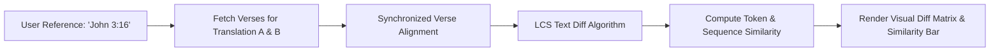

# Translation Comparison & Visual Diffing

The **Comparison Matrix** (`/compare`) is a specialized workbench for examining textual variations, stylistic divergences, and translational nuances across distinct Bible versions.

---

## 1. Dual-Translation Alignment & Visual Diffing

When studying critical theological passages, comparing two translations reveals subtle shifts in vocabulary, emphasis, and syntactic phrasing:



### Visual Diff Highlights

The comparison engine computes the **Longest Common Subsequence (LCS)** between two translated texts:

- **Matching Words**: Displayed in standard text.
- **Modified / Divergent Phrasing**: Highlighted with soft contextual colors to immediately spotlight where translations deviate.
- **Dynamic HSL Similarity Bar**: A real-time visual indicator showing text alignment percentage, smoothly transitioning from red (0% similarity) to emerald green (100% similarity).

```
┌────────────────────────────────────────────────────────────────────────┐
│  ⚖️ Comparison: Romans 5:1                                             │
├──────────────────────────────────┬─────────────────────────────────────┤
│  Translation A: KR92             │  Translation B: KR38                │
├──────────────────────────────────┼─────────────────────────────────────┤
│  Koska me siis olemme uskosta    │  Koska me siis olemme uskosta       │
│  [vanhurskaiksi tulleet],        │  [vanhurskautetut],                 │
│  meillä on rauha Jumalan kanssa  │  niin meillä on rauha Jumalan       │
│  meidän Herramme Jeesuksen       │  kanssa meidän Herramme Jeesuksen   │
│  Kristuksen kautta.              │  Kristuksen kautta.                 │
├──────────────────────────────────┴─────────────────────────────────────┤
│  Similarity Score: 88.5% [████████████████████░░░]                    │
└────────────────────────────────────────────────────────────────────────┘
```

---

## 2. Integrated AI Comparative Commentary

In addition to algorithmic word diffing, clible-v3 can generate an AI-powered theological comparison of the selected passage:

- **Theological Nuance Breakdown**: Explains how translational choices reflect different Greek/Hebrew manuscript traditions or theological perspectives (such as dynamic equivalence vs. formal equivalence).
- **Interactive Focus Chips (NextFocusChips)**: Clickable suggestion pills to explore related historical, grammatical, or doctrinal questions.
- **Deep-Dive Cards**: Expandable sections providing comprehensive exegesis notes.

---

## 3. Saving Comparisons to Research Workspaces

You can save any comparative study directly into your active [Research Workspace](/guide/workspaces):

1. Click **Save Comparison to Scope** in the top action bar.
2. Give the comparison a descriptive title (e.g., *Romans 5:1 Justification Comparison*).
3. The comparison parameters, similarity metrics, visual diff state, and AI commentary are saved in your workspace for immediate recall.
