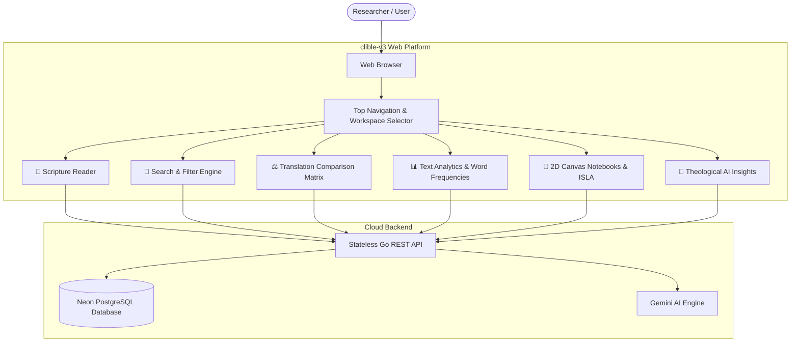

# Platform Overview & Quick Start

Welcome to **clible-v3**, a modern, web-native Bible study and textual research platform.

clible-v3 brings together high-speed scripture exploration, multi-translation comparative exegesis, quantitative linguistic analytics, and an interactive **2D Canvas Notebook** workspace powered by the **ISLA DSL query engine**.

---

## 1. Web Application Architecture

Unlike traditional desktop or CLI-only Bible software, clible-v3 is built from the ground up as a **cloud-native web application**:

- **Zero Client Installation**: Access your research, notes, and study workspaces from any modern web browser on desktop, tablet, or mobile devices.
- **Secure Cloud Persistence**: Workspaces, pinned searches, lexical analyses, and 2D canvas notebooks are saved securely to a high-performance PostgreSQL backend.
- **Instant Search & Exegesis**: Sub-millisecond full-text queries, linguistic regex pattern matching, and parallel translation matrices render smoothly without client lag.
- **Bilingual Experience**: Complete user interface localization in both Finnish (`fi`) and English (`en`) with fluid dark and light themes.



---

## 2. Navigating the Web Interface

The navigation bar at the top of the screen gives you one-click access to all primary research tools:

| View | Icon / Key | Primary Function |
|---|---|---|
| **Reader** | 📖 `Reader` | Chapter-by-chapter scripture reading, verse selection, and translation switching. |
| **Search** | 🔎 `Search` | Full-text, phrase, and regular expression searches across custom book/testament scopes. |
| **Compare** | ⚖️ `Compare` | Parallel side-by-side translation comparison with visual word difference diffing. |
| **Analytics** | 📊 `Analytics` | Lexical diversity (TTR), total/unique word counts, and token frequency rankings. |
| **Notebooks** | 📓 `Notebooks` | 2D resizable canvas cards, Markdown exegesis notes, and reactive ISLA query embeds. |
| **Workspaces** | 🗂️ `Scope Selector` | Switch active research project scopes to isolate saved searches, analyses, and notes. |
| **Translations** | 📚 `Catalog` | Manage, activate, or deactivate Bible translations in your workspace. |
| **Theme / Lang** | ☀️/🌙 & 🇫🇮/🇬🇧 | Toggle dark/light color themes and switch UI language between Finnish and English. |

---

## 3. Five-Minute Quick Start Workflow

Follow this quick walkthrough to explore the core capabilities of the web application:

### Step 1: Open the Scripture Reader & Select a Translation

1. Click **Reader** in the top navigation bar.
2. Select a book (e.g., *John* or *Johannes*) and chapter (*Chapter 3*).
3. Use the translation selector to choose your active Bible translation (e.g., *KR92*, *KR38*, *World English Bible*, or *King James Version*).
4. Verses are displayed in a clean, legible serif typography designed for distraction-free study.

### Step 2: Compare Multiple Translations Side-by-Side

1. Navigate to the **Compare** view.
2. Enter a reference such as `John 3:16` or `Romans 5:1`.
3. Select two translations to compare (e.g., `KR92` vs. `KR38` or `WEB` vs. `KJV`).
4. The system renders the verses in aligned columns and highlights textual variations and vocabulary choices.

### Step 3: Run a Scoped Full-Text or Boolean Search

1. Navigate to the **Search** view.
2. Enter a keyword (e.g., `armo` or `grace`).
3. Set the **Scope** to *New Testament* or a specific book like *Romans*.
4. Review matching verses with highlighted keywords and click any result to jump directly into context.

### Step 4: Create a Research Workspace

1. In the top navigation bar, click the **Scope Selector** and choose **Create New Scope**.
2. Name your workspace (e.g., `Romans Exegesis`).
3. Now, whenever you save searches or analytical reports, they will be organized neatly under this project.

### Step 5: Author an Interactive 2D Canvas Notebook

1. Navigate to **Notebooks** and click **New Notebook**.
2. Add a **Markdown Cell** to write your commentary and insights.
3. Embed a live ISLA directive inside your markdown notes:
   ```markdown
   Key comparative passage:
   ! at(Joh 3:16) => vs(KR92, KJV)
   ```
4. Add a **CLI Scratchpad Cell** (`$ clible`) to test queries dynamically:
   ```bash
   $ clible search "grace" --scope=ROM
   ```
5. Select the relevant verses using the checkboxes and click **Freeze** to append them as permanent Markdown commentary.
6. Resize and position the notebook cards on the 24-column grid canvas to create your custom visual study layout.

---

## 4. Account Management & Security

- **User Accounts**: Create an account with your email and password via **Register** or **Login**.
- **Session Security**: Sessions are authenticated using secure HTTP-only JWT cookies, protecting your research notes and account from unauthorized access.
- **Privacy & Isolation**: All workspaces, personal notes, search histories, and custom translations are strictly isolated to your user account.

---

## 5. Self-Hosting & Developer Setup

Are you a software engineer, DevOps specialist, or system administrator looking to run clible-v3 on your own infrastructure or contribute code?

Check out our comprehensive [Self-Hosting & Local Development Guide](/guide/self-hosting) for step-by-step instructions on Docker containers, Go backend configuration, PostgreSQL setup, Taskfile automation, and quality gates.
