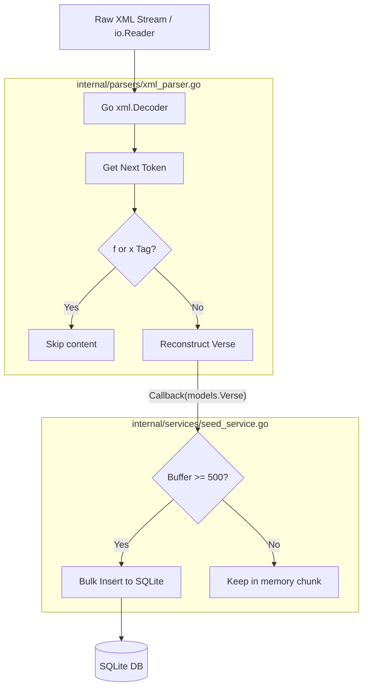

# XML Ingestion & Seeding Engine

clible-v3-go implements a highly optimized, memory-efficient pipeline to import large Bible translations from XML files (typically ranging from 3MB to over 10MB in size) directly into SQLite.

This engine is designed to operate on constrained environments (like low-memory container instances) without causing high RAM spikes.

---

## The $O(1)$ Ingestion Philosophy

Traditional XML parsing strategies (such as DOM-tree parsing or using Go's `xml.Unmarshal` on the entire file) load the complete document into memory. This can consume up to 10 times the raw file size in RAM, easily leading to memory exhaustion (OOM crashes).

Instead, clible-v3-go uses a **streaming token parser** (`xml.Decoder`) which achieves **$O(1)$ space complexity**:

- It reads the XML file sequentially, character by character, token by token.
- Only the current XML node and metadata are held in memory.
- It leverages a **functional callback pattern** to hand off fully reconstructed verses immediately to the database writer.



---

## Stream Parsing Details (`xml_parser.go`)

The core parsing logic is located in [xml_parser.go](file:///home/vivaldev/code/clible-v3-go/backend/internal/parsers/xml_parser.go). It reads standard USFX and OSIS XML structures.

### Key Mechanics

1. **State Tracking**: The parser maintains a minimal state machine keeping track of `currentBook`, `currentChapter`, and whether it is currently inside a verse text (`inVerse`).
2. **Text Construction**: A `strings.Builder` accumulates character data (`CharData`) when `inVerse` is active.
3. **Footnote and Reference Filtration**: Structural tags like `<f>` (footnotes) or `<x>` (cross-references) contain text that is not part of the actual Bible verse. The parser uses a `skipDepth` counter:
   - When a start tag `<f>` or `<x>` is encountered, `skipDepth` increases.
   - Any character data encountered while `skipDepth > 0` is discarded.
   - When the corresponding end tag is reached, `skipDepth` decreases.
4. **Self-closing & Multi-format support**: It handles standard USFX verse markers (like `<v id="1">` followed by text and `<ve/>` or `</v>`) and OSIS schemas (like `<verse osisID="Gen.1.1">`).

---

## Seeding Pipeline and Chunking (`seed_service.go`)

The [seed_service.go](file:///home/vivaldev/code/clible-v3-go/backend/internal/services/seed_service.go) coordinates the ingestion and acts as the gatekeeper for database operations.

### 1. Canonical Validation

Before parsing begins, the service queries the `books` metadata table to fetch the 66 canonical book IDs (from Genesis to Revelation). As the parser emits verses, any book not in this list (such as Apocrypha, introductions, or glossaries) is automatically skipped.

### 2. Alternative Abbreviation Mapping

To support various source XML providers, the service maps common book name abbreviations (e.g., `GENESIS.`, `1KGS`, `JN.`, `ROMA`) to the canonical three-letter uppercase IDs (e.g., `GEN`, `1KI`, `JHN`, `ROM`).

### 3. Buffered Bulk Insertion

Writing to SQLite can be slow if done row-by-row because every individual `INSERT` statement initiates a separate file transaction.
To maximize performance:

- The service groups parsed verses into **chunks of 500**.
- Once the buffer reaches 500, it flushes the segment to the database using `verseRepo.BulkInsert(ctx, chunk)`.
- A final flush is performed at the end of the stream to write any remaining verses.
- This reduces the import duration of a whole Bible (~31,000 verses) from several minutes down to **less than 2 seconds**.

---

## API Integration

The XML import is triggered via the HTTP REST API endpoint:

```http
POST /api/translations/import
Content-Type: multipart/form-data
```

The file is streamed directly from the incoming multipart network request into the parser:

```go
// In translation_handler.go
file, header, err := r.FormFile("file")
if err != nil { ... }
defer file.Close()

// The file stream is passed directly down
err = s.seedService.SeedTranslationFromFile(r.Context(), filePath, translationID)
```

This ensures that the server does not buffer the uploaded file to disk or load it fully into RAM, maintaining the $O(1)$ memory guarantee across the entire HTTP lifecycle.
