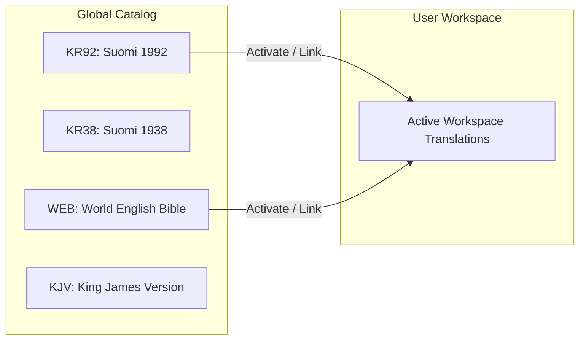
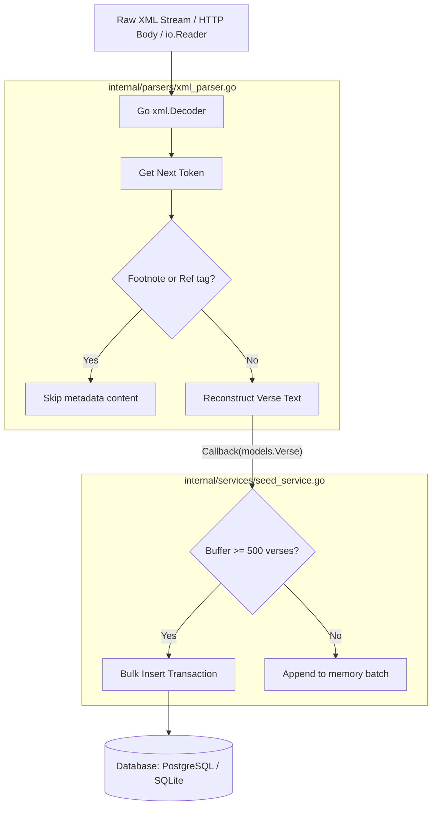

# Translation Catalog & Ingestion Engine

clible-v3 provides a comprehensive Bible translation management system. Users can easily activate translations from a global catalog, and administrators can upload custom Bible translations in standardized XML formats directly through the web API.

---

## 1. Managing Translations in the Web UI

From the **Translations Catalog** view (`/translations`), users can browse and configure available Bible versions:

- **Global Catalog**: Pre-installed standard translations (such as Finnish KR92, Finnish KR38, World English Bible, and King James Version) are available globally to all users.
- **Activating / Linking**: Clicking **Activate** links a translation to your personal account (`POST /api/translations/link`), enabling it across the Reader, Search, Comparison Matrix, and ISLA query engines.
- **Deactivating / Unlinking**: Deactivating a translation removes it from your active selectors without deleting the underlying translation data from the database.


```mermaid
graph LR
    subgraph Catalog [Global Catalog]
        T1[KR92: Suomi 1992]
        T2[KR38: Suomi 1938]
        T3[WEB: World English Bible]
        T4[KJV: King James Version]
    end
    
    subgraph UserSpace [User Workspace]
        Active[Active Workspace Translations]
    end
    
    T1 -->|Activate / Link| Active
    T3 -->|Activate / Link| Active
```

---

## 2. High-Performance $O(1)$ XML Streaming Engine

When new translations are imported (via `POST /api/translations/import` or CLI seeding), the backend utilizes a memory-efficient streaming pipeline capable of parsing large Bible XML files (ranging from 3MB to over 15MB) with **$O(1)$ constant memory overhead**.

### The $O(1)$ Ingestion Philosophy

Traditional XML parsers (such as DOM tree builders or unmarshalling the full file into memory) can easily consume 50MB to 100MB+ of RAM during import, potentially crashing low-memory container environments.

clible-v3 uses Go's streaming token parser (`xml.Decoder`):

- **Sequential Token Stream**: Reads the XML input rune by rune, holding only the immediate XML tag in RAM.
- **Functional Callback Pattern**: Reconstructed verses are handed off instantly to a buffered batch writer.
- **Zero Temporary Disk Files**: Streaming data pipes directly from HTTP multipart network streams into the database.


```mermaid
graph TD
    Stream[Raw XML Stream / HTTP Body / io.Reader] --> Dec[Go xml.Decoder]
    
    subgraph XML Parser [internal/parsers/xml_parser.go]
        Dec --> Token[Get Next Token]
        Token --> Filter{Footnote or Ref tag?}
        Filter -- Yes --> Skip[Skip metadata content]
        Filter -- No --> Process[Reconstruct Verse Text]
    end

    subgraph Seed Service [internal/services/seed_service.go]
        Process -- Callback(models.Verse) --> Buffer{Buffer >= 500 verses?}
        Buffer -- Yes --> Bulk[Bulk Insert Transaction]
        Buffer -- No --> Accumulate[Append to memory batch]
    end

    Bulk --> DB[(Database: PostgreSQL / SQLite)]
```

---

## 3. Supported Translation XML Formats

The parser automatically detects and parses two major open Scripture formats:

### 1. USFX (Unified Scripture Format XML)

Standard XML format with `<v id="1">` verse markers, `<c id="1">` chapter markers, and `<ve/>` end tags:

```xml
<book id="JHN">
  <c id="3"/>
  <v id="16"/>Sillä niin on Jumala maailmaa rakastanut...<ve/>
</book>
```

### 2. OSIS (Open Scriptural Information Standard)

Standard theological schema using structured element attributes:

```xml
<div type="book" osisID="John">
  <chapter osisID="John.3">
    <verse osisID="John.3.16">For God so loved the world...</verse>
  </chapter>
</div>
```

### Footnote & Editorial Filtration

Source XML files often embed footnotes (`<f>`), cross-references (`<x>`), and translation notes within verse tags. The parser maintains a `skipDepth` counter:

- When opening tags `<f>` or `<x>` are encountered, `skipDepth` increments and character collection is paused.
- When closing tags `</f>` or `</x>` are reached, `skipDepth` decrements, ensuring only pure scriptural text is indexed.

---

## 4. Seeding Pipeline & Buffered Batch Insertion

The ingestion pipeline in `internal/services/seed_service.go` applies three critical optimizations:

### 1. Canonical Book Validation

Before parsing begins, the service loads the 66 canonical book definitions from the database (`books` table). Non-canonical materials (such as introductions, appendices, or glossaries) are filtered out automatically.

### 2. Standardized Abbreviation Normalization

Source XML files often use non-standard book labels (e.g., `GENESIS.`, `1KGS`, `JN.`, `ROMA`). The service maps all variants to canonical 3-letter uppercase IDs (`GEN`, `1KI`, `JHN`, `ROM`).

### 3. Buffered Bulk Insertion (Chunks of 500)

Writing 31,102 verses individually creates severe database lock contention and network round-trip overhead.

The service buffers verses in memory chunks of **500 records** and issues multi-row batch insert statements:

- In **PostgreSQL**, this reduces full Bible import time from over 60 seconds to **under 2 seconds**.
- A final buffer flush is executed at the end of the file stream to write the remaining verses in a clean ACID transaction.

---

## 5. Admin Import API Endpoint

To upload and seed a new Bible translation into the catalog, send a multipart POST request:

```http
POST /api/translations/import
Content-Type: multipart/form-data
```

### Form Fields

- `translationId`: Unique slug (e.g., `fin-1992`, `kjv`, `vulgate`).
- `name`: Human-readable display title (e.g., `Suomi 1992`).
- `language`: 3-letter ISO language code (`FIN`, `ENG`, `LAT`, `GRC`, `HEB`).
- `file`: The raw XML file attachment.

```bash
# Example curl upload
curl -X POST http://localhost:8080/api/translations/import \
  -H "Cookie: token=YOUR_JWT_SESSION" \
  -F "translationId=fin-1992" \
  -F "name=Pyhä Raamattu (1992)" \
  -F "language=FIN" \
  -F "file=@/path/to/fin-1992.xml"
```
