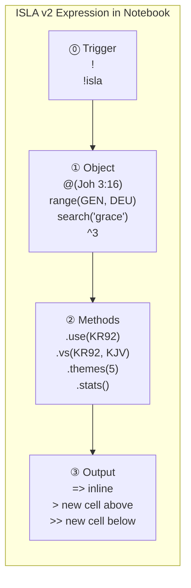
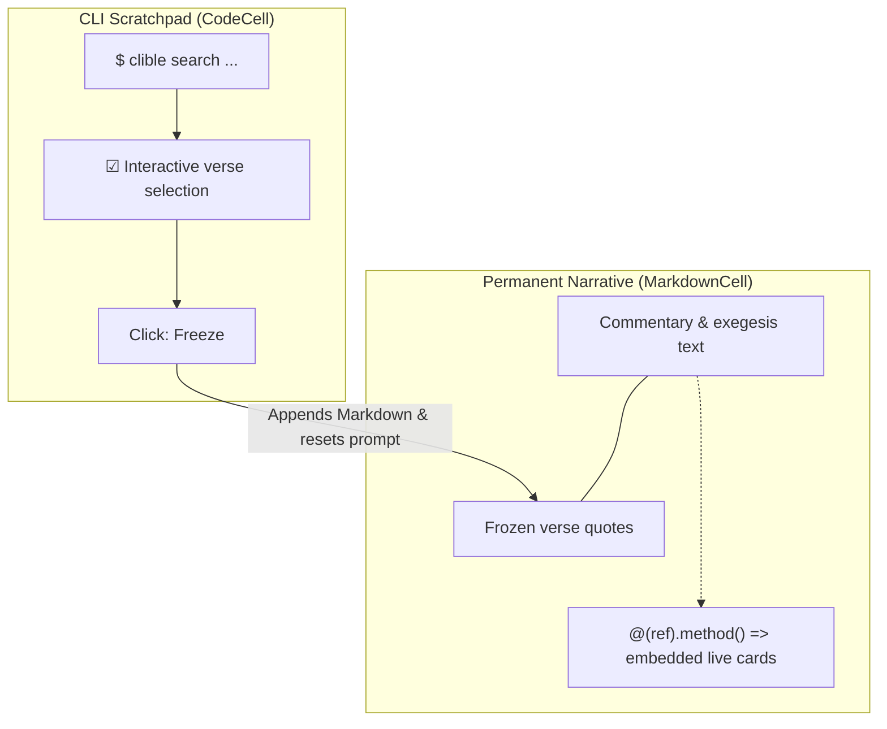

# ISLA v2 Language Guide

> **ISLA** — *Inline Structure & Logic Architecture*
> *(Also: Interactive Scripture & Layout Analyzer)*
>
> A complete guide to the ISLA v2 object-method query language — covering syntax,
> every object type, method reference, output operators, smart scopes,
> and the Monaco IntelliSense engine.

---

## 1. Overview & Design Philosophy

ISLA is a purpose-built, ergonomic query language that lives directly inside your Markdown
research documents. It bridges the gap between two extremes that most study environments
force you to choose between:

1. **Static Narrative (Markdown)**: Ideal for reading and publishing, but unable to
   dynamically query or compare scriptures without tedious copy-pasting.
2. **Command Cells (CLI / REPL)**: Powerful for querying, but produce fragmented,
   cell-heavy documents that cannot be read smoothly as continuous commentaries.

**ISLA unifies both** with a hybrid architecture: you write clean, standard Markdown
and seamlessly embed fast ISLA directives that render as live scripture comparison cards,
analytics summaries, or keyword clouds directly within your narrative flow.

### The `!` and `!isla` Trigger Prefix

When authoring research notes in a **Notebook Markdown Cell**, an ISLA directive begins with the
`!` or `!isla ` trigger prefix. This tells the editor and markdown renderer that the line is not
plain text, but an executable ISLA directive:

```isla
! @(Joh 3:16).vs(KR92, KJV) =>
! search("grace").at(ROM) =>
!isla range(GEN, DEU).count(words) >> Pentateuch Word Count
```

> [!TIP]
> The trigger prefix `!` (or `!isla `) is stripped automatically by the lexer before AST parsing,
> ensuring clean execution whether commands are invoked inside Markdown notes, via the REST API,
> or in interactive input widgets.

### The ISLA v2 Object-Method Paradigm

ISLA v2 introduces a uniform expression structure:

```text
[!] Object  .method1().method2()  OutputOperator
```

Every valid ISLA expression consists of:

1. **Trigger prefix** (`!` or `!isla ` in Markdown cells) — signals code execution.
2. **One source Object** — defines *what* data is loaded.
3. **Zero or more chained Methods** — transform or analyze the data.
4. **One Output Operator** — defines *where* the result is rendered.



---

## 2. The Four Source Objects

### `@(Citation)` — Verse Reference

Loads a single verse, verse range, or chapter:

```isla
@(Joh 3:16) =>
@(Rom 8:28-30) =>
@(1 Kor 13:4-8) =>
@(Ps 23) =>
```

The parentheses are required and may contain spaces, colons, and verse ranges using
standard `Book chapter:verse-verse` notation.

### `range(start, end)` — Passage Range

Loads a contiguous span of text from a starting reference to an ending reference.
Both arguments may be books, chapters, or specific verses:

```isla
range(Joh 1:1, Joh 1:18) =>
range(GEN, DEU) =>
range(ROM, GAL) =>
range(Ps 1:1, Ps 23:6) =>
```

### `search("query")` — Full-Text & Boolean Search

Executes a full-text or regex search against the database:

```isla
search("grace") =>
search("armo" AND "rauha") =>
search("kuolema" OR "elämä") =>
search(/righteous.*/) =>
```

Multi-term boolean mode defaults to **AND** when terms are given without an explicit
operator between them. Regex patterns are wrapped in `/slashes/`.

### `^[n|all]` — Cell Context

References the text content of preceding notebook cells. Useful for running analytics
or semantic queries against the narrative you have already written:

```isla
^ =>          — previous one cell
^3 =>         — previous three cells
^all =>       — all preceding cells in this notebook
```

Cell context objects are resolved server-side: the surrounding notebook cell text is
sent in the API request, stripped of any existing ISLA directives, and passed to the
execution engine.

---

## 3. Method Reference

Methods are chained after the object using dot notation: `.methodName(args)`.
They are applied in order, left to right.

### `.use(translationID)` — Translation Override

Forces a specific translation, overriding any smart-scope inference:

```isla
@(Joh 3:16).use(KR92) =>
@(Joh 3:16).use(KJV) =>
search("grace").use(WEB).limit(5) =>
```

**Allowed on:** `@()`, `range()`, `search()`

### `.vs(trans1, trans2)` — Parallel Comparison

Renders the passage in two translations side-by-side in a synchronized comparison matrix:

```isla
@(Joh 3:16).vs(KR92, KJV) =>
@(Rom 5:1).vs(KR92, KR38) =>
@(Ps 23).vs(WEB, KJV) >>
```

**Allowed on:** `@()` only

### `.refs(n)` — Cross-References

Fetches up to `n` canonical cross-references for the given verse from the database
(default: 5):

```isla
@(Joh 3:16).refs(3) =>
@(Rom 8:28).refs() >>
```

**Allowed on:** `@()` only

### `.at(scope)` — Scope Filter

Restricts a search to a specific book or genre group (see [Smart Scopes](#5-smart-scopes)):

```isla
search("armo").at(epistolat) =>
search("grace").at(epistles).limit(10) =>
search("kuningas").at(historia) >>
```

**Allowed on:** `search()` only

### `.limit(n)` — Result Limit

Truncates the result set to at most `n` verses:

```isla
search("light").at(gospels).limit(5) =>
search("armo").limit(20) >>
```

**Allowed on:** `search()` only

### `.count([unit])` — Count Aggregator

Counts the matched results. The optional `unit` parameter controls the counting dimension:

| Unit | Aliases | Counts |
|---|---|---|
| `verses` *(default)* | `verse`, `v`, `jakeet`, `jae` | Total matching verses |
| `words` | `word`, `w`, `sanat`, `sana` | Total word tokens |
| `unique_words` | `uw`, `uniques`, `uniikit`, `sanasto` | Unique word types |
| `chapters` | `chapter`, `c`, `luvut`, `luku` | Unique chapters represented |
| `books` | `book`, `b`, `kirjat`, `kirja` | Unique books represented |

```isla
search("armo" AND "rauha").at(epistolat).count() =>
range(GEN, DEU).count(words) =>
search("grace").at(NT).count(books) >>
```

**Allowed on:** All objects

### `.top(n)` — Word Frequency Rankings

Extracts the `n` most frequent words from the matched text corpus, returning a ranked
frequency list. Includes full analytics: token count, unique token count, and TTR:

```isla
range(ROM, GAL).top(15) =>
search("armo").at(epistolat).top(10) >>
^all.top(20) =>
```

**Allowed on:** All objects

### `.stats()` — Lexical Analytics

Computes comprehensive lexical statistics for the matched corpus:

| Metric | Description |
|---|---|
| `token_count` | Total word tokens |
| `unique_token_count` | Unique word types |
| `type_token_ratio` | Lexical diversity (TTR): unique / total |
| `character_count` | Total characters |
| `avg_word_length` | Mean word length in characters |

```isla
@(Rom 8:1-39).stats() =>
range(GEN, DEU).stats() >>
^all.stats() =>
```

**Allowed on:** All objects (alias: `.ttr()`)

### `.themes(n)` — Thematic Keyword Extraction

Extracts the `n` most prominent thematic keywords from the matched corpus,
rendered as a styled keyword cloud:

```isla
@(Joh 3:16).themes(5) =>
range(Joh 1:1, Joh 1:18).themes(8) >>
^all.themes(10) =>
```

**Allowed on:** All objects

### `.suggest(n)` — Contextual Scripture Suggestions

Returns up to `n` thematically related scripture passages based on keyword extraction
from the cell text or matched verse corpus:

```isla
@(Joh 3:16).suggest(3) =>
^.suggest(5) =>
^all.suggest(10) >>
```

**Allowed on:** All objects

---

## 4. Output Operators

Every ISLA expression must end with an output operator that specifies where the result
is rendered.

### `=>` — Inline (Current Cell)

Renders the result within the current notebook cell, replacing the raw command text
in reading mode:

```isla
@(Joh 3:16).vs(KR92, KJV) =>
search("grace").at(epistles).count() =>
```

### `>` — New Cell Above

Creates a new result cell **directly above** the current cell. An optional name or
`#slug` identifier can follow the operator:

```isla
range(ROM, GAL).top(15) > Epistle Word Frequencies
@(Joh 3:16).refs() > #joh316-refs
search("grace").count(books) >
```

### `>>` — New Cell Below

Creates a new result cell **directly below** the current cell:

```isla
search("armo" AND "rauha").at(epistolat).stats() >> Epistle Analytics
^all.themes(10) >> #notebook-themes
range(GEN, DEU).count(words) >>
```

> [!TIP]
> Named cells (e.g. `>> #results` or `>> My Analysis`) display their name in a styled
> header badge above the result card, making complex multi-cell notebooks easier to
> navigate and reference.

---

## 5. Smart Scopes

When `.at(scope)` is used with a genre group identifier (or when a Finnish/English alias
is detected), ISLA automatically infers the appropriate Bible translation:

| Scope Identifier | Books | Auto-Inferred Translation | Example |
|---|---|---|---|
| `epistolat` / `kirjeet` | Paul & General Epistles (ROM..JUD) | **KR92** | `search("armo").at(epistolat)` |
| `epistles` / `letters` | Paul & General Epistles (ROM..JUD) | **WEB** | `search("grace").at(epistles)` |
| `evankeliumit` / `evankeliumi` | Gospels (MAT, MRK, LUK, JHN) | **KR92** | `search("valkeus").at(evankeliumit)` |
| `gospels` / `gospel` | Gospels (MAT, MRK, LUK, JHN) | **WEB** | `search("light").at(gospels)` |
| `toora` / `laki` | Pentateuch (GEN..DEU) | **KR92** | `search("liitto").at(toora)` |
| `torah` / `law` | Pentateuch (GEN..DEU) | **WEB** | `search("covenant").at(torah)` |
| `viisaus` / `wisdom` | Wisdom literature (JOB..SNG) | Language-matched | `search("viisaus").at(viisaus)` |
| `profeetat` / `prophets` | Major & Minor Prophets (ISA..MAL) | Language-matched | `search("herra").at(profeetat)` |
| `historia` / `history` | Historical books (JOS..EST) | Language-matched | `search("kuningas").at(historia)` |
| `VT` / `OT` | Old Testament | Language-matched | `search("armo").at(VT).count()` |
| `UT` / `NT` | New Testament | Language-matched | `search("armo").at(UT).count()` |

Individual book identifiers (`Joh`, `ROM`, `Ps`, `GEN`, etc.) are also valid scope values.

> [!TIP]
> **Explicit override:** Append `.use(translationID)` after `.at(scope)` to force a specific
> translation regardless of scope inference:
> `search("grace").at(epistolat).use(KJV) =>`

---

## 6. Notebook Integration & Hybrid Cell Workflows

ISLA expressions are embedded directly inside **Markdown Cells** in a Clible Notebook:

```markdown
Paul's understanding of justification centers on faith:

@(Rom 5:1).vs(KR92, KJV) =>

The word "armo" (grace/mercy) dominates this section:

search("armo" AND "rauha").at(epistolat).top(8) >>
```

In **reading mode** (outside edit mode):

1. **Clean Typography**: The raw ISLA syntax is hidden; elegant serif scripture cards
   are rendered in its place.
2. **Hover Inspection**: Hovering over any result card reveals a floating
   `✦ @(Rom 5:1).vs(KR92, KJV) =>` badge in the top-right corner.

### CLI Scratchpad Workflow

The CLI scratchpad cell (prefix: `$ clible`) provides an interactive exploration
environment that complements ISLA narrative embeds:

1. Execute `$ clible search "grace" --scope=ROM` to browse results.
2. Use the interactive checkboxes to select relevant verses.
3. Click **Freeze** — selected verses are appended as a formatted Markdown cell, and
   the CLI prompt resets instantly to `$ clible` for the next query.



---

## 7. Monaco IntelliSense

ISLA features a rich language intelligence layer integrated into the notebook editor:

### Autocompletion Triggers

| Typed text | Completion offered |
|---|---|
| `@(` | Book name suggestions (`Joh`, `ROM`, `GEN`, ...) |
| `search(` | Query templates: string literal, boolean, regex |
| `range(` | Book and chapter reference patterns |
| `.` | All valid methods for the current object type |
| `.at(` | All scope identifiers and book names |
| `.use(` | All installed translation IDs |
| `.vs(` | Two-translation pair templates |

### Hover Documentation

Hovering over any ISLA keyword or method name in the editor displays an inline
documentation card showing the method signature, description, and a working example.

### Levenshtein Diagnostic Errors

The parser performs Levenshtein distance matching on unrecognized method names and
returns structured correction suggestions:

```
isla: unknown method .cnt()
      Did you mean: .count() ?
```

```
isla: unknown method .thems()
      Did you mean: .themes() ?
```

---

## 8. ISLA v2 Syntax Cheat Sheet

| Query Pattern | Expression | Result Type |
|---|---|---|
| **Verse lookup, default translation** | `@(Joh 3:16) =>` | Verse card |
| **Force translation** | `@(Joh 3:16).use(KR92) =>` | Verse card |
| **Side-by-side comparison** | `@(Joh 3:16).vs(KR92, KJV) =>` | Comparison matrix |
| **Passage range** | `range(Joh 1:1, Joh 1:18) =>` | Verse collection |
| **Cross-references** | `@(Joh 3:16).refs(5) =>` | Verse collection |
| **Thematic keywords** | `@(Joh 3:16).themes(5) =>` | Keyword cloud |
| **Contextual suggestions** | `^.suggest(5) =>` | Verse collection |
| **Single-term search** | `search("grace") =>` | Verse list |
| **Boolean AND search** | `search("armo" AND "rauha") =>` | Verse list |
| **Boolean OR search** | `search("kuolema" OR "elämä") =>` | Verse list |
| **Regex search** | `search(/righteous.*/).at(ROM) =>` | Verse list |
| **Scoped search** | `search("light").at(gospels) =>` | Verse list |
| **Scoped search with limit** | `search("armo").at(epistolat).limit(5) =>` | Verse list |
| **Verse count** | `search("grace").at(NT).count() =>` | Count metric |
| **Word count** | `range(GEN, DEU).count(words) =>` | Count metric |
| **Lexical analytics** | `range(ROM, GAL).stats() =>` | Stats card |
| **Word frequencies** | `range(ROM, GAL).top(15) =>` | Frequency list |
| **Output to new cell below** | `search("armo").at(epistolat).stats() >>` | Named result cell |
| **Output to new cell above** | `@(Joh 3:16).refs() > Cross-References` | Named result cell |
| **Cell context analytics** | `^all.themes(10) =>` | Keyword cloud |
| **Chained multi-method** | `search("armo").at(epistolat).limit(10).top(5) =>` | Frequency list |

---

## 9. Naming & Dedication

The name **ISLA** honors *Isla Aurora*, symbolizing brightness, clarity, and elegant structure.

Every query executed by the ISLA engine represents a commitment to clean code, joyful
engineering, and lasting open-source value.
