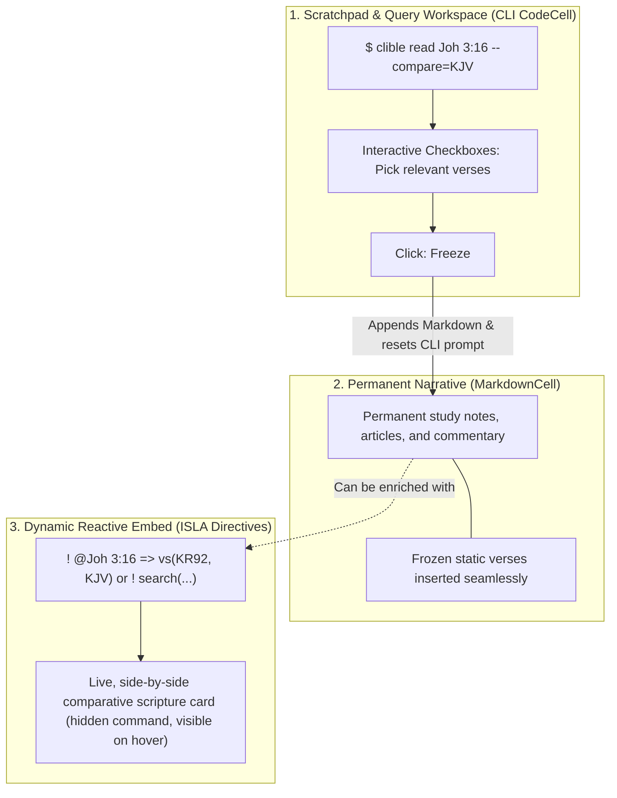

# ISLA Language Guide & Hybrid Cells

> **ISLA** — *Inline Structure & Logic Architecture*  
> (Also: *Interactive Scripture & Layout Analyzer*)  
> *A comprehensive guide to ISLA syntax, quick line directives (!isla, ! @), hybrid notebook workflows, and reactive Markdown blocks.*

---

## 1. Overview & Vision

In traditional computational notebooks and study environments, researchers are often forced to choose between two extremes:

1. **Static Narrative (Markdown)**: Ideal for reading and publishing, but unable to dynamically update or compare scriptures across different translations without tedious copy-pasting.
2. **Command Cells (CLI / REPL)**: Powerful for querying, but produce fragmented, cell-heavy documents that cannot be read smoothly as continuous articles, commentaries, or sermon manuscripts.

**ISLA bridges this gap with a unified hybrid architecture:**
You write clean, standard Markdown text and seamlessly embed fast **ISLA quick directives** (such as `! @Joh 3:16 => vs(KR92, KJV)` or `! search("armo") => @evankeliumit => in(KR92) => count()`). The execution engine parses them into deterministic ASTs and renders responsive, live scripture comparison cards directly within your narrative flow.

---

## 2. Conceptual Roles: CLI Cells vs. Markdown vs. ISLA Blocks



### Role Matrix

| Component | UI Entity | Primary Purpose | When to Use |
| --- | --- | --- | --- |
| **CLI Scratchpad** | `CodeCell` (`$ clible`) | Fast exploration, ad-hoc queries, filtering verses via checkboxes | When searching and discovering material before committing to text. |
| **Static Narrative** | `MarkdownCell` | Main reading text, headings, commentary, and permanent references | When authoring the final document or notes. |
| **Reactive Embed** | `ISLABlock` (`!isla`, `! @`, `! ?`) | Live, dynamic queries and side-by-side translation matrices | When you want a permanent live card that reacts to translation changes. |

> [!TIP]
> **Why do CLI cells persist after freezing?**  
> In Clible-v3, a CLI cell acts as a persistent "workbench". When you click **Freeze**, the selected verses are converted into a Markdown cell below/above, and the CLI input **instantly resets back to a pristine `$ clible` prompt**. You do not need to create 50 separate CLI cells; one or two cells serve as continuous scratchpads throughout your session.

---

## 3. Fast Embedding Shortcuts in Markdown

ISLA supports 4 fast embedding patterns:

### Method 1: Standard Quick Aliases `! @`, `! ?`, `! search(...)` (Recommended)

Place an exclamation mark followed by a space directly before `@`, `?` or `search(...)`:

```markdown
Key comparative passage:
! @Joh 3:16 => vs(KR92, KJV)

Quick text search:
! ? "light" @Joh => limit(3)

Functional pipeline:
! search("armo") => @evankeliumit => in(KR92) => count()
```

### Method 2: Direct Line Directive `!isla ...` or `! ...`

```markdown
!isla @Joh 3:16 => in(KR92)
! @Rom 8:28-30 => vs(KR92, KJV)
```

### Method 3: Inline Shortcut `` `! @...` `` or `` `!isla ...` ``

Embed live verses directly inside paragraph sentences:

```markdown
The cornerstone verse `! @Joh 3:16 => vs(KR92, KJV)` anchors the entire chapter.
```

### Method 4: Standard Markdown Tag `![@...]` and `[@...]`

Utilizes standard single bracket Markdown embed and link syntax:

```markdown
Inline clickable reference: [@Joh 3:16]
Live embedded scripture card: ![@Joh 3:16 => vs(KR92, KJV)]
Live cross-references: ![@Joh 3:16 => refs(3)]
```

---

## 4. Visual Polish: Command Syntax Hidden in Reading Mode

When exiting edit mode (`Esc` or `Ctrl + Enter`):

1. **Clean Typography**: The technical query syntax (`! @Joh 3:16 => vs(KR92, KJV)`) is hidden, presenting clean, distraction-free Lora serif scripture cards.
2. **Hover Inspection**: Hovering over any card reveals a floating `✦ @Joh 3:16 => vs(KR92, KJV)` badge in the top-right corner to inspect the underlying query.

---

## 5. ISLA Syntax Reference & Cheat Sheet

| Query Pattern | Syntax Example | Rendered View | Description |
| --- | --- | --- | --- |
| **Verse Lookup** | `! @Joh 3:16` | Verse Card | Retrieves passage in default translation |
| **Pipeline Projection** | `! @Joh 3:16 => in(KR92)` | Verse Card | Projects passage into specified translation |
| **Comparative Matrix** | `! @Joh 3:16 => vs(KR92, KJV)`<br>`! @Joh 3:16 ? KR92 : KJV` | 2-Column Matrix | Synchronized side-by-side comparative layout |
| **Cross-References** | `! @Joh 3:16 => refs(3)`<br>`! ~ @Joh 3:16` | Verse Collection | Related cross-references from the database |
| **Thematic Extraction** | `! @Joh 3:16 => themes(5)`<br>`! ^ => themes(10)` | Keyword Cloud | Extracted thematic keywords and frequencies |
| **Contextual Suggestions** | `! ^ => suggest(3)`<br>`! @Joh 3:16 => suggest(5)` | Verse Collection | Content-driven related scripture suggestions |
| **Full-Text Search** | `! ? "love"`<br>`! search("love")` | Verse List | Full-text database search |
| **Scoped Search** | `! ? "light" @Joh`<br>`! search("light") => @Joh` | Verse List | Search restricted to specific biblical book |
| **Genre & Group Scopes** | `! ? "valkeus" @evankeliumit`<br>`! ? "light" @gospels`<br>`! ? "grace" @epistles`<br>`! ? "laki" @toora` | Verse List | Search restricted to bilingual genre, testament, or book group |
| **Regex Query** | `! ? /righteous.*/ @Rom` | Verse List | Morphological pattern match |
| **Count Aggregator** | `! ? "grace" @gospels => count()`<br>`! @Joh 3:16 => refs() => count()` | Metric Card | Match count metric card |
| **Chained Pipeline** | `! @Joh 3:16 => in(KR92) => refs(3)`<br>`! search("armo") => @kirjeet => in(KR92) => count()` | Result Card | Sequential multi-stage evaluation |
