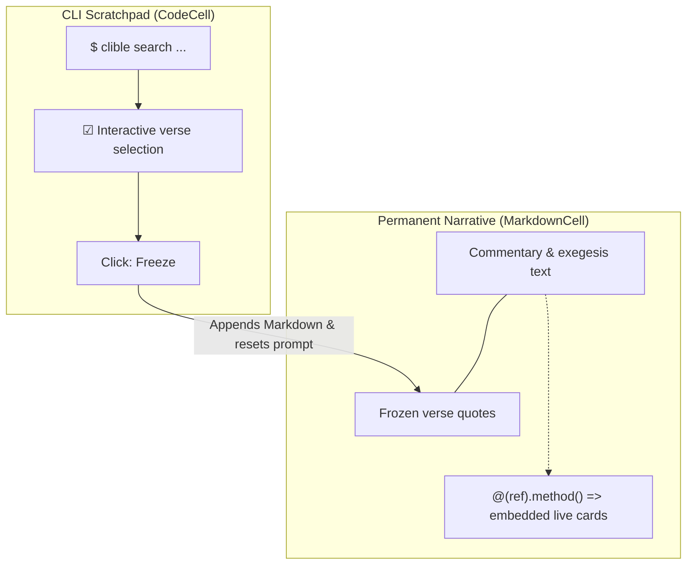

# ISLA v2 Language Guide

> **ISLA** — *Inline Structure & Logic Architecture*
> *(Also: Interactive Scripture & Layout Analyzer)*
>
> A complete guide to the ISLA v2 object-method query language — covering syntax,
> every object type, method reference, output operators, smart scopes,
> and the Monaco IntelliSense engine.

---

## 1. Overview & Design Philosophy

ISLA is a purpose-built, ergonomic query language that lives directly inside your Markdown
research documents. It bridges the gap between two extremes that most study environments
force you to choose between:

1. **Static Narrative (Markdown)**: Ideal for reading and publishing, but unable to
   dynamically query or compare scriptures without tedious copy-pasting.
2. **Command Cells (CLI / REPL)**: Powerful for querying, but produce fragmented,
   cell-heavy documents that cannot be read smoothly as continuous commentaries.

**ISLA unifies both** with a hybrid architecture: you write clean, standard Markdown
and seamlessly embed fast ISLA directives that render as live scripture comparison cards,
analytics summaries, or keyword clouds directly within your narrative flow.

### The `!` and `!isla` Trigger Prefix

When authoring research notes in a **Notebook Markdown Cell**, an ISLA directive begins with the
`!` or `!isla ` trigger prefix. This tells the editor and markdown renderer that the line is not
plain text, but an executable ISLA directive:

```isla
! @(Joh 3:16).vs(KR92, KJV) =>
! search("grace").at(ROM) =>
!isla range(GEN, DEU).count(words) >> Pentateuch Word Count
```

> [!TIP]
> The trigger prefix `!` (or `!isla `) is stripped automatically by the lexer before AST parsing,
> ensuring clean execution whether commands are invoked inside Markdown notes, via the REST API,
> or in interactive input widgets.

### The ISLA v2 Object-Method Paradigm

ISLA v2 introduces a uniform expression structure where every query follows an intuitive object-method anatomy:


| Component | In above example | Role |
|---|---|---|
| **0. Trigger** *(optional)* | `!` / `!isla ` | Signals execution in Markdown notes |
| **1. Object** *(required)* | `@(Joh 3:16)` | Defines *what* data to query (`@()`, `range`, `search`, `^`, `#var`) |
| **2. Method(s)** *(optional)* | `.vs(KR92, KJV)` | Transforms or analyzes the data (`.use`, `.vs`, `.themes`, `.stats`) |
| **3. Output** *(optional)* | `=> #joh-study` | Defines *where* to render and save (`=>`, `>`, `>>`) |

---

## 2. Top-5 Everyday Use Cases: ISLA vs. Raw SQL

To appreciate why ISLA exists, consider what the underlying engine actually executes behind the scenes in PostgreSQL. Instead of writing verbose, error-prone database queries with joins, full-text vector transformations, and statistical aggregations, ISLA condenses complex theological exegesis into readable, single-line directives.

### 1. Parallel Translation Matrix: Side-by-Side Comparison
Comparing verses across different languages or historical revisions is instantaneous in ISLA, while SQL requires multiple self-joins or union subqueries:

* **ISLA Expression**:
  ```isla
  @(Joh 3:16).vs(KR92, KJV) =>
  ```
* **Equivalent SQL Generated**:
  ```sql
  SELECT
    v1.verse,
    v1.text AS text_kr92,
    v2.text AS text_kjv
  FROM verses v1
  JOIN verses v2
    ON v1.book_id = v2.book_id
   AND v1.chapter = v2.chapter
   AND v1.verse = v2.verse
  WHERE v1.translation_id = 'kr92'
    AND v2.translation_id = 'kjv'
    AND v1.book_id = 'joh'
    AND v1.chapter = 3
    AND v1.verse = 16;
  ```

### 2. Scoped Lexical Search with Ranked Full-Text Search (FTS)
Searching theological concepts across genre groups (e.g. Pauline epistles) with PostgreSQL `tsvector` and `ts_rank` relevance ordering:

* **ISLA Expression**:
  ```isla
  search("armo" AND "rauha").at(epistolat).limit(10) =>
  ```
* **Equivalent SQL Generated**:
  ```sql
  SELECT id, translation_id, book_id, chapter, verse, text
  FROM verses
  WHERE translation_id = 'kr92'
    AND book_id IN ('rom', '1kor', '2kor', 'gal', 'ef', 'fil', 'kol', '1tes', '2tes', '1tim', '2tim', 'tit', 'flm')
    AND to_tsvector('finnish', text) @@ to_tsquery('finnish', 'armo & rauha')
  ORDER BY ts_rank(to_tsvector('finnish', text), to_tsquery('finnish', 'armo & rauha')) DESC
  LIMIT 10;
  ```

### 3. Quantitative Exegesis & Lexical Statistics (TTR & Vocabulary Density)
Calculating total word counts, vocabulary diversity (Type-Token Ratio), and lexical richness across an entire book or passage:

* **ISLA Expression**:
  ```isla
  range(ROM, GAL).stats() =>
  ```
* **Equivalent SQL / Processing Pipeline**:
  ```sql
  WITH passage_tokens AS (
    SELECT regexp_split_to_table(lower(text), '\s+') AS word
    FROM verses
    WHERE translation_id = 'kr92'
      AND book_id IN (
        SELECT id FROM books WHERE order_index BETWEEN 45 AND 48
      )
  )
  SELECT
    count(*) AS token_count,
    count(DISTINCT word) AS unique_token_count,
    round(count(DISTINCT word)::numeric / count(*), 4) AS type_token_ratio,
    avg(length(word)) AS avg_word_length
  FROM passage_tokens
  WHERE length(word) > 0;
  ```

### 4. Canonical Cross-References Lookups
Retrieving verified scriptural cross-references from the hermeneutical relationship graph:

* **ISLA Expression**:
  ```isla
  @(Rom 8:28).refs(5) =>
  ```
* **Equivalent SQL Generated**:
  ```sql
  SELECT v.id, v.translation_id, v.book_id, v.chapter, v.verse, v.text
  FROM cross_references cr
  JOIN verses v
    ON v.book_id = cr.target_book_id
   AND v.chapter = cr.target_chapter
   AND v.verse >= cr.target_verse_start
   AND v.verse <= cr.target_verse_end
  WHERE cr.source_book_id = 'rom'
    AND cr.source_chapter = 8
    AND cr.source_verse = 28
    AND v.translation_id = 'kr92'
  ORDER BY cr.rank ASC
  LIMIT 5;
  ```

### 5. Multi-Corpus Counting Dimensions
Counting how many books, chapters, or verses mention a specific word without writing complex GROUP BY queries:

* **ISLA Expression**:
  ```isla
  search("grace").at(NT).count(books) >>
  ```
* **Equivalent SQL Generated**:
  ```sql
  SELECT count(DISTINCT v.book_id) AS matching_books_count
  FROM verses v
  JOIN books b ON v.book_id = b.id
  WHERE v.translation_id = 'kjv'
    AND b.testament = 'NT'
    AND to_tsvector('english', v.text) @@ to_tsquery('english', 'grace');
  ```

---

## 3. The Five Source Objects

### `@(Citation)` — Verse Reference

Loads a single verse, verse range, or chapter:

```isla
@(Joh 3:16) =>
@(Rom 8:28-30) =>
@(1 Kor 13:4-8) =>
@(Ps 23) =>
```

The parentheses are required and may contain spaces, colons, and verse ranges using
standard `Book chapter:verse-verse` notation.

### `range(start, end)` / `(start .. end)` — Passage & Book Range

Loads a contiguous span of text from a starting reference to an ending reference.
Both arguments may be books, chapters, or specific verses:

```isla
range(Joh 1:1, Joh 1:18) =>
(MAT .. JOH) =>
@(GEN .. DEU) =>
range(ROM, GAL) =>
range(Ps 1:1, Ps 23:6) =>
```

### `search("query")` / `? "query"` — Full-Text & Boolean Search

Executes a full-text or regex search against the database:

```isla
search("grace") =>
? "armo" =>
search("armo" AND "rauha") =>
search("kuolema" OR "elämä") =>
search(/righteous.*/) =>
```

Multi-term boolean mode defaults to **AND** when terms are given without an explicit
operator between them. Regex patterns are wrapped in `/slashes/`.

### `^[n|all]` — Cell Context

References the text content of preceding notebook cells. Useful for running analytics
or semantic queries against the narrative you have already written:

```isla
^ =>          — previous one cell
^3 =>         — previous three cells
^all =>       — all preceding cells in this notebook
```

Cell context objects are resolved server-side: the surrounding notebook cell text is
sent in the API request, stripped of any existing ISLA directives, and passed to the
execution engine.

### `#variable` — Named Variable Reference

References the result of a previous query stored in a named variable using `=> #variable`, `> #variable`, or `>> #variable`.
A variable acts as a first-class object that you can chain analytical methods onto without re-querying the database:

```isla
search("armo").at(UT) => #armo
#armo.count(words) =>
#armo.top(10) =>
#armo.stats >> #armo-stats
```

---

## 4. Method Reference

Methods are chained after the object using dot notation: `.methodName(args)`.
They are applied in order, left to right.

### `.use(translationID)` — Translation Override

Forces a specific translation, overriding any smart-scope inference:

```isla
@(Joh 3:16).use(KR92) =>
@(Joh 3:16).use(KJV) =>
search("grace").use(WEB).limit(5) =>
```

**Allowed on:** `@()`, `range()`, `search()`

### `.vs(trans1, trans2)` — Parallel Comparison

Renders the passage in two translations side-by-side in a synchronized comparison matrix:

```isla
@(Joh 3:16).vs(KR92, KJV) =>
@(Rom 5:1).vs(KR92, KR38) =>
@(Ps 23).vs(WEB, KJV) >>
```

**Allowed on:** `@()` only

### `.refs(n)` — Cross-References

Fetches up to `n` canonical cross-references for the given verse from the database
(default: 5):

```isla
@(Joh 3:16).refs(3) =>
@(Rom 8:28).refs() >>
```

**Allowed on:** `@()` only

### `.at(scope)` — Scope Filter

Restricts a search to a specific book or genre group (see [Smart Scopes](#5-smart-scopes)):

```isla
search("armo").at(epistolat) =>
search("grace").at(epistles).limit(10) =>
search("kuningas").at(historia) >>
```

**Allowed on:** `search()` only

### `.limit(n)` — Result Limit

Truncates the result set to at most `n` verses:

```isla
search("light").at(gospels).limit(5) =>
search("armo").limit(20) >>
```

**Allowed on:** `search()` only

### `.count([unit])` — Count Aggregator

Counts the matched results. The optional `unit` parameter controls the counting dimension:

| Unit | Aliases | Counts |
|---|---|---|
| `verses` *(default)* | `verse`, `v`, `jakeet`, `jae` | Total matching verses |
| `words` | `word`, `w`, `sanat`, `sana` | Total word tokens |
| `unique_words` | `uw`, `uniques`, `uniikit`, `sanasto` | Unique word types |
| `chapters` | `chapter`, `c`, `luvut`, `luku` | Unique chapters represented |
| `books` | `book`, `b`, `kirjat`, `kirja` | Unique books represented |

```isla
search("armo" AND "rauha").at(epistolat).count() =>
range(GEN, DEU).count(words) =>
search("grace").at(NT).count(books) >>
```

**Allowed on:** All objects

### `.top(n)` — Word Frequency Rankings

Extracts the `n` most frequent words from the matched text corpus, returning a ranked
frequency list. Includes full analytics: token count, unique token count, and TTR.

By default, tokens are counted **as-is** (inflected forms treated separately). To
collapse inflected Finnish forms into their base lemma, add a lemmatization modifier
before `.top()`:

```isla
range(ROM, GAL).top(15) =>
range(ROM, GAL).lemma().top(15) =>
search("armo").at(epistolat).top(10) >>
^all.cluster().top(20) =>
```

**Allowed on:** All objects

### `.ngrams(size, [limit])` — Bigram and Trigram Frequencies

Returns the most frequent consecutive word pairs or triples from the selected text.
Use `2` for bigrams and `3` for trigrams. The optional `limit` controls how many
ranked results are returned and defaults to `10`.

```isla
! @(Joh 7).ngrams(2, 3) =>
! @(Joh 7).ngrams(3, 10) =>
! ^.ngrams(2, 10) =>
```

The first two commands analyze the selected Bible passage. The last command analyzes
the text of the current notebook cell. Results are shown in the frequency card as
**Bigrams** or **Trigrams**, with the phrase and its count.

| Argument | Accepted values | Example |
|---|---|---|
| `size` | `2` (bigrams) or `3` (trigrams) | `.ngrams(2, 10)` |
| `limit` | Integer from `1` to `1000`; defaults to `10` | `.ngrams(3, 5)` |

Do not prefix the method name with an extra parenthesis and do not combine it with
`.top()`: `.ngrams()` already selects and ranks phrase frequencies. For example,
use `@(Joh 7).ngrams(2, 3)`, not `@(Joh 7).(ngrams(2, 3)` or
`@(Joh 7).top(10).ngrams(2, 3)`.

The engine rejects sizes other than `2` or `3`, a limit of `0` or less, and more
than two arguments.

**Allowed on:** All objects

### `.lemma()` / `.categorize()` / `.cluster()` — Finnish Lemmatization

These three **pipeline-modifier methods** are synonymous: any one of them activates
Finnish morphological lemmatization for the following `.top(n)` call. They can appear
anywhere in the method chain.

| Method | Framing | Effect |
|---|---|---|
| `.lemma()` | Linguistic | "Lemmatize tokens before counting" |
| `.categorize()` | Domain | "Group inflections into lexical categories" |
| `.cluster()` | Statistical | "Cluster morphological variants under one stem" |

**Optional boolean argument:** `.lemma(true)` enables (default), `.lemma(false)` disables.

```isla
! ^.cluster().top(10)                        — cell context, lemmatized
! range(MAT, JOH).lemma().top(15) =>          — passage range, lemmatized
! search("armo").at(NT).categorize().top(10)  — search, lemmatized
```

**Without lemmatization** — inflected forms are separate:

| Token | Count |
|---|---|
| jeesus | 5 |
| jeesuksen | 4 |
| kristus | 4 |
| kristuksen | 4 |

**With `.lemma()` / `.cluster()` / `.categorize()`** — forms are merged:

| Token | Count |
|---|---|
| Jeesus | 9 |
| Kristus | 8 |

The lemmatizer uses a two-stage pipeline:

1. **Dictionary lookup** — 300+ hand-curated entries for Finnish theological vocabulary
   (Jeesus, Kristus, Jumala, Herra, armo, rakkaus, usko, synti, pelastus, vanhurskaus, …)
2. **Rule-based suffix stripping** — removes clitic particles (`-kin`, `-kaan`), possessive
   suffixes (`-ni`, `-mme`), case endings (`-ssa`, `-sta`, `-lle`, `-ksi`), and plural markers.

**Allowed on:** All objects

### `.stats()` — Lexical Analytics

Computes comprehensive lexical statistics for the matched corpus:

| Metric | Description |
|---|---|
| `token_count` | Total word tokens |
| `unique_token_count` | Unique word types |
| `hapax_legomena_count` | Word types occurring exactly once |
| `hapax_legomena_ratio` | Hapax types / analyzed tokens |
| `type_token_ratio` | Lexical diversity (TTR): unique / total |
| `character_count` | Total characters |
| `avg_word_length` | Mean word length in characters |

```isla
@(Rom 8:1-39).stats() =>
range(GEN, DEU).stats() >>
^all.stats() =>
```

**Allowed on:** All objects (alias: `.ttr()`)

### `.themes(n)` — Thematic Keyword Extraction

Extracts the `n` most prominent thematic keywords from the matched corpus,
rendered as a styled keyword cloud:

```isla
@(Joh 3:16).themes(5) =>
range(Joh 1:1, Joh 1:18).themes(8) >>
^all.themes(10) =>
```

**Allowed on:** All objects

### `.suggest(n)` — Contextual Scripture Suggestions

Returns up to `n` thematically related scripture passages based on keyword extraction
from the cell text or matched verse corpus:

```isla
@(Joh 3:16).suggest(3) =>
^.suggest(5) =>
^all.suggest(10) >>
```

**Allowed on:** All objects

---

## 5. Output Operators

Every ISLA expression must end with an output operator that specifies where the result
is rendered.

### `=>` — Inline (Current Cell) & Variable Assignment

Renders the result within the current notebook cell, replacing the raw command text
in reading mode. It can optionally assign the result to a named variable using `#variable`:

```isla
@(Joh 3:16).vs(KR92, KJV) =>
search("grace").at(epistles) => #grace
#grace.count(words) =>
```

### `>` — New Cell Above

Creates a new result cell **directly above** the current cell. An optional name or
`#slug` identifier can follow the operator:

```isla
range(ROM, GAL).top(15) > Epistle Word Frequencies
@(Joh 3:16).refs() > #joh316-refs
search("grace").count(books) >
```

### `>>` — New Cell Below

Creates a new result cell **directly below** the current cell:

```isla
search("armo" AND "rauha").at(epistolat).stats() >> Epistle Analytics
^all.themes(10) >> #notebook-themes
range(GEN, DEU).count(words) >>
```

> [!TIP]
> Named cells (e.g. `>> #results` or `>> My Analysis`) display their name in a styled
> header badge above the result card, making complex multi-cell notebooks easier to
> navigate and reference.

---

## 6. Smart Scopes

When `.at(scope)` is used with a genre group identifier (or when a Finnish/English alias
is detected), ISLA automatically infers the appropriate Bible translation:

| Scope Identifier | Books | Auto-Inferred Translation | Example |
|---|---|---|---|
| `epistolat` / `kirjeet` | Paul & General Epistles (ROM..JUD) | **KR92** | `search("armo").at(epistolat)` |
| `epistles` / `letters` | Paul & General Epistles (ROM..JUD) | **WEB** | `search("grace").at(epistles)` |
| `evankeliumit` / `evankeliumi` | Gospels (MAT, MRK, LUK, JHN) | **KR92** | `search("valkeus").at(evankeliumit)` |
| `gospels` / `gospel` | Gospels (MAT, MRK, LUK, JHN) | **WEB** | `search("light").at(gospels)` |
| `toora` / `laki` | Pentateuch (GEN..DEU) | **KR92** | `search("liitto").at(toora)` |
| `torah` / `law` | Pentateuch (GEN..DEU) | **WEB** | `search("covenant").at(torah)` |
| `viisaus` / `wisdom` | Wisdom literature (JOB..SNG) | Language-matched | `search("viisaus").at(viisaus)` |
| `profeetat` / `prophets` | Major & Minor Prophets (ISA..MAL) | Language-matched | `search("herra").at(profeetat)` |
| `historia` / `history` | Historical books (JOS..EST) | Language-matched | `search("kuningas").at(historia)` |
| `VT` / `OT` | Old Testament | Language-matched | `search("armo").at(VT).count()` |
| `UT` / `NT` | New Testament | Language-matched | `search("armo").at(UT).count()` |

Individual book identifiers (`Joh`, `ROM`, `Ps`, `GEN`, etc.) are also valid scope values.

> [!TIP]
> **Explicit override:** Append `.use(translationID)` after `.at(scope)` to force a specific
> translation regardless of scope inference:
> `search("grace").at(epistolat).use(KJV) =>`

---

## 7. Notebook Integration & Hybrid Cell Workflows

ISLA expressions are embedded directly inside **Markdown Cells** in a Clible Notebook:

```markdown
Paul's understanding of justification centers on faith:

@(Rom 5:1).vs(KR92, KJV) =>

The word "armo" (grace/mercy) dominates this section:

search("armo" AND "rauha").at(epistolat).top(8) >>
```

In **reading mode** (outside edit mode):

1. **Clean Typography**: The raw ISLA syntax is hidden; elegant serif scripture cards
   are rendered in its place.
2. **Hover Inspection**: Hovering over any result card reveals a floating
   `✦ @(Rom 5:1).vs(KR92, KJV) =>` badge in the top-right corner.

### CLI Scratchpad Workflow

The CLI scratchpad cell (prefix: `$ clible`) provides an interactive exploration
environment that complements ISLA narrative embeds:

1. Execute `$ clible search "grace" --scope=ROM` to browse results.
2. Use the interactive checkboxes to select relevant verses.
3. Click **Freeze** — selected verses are appended as a formatted Markdown cell, and
   the CLI prompt resets instantly to `$ clible` for the next query.


```mermaid
flowchart TD
    subgraph Scratchpad ["CLI Scratchpad (CodeCell)"]
        CLI["$ clible search ..."]
        PICK["☑ Interactive verse selection"]
        FREEZE["Click: Freeze"]
        CLI --> PICK --> FREEZE
    end

    subgraph Narrative ["Permanent Narrative (MarkdownCell)"]
        PROSE["Commentary & exegesis text"]
        STATIC["Frozen verse quotes"]
        ISLA["@(ref).method() => embedded live cards"]
    end

    FREEZE -->|"Appends Markdown & resets prompt"| STATIC
    PROSE --- STATIC
    PROSE -..-> ISLA
```

---

## 8. ISLAEditor & Language Intelligence

The **ISLAEditor** component delivers real-time language intelligence inside notebook cells via a lightweight overlay architecture and automated typing gestures:

### Overlay Pattern & Real-Time Highlighting

Instead of loading heavy, monolithic editor frameworks, ISLAEditor uses a high-performance **overlay pattern**:

```
┌──────────────────────────────────────────────────────────────────────┐
│ div.relative (wrapper)                                                │
│ ├─ div[aria-hidden] ISLASyntaxLayer  ← colour-coded token overlay    │
│ │   ├─ @(          ← amber (trigger)                                 │
│ │   ├─ Joh 3:16   ← cyan (citation)                                 │
│ │   └─ .vs(       ← fuchsia (method)                                │
│ └─ <textarea>      ← transparent text, visible amber caret           │
└──────────────────────────────────────────────────────────────────────┘
```

The underlying `<textarea>` handles all standard browser keyboard input, selection, and undo histories, while the `aria-hidden` overlay renders colour-coded `<span>` tokens aligned pixel-for-pixel.

### Smart Typing Gestures

ISLAEditor includes modern editor ergonomics to accelerate query authoring:

1. **Smart `!` Command Gesture**: Typing `!` at the beginning of an empty line automatically outputs `! ` and opens the primary ISLA template dropdown.
2. **Smart `@` Citation Gesture**: Typing `@` automatically produces `@()` and places the caret inside `@(|)`, immediately displaying biblical book completions.
3. **Auto-Closing Pairs**: Typing `(`, `"`, or `'` automatically inserts closing pairs (`()`, `""`, `''`) with the caret placed between them.
4. **Selection Wrapping**: Selecting text and typing `@`, `(`, `"`, or `'` non-destructively wraps the selection (e.g. `Joh 3:16` → `@(Joh 3:16)`).
5. **Overtype / Leapfrog**: Typing `)`, `"`, or `'` when the caret is adjacent to a closing symbol skips over without duplicating it.
6. **Token Pair Deletion**: Pressing Backspace inside `@(|)` removes the entire `@()` token cleanly.

### Autocompletion Triggers

| Typed text | Completion offered |
|---|---|
| `!` | Root ISLA query snippets (`@(Joh 3:16) =>`, `search("armo") =>`) |
| `@(` | Book name suggestions (`Joh`, `ROM`, `GEN`, ...) and genre groups |
| `search(` / `?` | Query templates: string literal, boolean, regex |
| `range(` / `(` | Book and chapter reference patterns with `..` range support |
| `#` | Currently registered cross-cell variable identifiers (`#armo`, `#joh316`) |
| `.` | All valid methods for the current object type |
| `.at(` | All scope identifiers and book names |
| `.use(` | All installed translation IDs |
| `.vs(` | Two-translation pair templates |

### Hover Documentation & Error Suggestions

Hovering over any ISLA keyword or method displays an inline signature and example card. Unrecognized method names trigger Levenshtein distance matching:

```
isla: unknown method .cnt()
      Did you mean: .count() ?
```

---

## 9. ISLA v2 Syntax Cheat Sheet

| Query Pattern | Expression | Result Type |
|---|---|---|
| **Verse lookup, default translation** | `@(Joh 3:16) =>` | Verse card |
| **Force translation** | `@(Joh 3:16).use(KR92) =>` | Verse card |
| **Side-by-side comparison** | `@(Joh 3:16).vs(KR92, KJV) =>` | Comparison matrix |
| **Passage range** | `range(Joh 1:1, Joh 1:18) =>` | Verse collection |
| **Multi-book span (dot-dot)** | `(MAT .. JOH).count(books) =>` | Count metric |
| **Cross-references** | `@(Joh 3:16).refs(5) =>` | Verse collection |
| **Thematic keywords** | `@(Joh 3:16).themes(5) =>` | Keyword cloud |
| **Contextual suggestions** | `^.suggest(5) =>` | Verse collection |
| **Single-term search** | `search("grace") =>` | Verse list |
| **Shorthand search** | `? "armo" =>` | Verse list |
| **Boolean AND search** | `search("armo" AND "rauha") =>` | Verse list |
| **Boolean OR search** | `search("kuolema" OR "elämä") =>` | Verse list |
| **Regex search** | `search(/righteous.*/).at(ROM) =>` | Verse list |
| **Scoped search** | `search("light").at(gospels) =>` | Verse list |
| **Scoped search with limit** | `search("armo").at(epistolat).limit(5) =>` | Verse list |
| **Variable assignment (inline)** | `search("armo").at(UT) => #armo` | Verse list + `#armo` badge |
| **Variable method chaining** | `#armo.count(words) =>` | Count metric |
| **Variable top frequencies** | `#armo.top(10) =>` | Frequency list |
| **Verse count** | `search("grace").at(NT).count() =>` | Count metric |
| **Word count** | `range(GEN, DEU).count(words) =>` | Count metric |
| **Lexical analytics** | `range(ROM, GAL).stats() =>` | Stats card |
| **Word frequencies** | `range(ROM, GAL).top(15) =>` | Frequency list |
| **Bigram frequencies** | `@(Joh 7).ngrams(2, 10) =>` | Frequency list |
| **Trigram frequencies** | `^.ngrams(3, 10) =>` | Frequency list |
| **Lemmatized frequencies** | `range(ROM, GAL).lemma().top(15) =>` | Frequency list (merged forms) |
| **Cluster cell context** | `^.cluster().top(10) =>` | Frequency list (merged forms) |
| **Categorize + search** | `search("armo").at(NT).categorize().top(10) =>` | Frequency list (merged forms) |
| **Output to new cell below** | `search("armo").at(epistolat).stats() >>` | Named result cell |
| **Output to new cell above** | `@(Joh 3:16).refs() > Cross-References` | Named result cell |
| **Cell context analytics** | `^all.themes(10) =>` | Keyword cloud |
| **Chained multi-method** | `search("armo").at(epistolat).limit(10).top(5) =>` | Frequency list |

---

## 10. Naming & Dedication

The name **ISLA** honors *Isla Aurora*, symbolizing brightness, clarity, and elegant structure.

Every query executed by the ISLA engine represents a commitment to clean code, joyful
engineering, and lasting open-source value.

---

## See Also

- [Liturgical Calendar & Prayer Offices](/guide/liturgical-calendar) — Church year data,
  daily prayer offices, and lectionary cycles embedded in Clible.
- [Search & Analytics](/guide/search-and-analytics) — Frequency analysis, thematic extraction,
  and statistical metrics.
