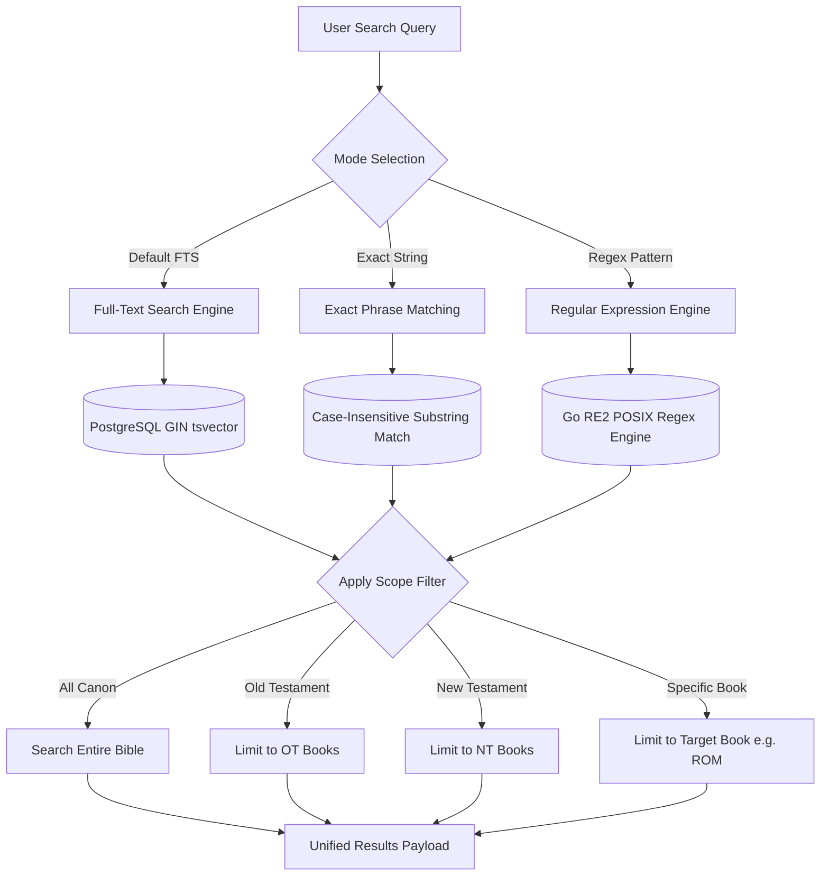

# Search & Text Analytics

clible-v3 provides a high-performance search and analytical engine designed for both simple verse lookups and deep linguistic research across multiple Bible translations.

---

## 1. Search Engine Modes & Capabilities

The platform supports three distinct search evaluation modes:



### Full-Text Search (FTS)

- **PostgreSQL**: Queries are evaluated against a **GIN (Generalized Inverted Index)** using native `to_tsvector('simple', text) @@ to_tsquery('simple', ...)` matching. This delivers sub-millisecond lookups across tens of thousands of verses.
- **SQLite Test Fallback**: Evaluated against an **FTS5 external content virtual table** synchronized via automated database triggers.
- **Stemming & Multi-word**: Supports multi-term searches with ranking.

### Phrase Search

Matches the exact consecutive sequence of words regardless of capitalization:

```text
"justified by faith"
"kingdom of heaven"
"armo ja rauha"
```

### Regular Expression Search (Regex)

For advanced linguistic and morphological analysis, enable the **Regex** toggle in the search interface. Queries are evaluated using Go's safe `regexp` (RE2) engine:

- `/righteous.*/` — Finds *righteous*, *righteousness*, *righteously*.
- `/\b(valkeus|valo)\b/` — Matches Finnish exact roots for *valkeus* or *valo*.
- `/covenant.*blood/` — Matches verses containing covenant followed by blood.

---

## 2. Search Scoping

You can restrict any search to a specific biblical division to narrow down results:

| Scope Option | Target Range | Description |
|---|---|---|
| **Whole Bible (`all`)** | Genesis–Revelation | Searches all 66 canonical books. |
| **Old Testament (`ot`)** | Genesis–Malachi | Restricts queries to the 39 Hebrew Bible books. |
| **New Testament (`nt`)** | Matthew–Revelation | Restricts queries to the 27 Greek New Testament books. |
| **Specific Book (`book`)** | e.g., `ROM`, `JHN`, `GEN` | Limits query strictly to the selected book. |

---

## 3. Search History & Instant Recall

Every executed search is automatically logged in your personal **Search History**:

- **Timestamp & Mode**: Records the exact query, search mode (FTS, phrase, regex), target translation, and scope.
- **Result Count**: Displays the total count of matched verses.
- **One-Click Re-run**: Clicking any entry in the history drawer immediately re-executes the query without re-typing.
- **Persisted Across Sessions**: Search history is saved to the backend database and synchronized across devices.

---

## 4. Text Analytics Engine

The **Analytics** view (`/analytics`) provides quantitative insights into biblical vocabulary, lexical complexity, and stylistic variations.

```
┌────────────────────────────────────────────────────────────────────────┐
│  Text Analytics: John 3 (World English Bible)                          │
├───────────────────┬───────────────────┬────────────────────────────────┤
│  Total Words      │  Unique Words     │  Lexical Diversity (TTR)       │
│  789              │  210              │  0.266 (26.6%)                 │
├───────────────────┴───────────────────┴────────────────────────────────┤
│  Top Token Frequencies:                                                │
│  1. world (12)    2. life (10)    3. believe (9)    4. light (8)       │
└────────────────────────────────────────────────────────────────────────┘
```

### 1. Lexical Diversity & Vocabulary Metrics

- **Total Word Count**: Total number of words in the selected passage or chapter.
- **Unique Vocabulary**: Count of distinct word forms (types).
- **Lexical Diversity (Type-Token Ratio / TTR)**: Calculated as:
  $$\text{TTR} = \frac{\text{Unique Words}}{\text{Total Words}}$$
  A higher ratio indicates richer, more varied vocabulary (common in epistolary literature like Hebrews), while a lower ratio indicates repetitive, thematic phrasing (common in Johannine literature).

### 2. Token Frequency Ranking

- Breaks down the most frequent words in the text after stripping punctuation and applying language-aware normalization.
- Renders interactive bar charts and frequency distribution tables.

### 3. Translation Comparison Matrix

Compare two translations of the same passage side-by-side:

- **Similarity Score**: Computed lexical similarity between translations.
- **Visual Diff Highlighting**: Highlights additions, deletions, and phrasing differences between translations (e.g., comparing KR92 vs. KR38 or KJV vs. WEB).

---

## 5. AI-Powered Study Tools

When enabled with a Google Gemini API key on the backend, clible-v3 provides advanced AI study tools directly within the web interface:

- **Theological Insights**: Generate exegesis notes focusing on specific biblical covenants, historical context, or literary motifs.
- **Original Language Studies**: Greek and Hebrew root word breakdowns, grammatical morphology, and lexicon cross-references.
- **Semantic Search**: Ask conceptual natural language questions (e.g., *"Where does Paul talk about spiritual warfare?"*) to discover relevant passages even when exact keywords differ.
- **AI Translation Comparison**: Detailed analytical breakdown of theological nuances between distinct translations.
