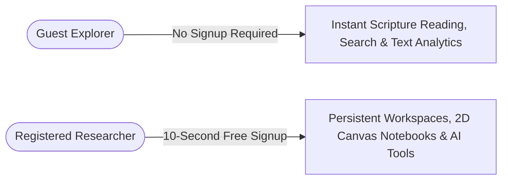

# Terms of Service & Privacy Policy

*Last updated: August 31, 2026*

Welcome to **Clible** (`clible-v3`), an open, web-native platform designed for biblical research, lexical analytics, and 2D canvas study exegesis.

We believe research tools should be transparent, respectful of user privacy, and free of commercial data exploitation. This document outlines our terms of service, acceptable use principles, and data protection practices.

---

## 1. Scope & Acceptance

By accessing or using Clible (either via **Guest Mode** or as a **Registered User**), you agree to be bound by these Terms of Service and Privacy Policy. If you do not agree with any part of these terms, you may freely choose not to use the platform or register an account.

---

## 2. User Accounts & Fair Access

### Instant & Frictionless Registration

* Creating an account requires only a valid **email address** and a secure **password**.
* We do **not** collect phone numbers, real names, credit cards, or unnecessary profile information.
* Registration takes less than 10 seconds and grants access to cloud workspace persistence, notebook sync, and theological AI features.

### Account Security & Passwords

* All passwords are encrypted using industry-standard **bcrypt** hashing with strong salt factors before storage.
* Passwords are never stored in plain text and cannot be retrieved or read by server administrators.

### Account Termination & Data Deletion

* You retain full ownership of your data and may request account deletion at any time.
* Deleting your account permanently purges your user profile, linked translations, private research workspaces, and search history from the database.

---

## 3. Privacy Policy & Data Protection (GDPR Aligned)

We adhere strictly to privacy-by-design principles:

### What Data We Store

| Data Type | Purpose | Storage & Security |
| :--- | :--- | :--- |
| **Email Address** | Account identification & session authentication | PostgreSQL `users` table |
| **Password Hash** | Secure login verification | Cryptographic bcrypt hash |
| **Research Workspaces** | Persisting user study projects, pinned searches & analytics | PostgreSQL `scopes` & `saved_*` tables |
| **2D Canvas Notebooks** | Saving user research notes, cards, and ISLA scripts | PostgreSQL `notebooks` & `cells` tables |
| **Search History** | Providing quick recall of past queries | PostgreSQL `search_history` (user-isolated) |

### What We NEVER Do

* ❌ **No Third-Party Ad Trackers**: We do not embed Google Analytics, Facebook Pixels, advertising cookies, or behavioral tracking SDKs.
* ❌ **No Data Selling**: We will never sell, rent, monetize, or disclose your personal information or study notes to third parties.
* ❌ **No AI Model Training on Private Notes**: Your personal study notes and manuscripts are never used to train public commercial AI models without your explicit consent.

---

## 4. Scripture Texts & Intellectual Property

### Translation Rights & Public Study

* Scripture translations available in Clible (such as Finnish KR92, Finnish 1776, World English Bible, SBLGNT, and Hebrew MT) are indexed and displayed exclusively for personal study, research, and non-commercial educational exegesis in accordance with their respective public domain status, Creative Commons licenses, or fair-use educational provisions.
* For detailed provenance and translation attribution, refer to the project's [`NOTICE.md`](https://github.com/mvirtai/clible-v3-go) repository documentation.

### User-Generated Content

* You retain **100% intellectual property ownership** over all original notes, exegesis cards, and markdown manuscripts created within your 2D Canvas Notebooks.
* Clible claims no copyright or commercial rights over research produced by users on the platform.

---

## 5. Theological AI Tools & Exegetical Disclaimer

Clible provides integrated lexical intelligence powered by Google Gemini AI (such as Hebrew/Greek morphosyntactic breakdown, contextual insight, and comparative translation analysis).

> [!IMPORTANT]
> **Assistive Tool Disclaimer**:
> Theological AI analyses generated by Clible are computational summaries intended as an exegesis aid. They do **not** represent official ecclesiastical dogma, doctrinal authority, or infallible theological interpretation. Researchers and scholars are always encouraged to verify morphological and linguistic claims against primary manuscript evidence and established academic lexicons (e.g., BDAG, HALOT).

---

## 6. Acceptable Use & Platform Integrity

To ensure high availability and fair performance for the entire research community, users agree not to:

1. Attempt to bypass rate limits, authentication barriers, or security controls.
2. Launch automated denial-of-service (DDoS) attacks, brute-force requests, or abusive scraping against the API.
3. Use the service or AI features for unlawful, harmful, or fraudulent activities.
4. Exploit system vulnerabilities; responsible security disclosure should be reported directly to the repository maintainers.

---

## 7. Open Source & Community Governance

Clible is developed as an open-source research initiative under the **GPL-3.0 License**.

* **Source Code Repository**: [github.com/mvirtai/clible-v3-go](https://github.com/mvirtai/clible-v3-go)
* **Feedback & Inquiries**: If you have questions about these terms or wish to submit feedback, please open an issue on the GitHub repository or contact the project maintainers.
