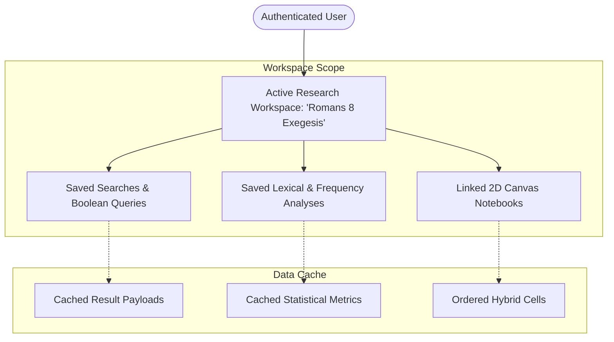

# Research Workspaces & Scopes

clible-v3 is designed around the concept of **Research Workspaces (Scopes)**. Rather than scattering bookmarks, searches, and notes across disconnected sessions, the platform enables researchers to organize their biblical exegesis into focused, project-oriented workspaces.

---

## What is a Research Workspace?

A **Scope** is an isolated research context that groups together all materials related to a specific study topic, sermon series, book analysis, or academic paper.

Within an active workspace, you can:

- **Pin Saved Searches**: Store complex full-text and regex search queries along with their cached results for immediate recall.
- **Save Text Analyses**: Persist lexical statistics, word frequency distributions, and translation comparison matrices.
- **Link 2D Canvas Notebooks**: Associate interactive study documents and exegesis notes directly with the workspace.
- **Quick-Switch Contexts**: Switch seamlessly between different research projects from the top navigation bar without losing state.



---

## Managing Workspaces in the Web UI

### 1. Creating a Workspace

1. In the top navigation bar, locate the **Scope Selector** dropdown.
2. Click **Create New Scope** (or the `+` button).
3. Enter a descriptive title for your research project (e.g., `Pauline Grace Study`, `Sermon on the Mount`, `Hebrews 11 Faith`).
4. Click **Save**. The new workspace is created and automatically set as your active working scope.

### 2. Switching Between Workspaces

Clicking the **Scope Selector** opens a dropdown list of all your research projects:

- Selecting any workspace instantly loads its associated saved searches, analyses, and notebooks.
- Selecting **Global (No Scope)** lets you perform ad-hoc searches and explorations without attaching them to a specific project.

### 3. Renaming & Deleting Workspaces

- **Renaming**: Click the edit icon next to the active workspace in the workspace manager to update its name.
- **Deleting**: When a workspace is deleted, the backend performs a clean cascade on search and analysis records (`ON DELETE CASCADE`).

> [!IMPORTANT]
> **Personal Note Protection**: Any notebook linked to a deleted workspace is **NOT** destroyed. The database executes an `ON DELETE SET NULL` rule on `notebooks.scope_id`, ensuring your research manuscripts, exegesis cards, and personal notes remain permanently accessible in your main Notebooks library.

---

## Saved Searches

When conducting deep word studies across translations, you will frequently refine queries with specific scopes and filters (such as searching for `"armo"` across the Epistles in KR92, or searching for `"grace" AND "peace"` in WEB).

### Pinning a Search to a Workspace

1. Execute a query in the **Search** view.
2. In the results header, click **Save to Workspace**.
3. Give the search a recognizable label (e.g., *Occurrences of Grace in Romans*).
4. The search is saved with its complete configuration:
   - Query string and mode (phrase, full-text, or regex).
   - Search scope (all, Old Testament, New Testament, or specific book code).
   - Target Bible translation.
   - Cached result payload (avoiding redundant server recalculation upon reload).

---

## Saved Analyses

The **Analytics** view computes lexical density, word frequencies, and comparative translation metrics.

### Pinning an Analysis

1. Run an analysis for a specific chapter or passage (e.g., *Romans 8 Lexical Analysis*).
2. Click **Save Analysis to Scope**.
3. Enter a name and confirm.
4. The exact parameter set and computed statistical outputs (total words, unique words, lexical diversity ratio, and frequency tables) are saved to your workspace.

---

## High-Performance Aggregate Workspace Fetching

To ensure the web application feels instantaneous, the backend provides an aggregate workspace endpoint:

```http
GET /api/scopes/workspace?id={scopeId}
```

Instead of issuing separate HTTP requests for the workspace metadata, its saved searches, its saved analyses, and its linked notebooks, the Go REST API fetches all associated entities in a single database round-trip and returns a unified JSON payload:

```json
{
  "id": "7bc751d3-3b1a-4712-8df7-e62a98e82110",
  "name": "Romans 8 Exegesis",
  "createdAt": "2026-07-09T07:00:00Z",
  "savedSearches": [
    {
      "id": "search-uuid-1",
      "name": "Search for 'grace'",
      "queryText": "grace",
      "searchScope": "book",
      "scopeValue": "ROM",
      "translationId": "web",
      "resultJson": "[...]"
    }
  ],
  "savedAnalyses": [
    {
      "id": "analysis-uuid-1",
      "name": "Romans 8 Frequency Analysis",
      "reference": "Romans 8",
      "analysisType": "single_stats",
      "translationId": "web",
      "resultJson": "{\"totalWords\":540,\"uniqueWords\":210,...}"
    }
  ],
  "notebooks": [
    {
      "id": "nb-uuid-1",
      "title": "Romans 8 Exegesis Notes",
      "createdAt": "2026-07-09T07:12:00Z"
    }
  ]
}
```

This ensures zero layout shifts and instant loading when switching between research workspaces in the web interface.
