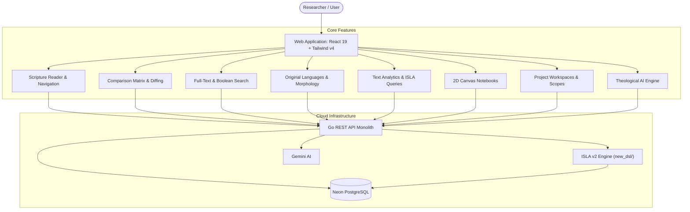

## Platform Architecture at a Glance

clible-v3 is designed as a web-native research suite accessed directly in your browser.
The ISLA query engine runs server-side as a dedicated Go package, processing expressions
in under 50 µs from lexer to result projection:

---

## Documentation Map

| If you want to… | Start here |
|---|---|
| Learn how to navigate and use the web interface | [Platform Overview & Quick Start](/guide/getting-started) |
| Read scriptures and explore canonical books | [Scripture Reader & Navigation](/guide/reader) |
| Compare translations side-by-side with visual diffs | [Comparison & Diffing](/guide/compare-and-diff) |
| Master full-text, regex search, and linguistic analytics | [Search & Text Analytics](/guide/search-and-analytics) |
| Study Greek/Hebrew root words and morphological lemmas | [Original Languages & Morphology](/guide/original-languages) |
| Leverage theological AI insights and semantic search | [Theological AI Tools](/guide/ai-study-tools) |
| Organize research into scopes and saved searches | [Workspaces & Scopes](/guide/workspaces) |
| Create 2D canvas study sheets and freeze CLI queries | [Notebooks & 2D Canvas](/guide/notebooks) |
| Master the ISLA v2 query language | [ISLA v2 Language Guide](/guide/isla-guide) |
| Manage the translation catalog and streaming XML imports | [Translations & Ingestion](/guide/import-and-seeding) |
| Self-host the application or set up local development | [Self-Hosting & Setup](/guide/self-hosting) |
| Understand the Go + React layered architecture | [Architecture Overview](/architecture/overview) |
| Explore the PostgreSQL GIN and SQLite FTS5 schemas | [Database & Dual FTS](/architecture/database) |
| Read the formal ISLA v2 grammar and EBNF | [ISLA v2 Language Specification](/architecture/isla-specification) |
| Browse the complete REST API endpoints | [Web API Reference](/api/reference) |
