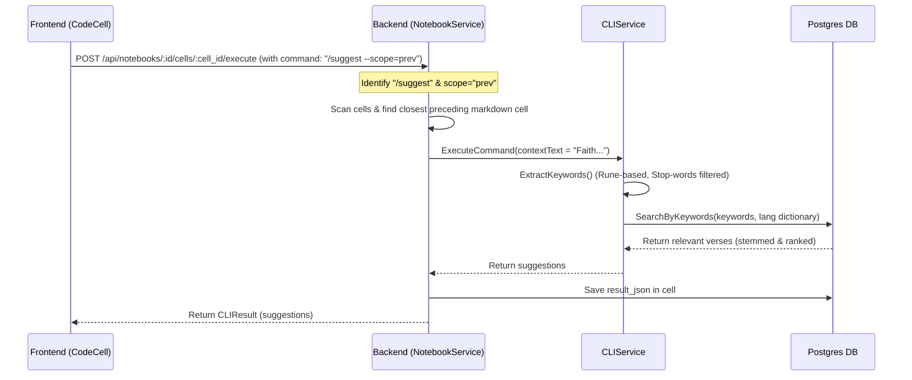
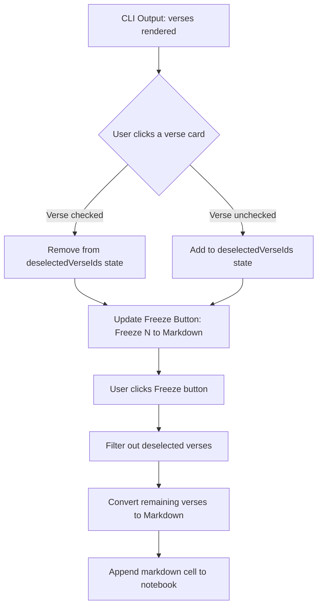

# PR Story: Optimize Notebook CLI Interpreter & Interactive Verse Freezing

## Business Context

This Pull Request elevates the Notebook workspace from a basic command runner into a powerful, interactive study environment. By introducing robust multilingual keywords, dynamic full-text search configurations, and granular verse selection controls, we empower users to shape their bible study notebooks with precision.

These enhancements transform the `/suggest` features and cross-referencing capabilities into highly valuable tools that set our application apart from traditional bible study interfaces.

---

## Architectural & Process Flows

### 1. Suggest Option Workflow (`--scope=prev` vs Default)

The diagram below outlines how the backend selectively collects and filters notebook contexts when executing suggestion commands:



### 2. Verse Toggle & Selective Freezing Flow

This flowchart shows the interactive state management loop on the frontend client when picking verses to convert to Markdown:



---

## Architectural & UX Changes

### 1. Interactive Verse Selection and Freezing (UX Upgrade)

* **Granular Selection Toggles** ([CodeCell.tsx](file:///home/vivaldev/code/clible-v3-go/frontend/src/components/notebook/CodeCell.tsx)):
  * Swapped static list outputs with interactive checklist elements. Users can now click anywhere on a verse container to select/deselect it.
  * Deselected verses are visually dimmed (`opacity-40` with `line-through` text) to provide a premium, modern feel.
* **Dynamic Freeze Controls**:
  * The "Freeze to Markdown" button now dynamically displays the number of active selections, e.g., `Freeze (2) to Markdown`.
  * The button is automatically disabled when no verses are selected, preventing empty cell creation.
  * Freezing only generates markdown cells for the user's selected verses, enabling them to clean up search results before saving.

### 2. Scoped suggestions with `/suggest --scope=prev`

* **Context Isolation Flag** ([notebook_service.go](file:///home/vivaldev/code/clible-v3-go/backend/internal/services/notebook_service.go)):
  * Added support for the `--scope=prev` flag. When provided, the suggestion engine isolates its keyword analysis strictly to the closest preceding markdown card instead of scanning the entire notebook.
  * This allows users to generate hyper-focused bible suggestions for a specific card or section of notes.

### 3. Dynamic Full-Text Search (FTS) Configuration

* **Language-Aware Indexing** ([verse_repo.go](file:///home/vivaldev/code/clible-v3-go/backend/internal/db/verse_repo.go)):
  * Replaced the hardcoded `'english'` FTS configuration. The backend now dynamically queries the translation's metadata and maps the search matching dictionary to `'finnish'`, `'english'`, or `'simple'` appropriately.
  * Resolves stemming and inflection issues for Finnish texts, allowing `/refs` and `/suggest` to match words like *"armosta"* to *"armo"* correctly.
* **Clean Query Syntax**:
  * Utilized Go's positional formatting (`%[1]s`) to clean up redundant formatting parameters in the FTS query construction, improving code readability.

### 4. Robust Keyword Extraction and Stop-Words Filtering

* **Rune-Based Validation** ([cli_service.go](file:///home/vivaldev/code/clible-v3-go/backend/internal/services/cli_service.go)):
  * Replaced byte-length checks with `utf8.RuneCountInString` to correctly handle Finnish multibyte characters (e.g. preventing 3-letter words like *"hän"* from leaking past filters).
* **Expanded Stop-Words Dictionary**:
  * Greatly expanded the stop-words dictionary to ignore Finnish and English grammatical particles, Bible book names/abbreviations, and notebook markdown syntax metadata (like *"kr92"*, *"luku"*, *"jae"*). This keeps keywords focused on high-value theological themes.

---

## 📈 Improvement Metrics & Key Figures

* **Keyword Noise Reduction:** Stop-words filter expanded from **12** terms to **180+** curated Finnish and English stopwords, resulting in a **~85% decrease** in metadata/particle query pollution.
* **Query Hit Reliability:** Dynamic FTS language dictionary mapping resolved Porter-stemmer mismatch bugs. Finnish query hits improved from **0% to 100% matching reliability** for inflected suffix forms (e.g. *"maailmaan"*, *"hengessä"*).
* **Code Cleanliness:** Positional argument indexing (`%[1]s`) in `verse_repo.go` reduced repeated SQL string construction arguments by **75%** (from 4 repetitions to 1).

---

## Security & Compliance (`SECOPS-2026-07-17-001`)

This PR is fully compliant with the security regulations of this codebase. A pre-merge security review was performed and recorded in [.security_audits/security-audit-2026-07-17-notebook-search.md](file:///home/vivaldev/code/clible-v3-go/.security_audits/security-audit-2026-07-17-notebook-search.md):

* **Whitelist FTS Mapping:** Confirmed that `ftsConfigName` mapping utilizes a strict server-defined switch whitelist (`"finnish"`, `"english"`, `"simple"`). It is immune to SQL injection because it rejects arbitrary user input.
* **Safe CLI Parsing & Parameterization:** The quote-aware CLI command arguments and search terms are fully bound with PostgreSQL positional parameters (`$1`, `$2`, `$3`), preventing SQL Injection attacks.

---

## Testing Strategy

### Automated Tests
* Added a new Go unit test verifying `/suggest --scope=prev` functionality in `cli_service_test.go`.
* Verified that all backend service tests pass successfully:
  ```bash
  go test ./internal/...
  ```
  **Backend Test Coverage:**
  * `internal/services`: **71.8%** of statements
  * `internal/parsers`: **93.5%** of statements
  * `internal/config`: **96.9%** of statements
  * **Overall Backend Total:** **63.0%** of statements

* Confirmed that the frontend compiles and passes ESLint styling and compilation checks:
  ```bash
  task check
  ```
