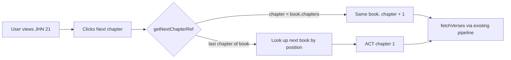

# PR Story: Add Context Navigation to the Reader

## Business Context

Reading the Bible sequentially — chapter by chapter, book by book — is one of the most common ways users engage with Scripture, yet the Reader previously required returning to the reference input on every chapter change. This PR introduces frictionless chapter-level navigation, the first building block of a broader initiative (`.plans/06-reader-improvements-and-study-paths/`) to turn the Reader into a genuine study environment ahead of upcoming reading-plan (Study Paths) features.

This is intentionally scoped as a pure frontend enhancement: no new database tables, no new API endpoints, no backend changes. All the data required (book order and chapter counts) already existed locally in `frontend/src/data/bible_structure.json`, so the feature could be delivered with zero additional network calls.

---

## Architectural & Process Flow



The same symmetric logic applies backwards via `getPreviousChapterRef`, correctly crossing book boundaries (e.g. Acts 1 → John 21) and returning `null` at the absolute start (Genesis 1) and end (Revelation 22) of the canon.

---

## Architectural Changes

### 1. Pure Navigation Utilities (`frontend/src/utils/readerNavigation.ts`)

* Introduced `getNextChapterRef`, `getPreviousChapterRef`, `getChapterCount`, and `formatChapterRef` as dependency-free functions operating on the existing static `bible_structure.json` dataset.
* Precomputed `Map`-based lookups (`BY_ID`, `BY_POSITION`) at module load time, avoiding repeated linear scans of the 66-book list on every navigation click.
* Deliberately excludes React state — the module is pure, synchronous, and independently testable without mounting any component.

### 2. Reader Integration (`frontend/src/components/VerseReader.tsx`)

* Added `parseCurrentChapter`, a small regex-based helper reusing the same book-ID pattern (`REF_BOOK_PREFIX`-style matching) already established in `bookNames.ts`, to decompose the backend's normalized `data.reference` string (e.g. `"JHN 3"`) into `{ bookId, chapter }`.
* Derived `nextChapterRef`, `prevChapterRef`, and `totalChapters` reactively from `data`, following the same pattern as the existing `displayRef` computation.
* Added `handleNextChapter` / `handlePreviousChapter`, both delegating to the pre-existing `fetchVerses` pipeline — no new data-fetching logic was introduced.
* **Scoped visibility:** the navigation row only renders when `!data.reference.includes(':')`, i.e. only in chapter/book view, not when viewing an isolated single verse. This preserves the existing "back to broader text" UX for verse-level drill-down and keeps the two navigation mechanisms from competing visually.

### 3. Internationalization

* Added `previousChapterLabel` / `nextChapterLabel` to `frontend/src/utils/i18n.ts` for both `en` and `fi`.
* A `chapterOfTotalLabel` placeholder-style string (`'{current}/{total} chapters'`) was initially drafted but **removed** after auditing the codebase's actual i18n conventions: no other component in Clible uses `.replace('{x}', ...)`-style interpolation. The established pattern (seen in `CompareView.tsx`, `GeminiUsage.tsx`) keeps dynamic numeric values as separate JSX expressions alongside static `strings.*` labels. The chapter-progress indicator (`3/21`) is therefore rendered as plain JSX numbers with no translation key at all, since digits and a slash require no localization.

---

## UI Changes

* New navigation row placed directly beneath the reference header, above the "save to workspace" block:
  * Left: "Previous chapter" / "Edellinen luku" button with `ChevronLeft` icon, disabled and visually dimmed at the start of the canon (Genesis 1).
  * Center: compact `current/total` chapter indicator (e.g. `3/21`), shown only when a valid book/chapter context is resolved.
  * Right: "Next chapter" / "Seuraava luku" button with `ChevronRight` icon, disabled at the end of the canon (Revelation 22).
* Styled with the same CSS custom properties already used elsewhere in the Reader (`var(--muted)`, `var(--border-soft)`, `var(--surface-2)`, `btn-tactile`), so the new row integrates visually without introducing new design tokens.

---

## Testing Strategy

### Automated Tests

* **`frontend/src/utils/readerNavigation.test.ts`** (new) — 11 unit tests covering:
  * In-book chapter advancement/retreat
  * Book-boundary crossing in both directions (e.g. John 21 → Acts 1, Acts 1 → John 21)
  * Canon-edge cases returning `null` (before Genesis 1, after Revelation 22)
  * Unrecognized book IDs returning `null`
  * `getChapterCount` for known and unknown books
* **`frontend/src/components/VerseReader.test.tsx`** — existing suite re-verified; one pre-existing test initially broke because it queried the first `button[type="button"]` in the DOM, which became the new "Previous chapter" button once the navigation row was added. Resolved by scoping the navigation row's visibility to chapter/book views only (`!data.reference.includes(':')`), restoring the original single-verse-view button ordering the test relies on.

```bash
cd frontend && npx vitest run src/utils/readerNavigation.test.ts
# ✓ 11 tests passed

task check
# ✓ All local quality checks passed flawlessly! (41/41 frontend tests, backend suite unaffected)
```

### Manual Verification

* Navigated `John 21` → Next chapter → confirmed landing on `Acts 1`.
* Navigated back twice from `Acts 1` → confirmed return to `John 21`.
* Confirmed "Previous chapter" is disabled at `Genesis 1` and "Next chapter" is disabled at `Revelation 22`.
* Confirmed the `current/total` indicator updates correctly per chapter.
* Confirmed single-verse view (e.g. clicking a verse) hides the chapter navigation row and preserves the existing "back to broader text" flow untouched.

---

## Scope Notes

* No database migrations, no new REST endpoints, no backend changes of any kind.
* This PR corresponds to Part 1 ("Osa 1: Kontekstinavigaatio") of `.plans/06-reader-improvements-and-study-paths/01-vaihe-a-lukunakyman-parannukset.md`. Bookmarks, verse annotations, and reading-progress tracking (Osat 2–4 of the same plan) are intentionally deferred to separate PRs, each with its own migration and API surface.
* A follow-up typography/readability improvement for prose vs. poetry books (`.plans/06-reader-improvements-and-study-paths/02-tekstin-typografia-ja-luettavuus.md`) was scoped as a deliberately separate PR, since it is a purely visual change with a different risk profile and benefits from independent review.
