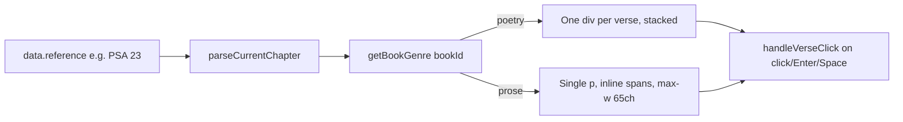

# PR Story: Improve Typography and Readability in the Reader

## Business Context

The Reader previously rendered every passage the same way regardless of literary genre: a single juokseva (running) paragraph of inline `<span>` elements, with no upper bound on line length. This works reasonably well for narrative prose, but it has two concrete readability problems documented in `.plans/06-reader-improvements-and-study-paths/02-tekstin-typografia-ja-luettavuus.md`:

1. **Unbounded line length.** On wide screens, a chapter's text could stretch far beyond the ~60–75 character range considered optimal for reading comfort.
2. **Loss of poetic structure.** Hebrew poetry (Psalms, Proverbs, Job, Song of Songs, Lamentations, Ecclesiastes) is built on parallelism — paired lines that restate or contrast the same idea. Flattened into a single running paragraph, that structure disappears entirely.

Before proposing a fix, the three Finnish XML sources in `xml_translations/` were audited directly. All three use only `<verse>` tags — no `<p>`, no `<heading>`, no structural markup of any kind, even in the OSIS-formatted source. This means true paragraph breaks derived from the original text are not recoverable from any currently supported source without a richer format (e.g. USX), and that work is explicitly out of scope here.

Given that constraint, this PR ships the improvement that *is* achievable with existing data: a genre classification (`prose` vs `poetry`) keyed off the book ID, which is already known and requires no backend or schema changes.

---

## Architectural & Process Flow



Both rendering paths reuse the exact same `handleVerseClick` navigation logic already used before this PR — only the markup and layout differ.

---

## Architectural Changes

### 1. Genre Classification Utility (`frontend/src/utils/bookGenre.ts`)

* New, dependency-free module exporting `getBookGenre(bookId: string): 'prose' | 'poetry'`.
* Poetry set is a fixed, hardcoded list of the six books universally recognized as Hebrew poetry: `JOB`, `PSA`, `PRO`, `ECC`, `SNG`, `LAM`.
* Prophetic books (Isaiah, Jeremiah, etc.) are deliberately left classified as `prose` in this first version — they interleave narrative and oracular poetry at a verse-level granularity that isn't recoverable from the current data sources, so a conservative default was preferred over a misleading heuristic.
* Unrecognized book IDs default to `prose`, matching the existing safe-default philosophy used elsewhere in the reader utilities (e.g. `readerNavigation.ts`).

### 2. Reader Integration (`frontend/src/components/VerseReader.tsx`)

* Reused the `currentChapterInfo` derived in the existing `parseCurrentChapter` helper (introduced in PR #053) to resolve `genre = getBookGenre(currentChapterInfo.bookId)`.
* Replaced the single unconditional verse-rendering block with a three-way conditional:
  * **Empty state** — unchanged `strings.noVersesFound` message.
  * **Poetry** — each verse renders in its own flex row (`<div>` instead of `<span>`), verse number and text on the same baseline, wrapped in a `space-y-2` container.
  * **Prose** — same inline `<span>`-per-verse structure as before, now wrapped in a `<p>` with `max-w-[65ch]` to bound line length.
* No changes to `fetchVerses`, `handleVerseClick`, or any state management — this is purely a rendering-layer change.

### 3. Accessibility Improvements (both rendering paths)

While touching the verse-click markup, a pre-existing gap was closed: clickable verse elements previously relied on `onClick` alone, with no keyboard affordance.

* Added `role="button"` and `tabIndex={0}` to every clickable verse element (both the poetry `<div>` and prose `<span>`).
* Added an `onKeyDown` handler triggering `handleVerseClick` on `Enter` or `Space`, with `preventDefault()` to stop the page from scrolling on Space.
* Added `aria-label={`${strings.verseLabel} ${v.verse}: ${v.text}`}` using the existing `verseLabel` i18n string (already used elsewhere, e.g. `CompareView.tsx`), so screen readers announce a single coherent label per verse.
* Marked the `<sup>` verse-number element `aria-hidden={true}` in both paths, since its content is already included in the verse's `aria-label` — this avoids the number being announced twice.

---

## UI Changes

* **Poetry books** (e.g. `PSA 23`): each verse now occupies its own line, with the verse number aligned to the text baseline via `flex gap-2 items-baseline`, preserving the visual pairing/parallelism of the original poetic structure.
* **Prose books** (e.g. `JHN 3`): text remains a single flowing paragraph, but is now capped at `max-w-[65ch]` — noticeably shorter, more comfortable line lengths on wide viewports, with no visual change on narrow ones.
* No new colors, tokens, or fonts introduced; both paths reuse the existing `text-xl leading-relaxed font-serif` verse text styling and `var(--accent)` / `var(--text-2)` / `var(--accent-bg)` custom properties already established in the Reader.

---

## Testing Strategy

### Automated Tests

* **`frontend/src/utils/bookGenre.test.ts`** (new) — 3 unit tests:
  * `PSA` classified as `poetry`
  * `GEN` classified as `prose`
  * Unrecognized book ID (`XXX`) safely defaults to `prose`
* **`frontend/src/components/VerseReader.test.tsx`** — added a new test asserting that Psalms (`PSA 23`) render verses as `div.cursor-pointer` elements (one per line), while the existing tests covering John 3 (prose) continue to assert `span.cursor-pointer` elements, confirming both render paths coexist correctly without regressing prior behavior.

```bash
cd frontend && npx vitest run src/utils/bookGenre.test.ts src/components/VerseReader.test.tsx
# ✓ all tests passed
```

### Manual Verification

* Opened `Psalmit 23` (`PSA 23`) — confirmed every verse renders on its own line with the verse number cleanly aligned.
* Opened `Johannes 3` (`JHN 3`) — confirmed text remains a single running paragraph, unaffected in narrow viewports and visibly narrower on a 1920px-wide window.
* Tabbed through verses with the keyboard and activated selection with both Enter and Space in both poetry and prose views — confirmed identical navigation behavior to mouse clicks.
* Confirmed clicking a verse in either mode still triggers `handleVerseClick`, isolates the single verse, and preserves the existing "back to broader text" flow.

---

## Scope Notes

* Purely a frontend, presentational change — no database migrations, no new API endpoints, no changes to `xml_parser.go` or `models.Verse`.
* This PR corresponds to `.plans/06-reader-improvements-and-study-paths/02-tekstin-typografia-ja-luettavuus.md`, deliberately scoped as a separate PR from context navigation (PR #053) since it is a visual/typographic change with a different risk profile and review focus.
* Genre classification is intentionally coarse (book-level, not verse-level) given the lack of paragraph/structure markup in any currently supported XML source. Refining prophetic-book classification or introducing dialogue-aware formatting (e.g. the em-dash convention observed in `fin-1992`) are noted as possible follow-ups, not part of this PR.
* The accessibility (keyboard + `aria-label`) improvements were added opportunistically while touching this markup, since they directly overlap with the elements being restructured, but they are backward-compatible and do not change any existing test expectations around click-based navigation.
