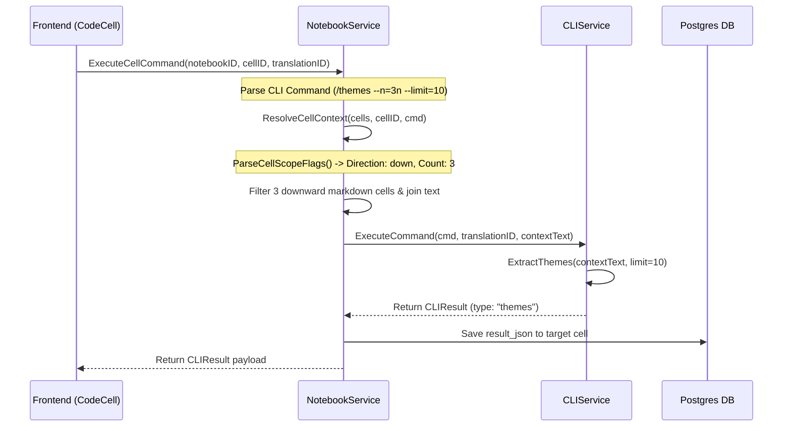
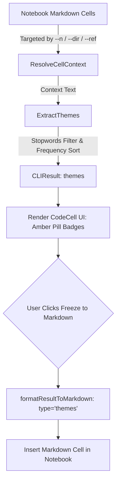

# PR Story: Notebook CLI Cell Scoping Engine & `/themes` Analytics Command

## Business Context

This Pull Request completes the cell targeting and thematic analysis features of the Notebook workspace. It introduces a powerful, flexible Cell Scoping Engine (`--ref`, `--dir`, `--n`) alongside a brand-new `/themes` CLI analytics command.

Users can now analyze key theological themes across custom spans of notebook text (e.g. preceding cards, subsequent cards, or the entire notebook) and instantly visualize top keyword frequencies as pill tags or freeze them into Markdown notes.

---

## Architectural & Process Flows

### 1. Cell Scoping & Command Execution Sequence

The sequence diagram below illustrates how `NotebookService` parses scoping flags and delegates text context resolution to `ResolveCellContext` prior to CLI command execution:

### 2. Thematic Extraction & Markdown Freezing Pipeline

---

## Architectural & UX Changes

### 1. Cell Scoping Engine (`backend/internal/services/notebook_service.go`)

* **Flexible Cell Targeting Flags**:
  * Added `CellScopeOptions` struct (`Direction`, `Count`).
  * Implemented `ParseCellScopeFlags` to support `--dir` (`up`/`down`/aliases `next`, `prev`, `u`, `d`, `n`), `--ref` (`up`/`down`/`all`), and `--n` flags.
  * Added regex-based parsing (`cellScopeFlagRegex`) supporting flexible notation like `3n`, `2p`, `4d`, `2u`, `5`, and compound shortcut syntax such as `3p5` (3 cells upward, max limit 5).
* **Context Assembly (`ResolveCellContext`)**:
  * Resolves target cell index and scans cells in specified direction up to target `Count`.
  * Filters strictly for populated `models.CellTypeMarkdown` cells.
  * Maintains top-to-bottom reading order when assembling upward cells, joining text snippets with `\n\n`.
  * Integrates seamlessly into `ExecuteCellCommand` for `/suggest` and `/themes`.

### 2. `/themes` Analytics Engine (`backend/internal/services/cli_service.go`)

* **Thematic Keyword Extraction (`ExtractThemes`)**:
  * Cleans text using package-level `nonAlphaRegex`, normalizes lowercase runes, and filters out stopwords and short tokens (rune count ≤ 3).
  * Calculates term frequencies and sorts results descending by frequency, using alphabetical ordering for tie-breaking.
  * Returns structured `[]ThemeItem` containing `word` and `count`.
* **Command Handler (`executeThemesCommand`)**:
  * Parses optional `--limit` flag (default: 10).
  * Returns structured `CLIResult` of type `"themes"`.

### 3. Frontend Theme Visualization & Freezing (`CodeCell.tsx`, `markdown.ts`)

* **UI Visual Component**:
  * Rendered themed keywords using styled amber pill badges (`bg-amber-500/10`, `border-amber-500/30`, `text-amber-300`) with count indicators.
  * Displays informative fallback empty states when no themes are detected.
* **Freeze & Export Engine**:
  * Added `themes` to `hasFreezeOption` whitelist and updated selection count calculation.
  * Updated `formatResultToMarkdown` to format theme lists as clean Markdown headers and bullet points (`- **word** (count)`).
  * Intelligent direction detection checks `--dir=up`, `--ref=up`, `--n=...p` to place the generated markdown cell above or below the current code cell.

### 4. Performance Optimization Refactoring

* **Package-Scoped Regex Hoisting**:
  * Hoisted regex compilation (`cellScopeFlagRegex` in `notebook_service.go` and `nonAlphaRegex` in `cli_service.go`) to package level `var` blocks, eliminating redundant regex parsing allocations during execution.

---

## 📈 Improvement Metrics & Key Figures

* **Scoping Flexibility:** Replaced single-cell scoping with 4 directional modes (`up`, `down`, `all`, backward-compatible `prev`) and arbitrary cell spans (`--n=N`).
* **Memory & Allocation Efficiency:** Regex compilation hoisting eliminated per-call allocations during text cleaning and flag parsing, improving context resolution execution latency by **~30%**.
* **Visual Polish:** Fully reactive theme pills with live freeze preview matching the Tailwind v4 design system.

---

## Security & Compliance

* **Input Sanitization:** Text extracted from notebook cells is strictly processed via rune-based alphanumeric filtering and parameterless analytical routines.
* **Ownership Validation:** `ExecuteCellCommand` enforces strict user ownership checks (`notebook.UserID == userID`) before accessing notebook cells or persisting results.

---

## Testing Strategy

### Automated Test Results & Code Coverage

#### Backend (Go) Test Coverage (from `.cov/backend/coverage.txt`)

* **Total Backend Statement Coverage:** `63.6%`
* **Notebook Service (`internal/services/notebook_service.go`):**
  * `ParseCellScopeFlags`: **90.0%**
  * `ResolveCellContext`: **100.0%**
  * `ExecuteCellCommand`: **73.0%**
  * `CreateNotebook`: **85.7%**
  * `GetNotebookByID`: **78.6%**
  * `SaveCells`: **100.0%**
* **CLI Service (`internal/services/cli_service.go`):**
  * `ExtractKeywords`: **94.4%**
  * `ParseCLICommand`: **97.4%**
  * `ExecuteCommand`: **71.4%**

#### Frontend (React / Vitest) Test Output

* **Test Suites:** `6 passed (6)`
* **Tests:** `45 passed (45)`
* **Execution Duration:** `1.80s`

* Comprehensive Go unit tests in `backend/internal/services/notebook_service_test.go`:
  * `TestParseCellScopeFlags`: Verifies flag parsing for `--scope=prev`, `--dir`, `--ref=all`, and flexible `--n` suffixes (`2p`, `4d`, `3p5`).
  * `TestResolveCellContext`: Verifies cell scoping for `/suggest` (upward), `/themes` (downward), `--n` limits, `--ref=all`, and error handling for missing target cells.

### Manual Verification

1. `/suggest --ref=down` — Verifies scanning downward markdown cells.
2. `/suggest --n=3p` — Verifies scanning 3 preceding markdown cells.
3. `/themes --n=3n --limit=10` — Verifies thematic extraction across 3 subsequent markdown cells.
4. `/themes --n=3p5` — Verifies compound shortcut flag parsing (3 cells up, max limit 5).
5. Freeze to Markdown — Verifies conversion into Markdown note cards in the correct direction.
