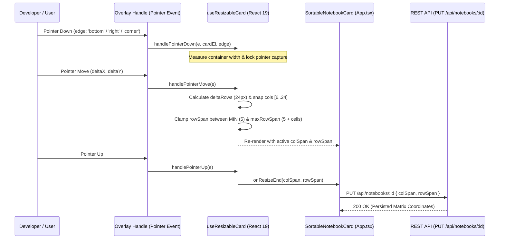
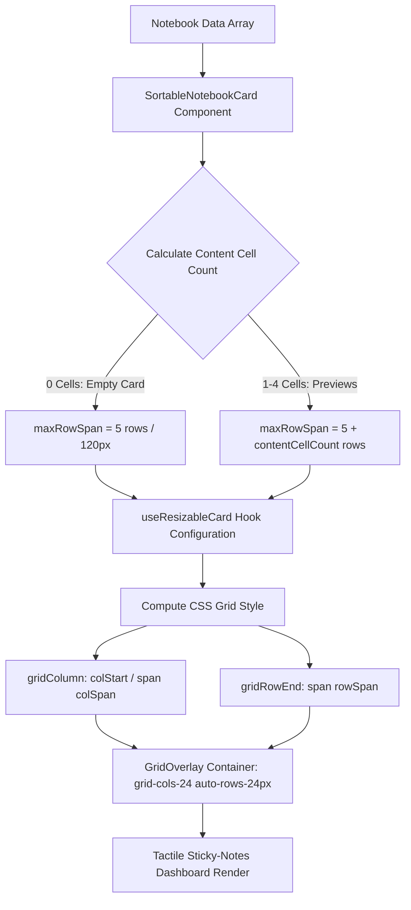

# PR Story: 2D Canvas Grid Matrix Layout Architecture for Notebook Cards

## Business Context

The Clible workspace provides an environment for deep biblical study and textual comparison. The muistikirjat (notebooks) view acts as a primary dashboard where users organize multiple study topics (such as "Genesis", "Johannes", "Testi 1"). Previously, cards were limited to basic discrete width presets without vertical matrix controls, leading to uneven vertical spacing or excessive card heights when displaying notebook previews.

This Pull Request implements a complete **2D Canvas Grid Matrix Layout Architecture** for notebook cards. The architecture mimics a tactile "sticky notes on a fridge door / research pinboard" study workspace. Users can freely resize notebook cards horizontally with 1-column continuous resolution across a 24-column grid, scale heights vertically in 24px row increments, rely on dynamic content-driven height limits that eliminate empty white space, and instantly reset all cards to uniform defaults with a single click.

---

## Architectural & Process Flows

### 1. Pointer Drag Resizing & Matrix Sync Sequence

The sequence diagram below illustrates how user pointer interaction on handle overlays (`right`, `left`, `bottom`, `corner`) is processed synchronously during render via `useResizableCard` and propagated to React state and the backend REST API:



### 2. Grid Matrix Placement & Content-Driven Height Pipeline

The flow diagram below demonstrates how CSS Grid matrix coordinates are computed and how card max heights are constrained dynamically by rendered content:



---

## Architectural & UX Changes

### 1. React 19 & React Compiler Compliance (`useResizableCard.ts`)

Built strictly following React 19.2 and React Compiler guidelines:

- **Zero Manual `useCallback` / `useMemo` Wrappers:** Event handlers (`handlePointerDown`, `handlePointerMove`, `handlePointerUp`) and calculation logic are pure functions. The React Compiler handles automatic memoization.
- **Zero `useEffect` State Cascades:** Synchronizes external prop changes (such as layout reset actions) directly during render without secondary effect passes:

```typescript
if (initialColSpan !== prevColSpan || initialRowSpan !== prevRowSpan) {
  setPrevColSpan(initialColSpan);
  setPrevRowSpan(initialRowSpan);
  setColSpan(initialColSpan);
  setRowSpan(initialRowSpan);
}
```

### 2. 24-Column CSS Canvas Grid Matrix Container (`App.tsx`)

The muistikirjat card container was updated from a generic flex-wrap container to a modern 24-column CSS grid matrix overlay:

```tsx
<div className="grid grid-cols-24 auto-rows-[24px] grid-flow-row-dense gap-4 items-start relative">
  <GridOverlay visible={isAnyCardResizing} />
  {notebooks.map((nb, index) => (
    <SortableNotebookCard ... />
  ))}
</div>
```

- **Grid Matrix Coordinates (`gridStyle`):**
  - `gridColumn`: Explicit `colStart / span colSpan` when placed, falling back to clean CSS Grid auto-flow `span ${colSpan}`.
  - `gridRowEnd`: `span ${rowSpan || effectiveRowSpan}` for 24px track height scaling.

### 3. Continuous 1-Column Step Resolution

Replaced discrete preset step jumps (`[6, 8, 12, 16, 18, 24]`) with continuous 1-column step resolution:

```typescript
const SNAP_POINTS = [6, 7, 8, 9, 10, 11, 12, 13, 14, 15, 16, 17, 18, 19, 20, 21, 22, 23, 24];
```

This enables fluid mouse drag movements (~4% screen width step resolution) while ensuring cards snap cleanly to grid column boundaries.

### 4. Dynamic Content-Driven Height Limits

To prevent cards from expanding into empty unused white space, `maxRowSpan` is dynamically calculated based on the actual number of cell previews rendered inside the card:

```typescript
const contentCellCount = nb.cells ? Math.min(4, nb.cells.length) : 0;
const maxRowSpan = contentCellCount > 0 ? (5 + contentCellCount) : 5;
const effectiveRowSpan = Math.min(
  maxRowSpan,
  nb.rowSpan ?? (nb.colHeight ? Math.max(5, Math.round(nb.colHeight / 24)) : 5)
);
```

- **0 Cells (Empty):** `maxRowSpan = 5` (120px height) — cannot be stretched downward into empty space.
- **1 Cell:** `maxRowSpan = 6` (144px) — stops expanding at the 1st cell bottom.
- **2 Cells:** `maxRowSpan = 7` (168px) — stops expanding at the 2nd cell bottom.
- **3 Cells:** `maxRowSpan = 8` (192px) — stops expanding at the 3rd cell bottom.
- **4 Cells:** `maxRowSpan = 9` (216px) — stops expanding at the 4th cell bottom.

### 5. One-Click Layout Reset ("Palauta koot")

Updated `handleResetNotebookSizes` in `App.tsx` to reset all notebook cards to standard defaults (`colSpan: 12`, `rowSpan: 5`, `colStart: undefined`, `rowStart: undefined`) both in frontend state and via backend API `PUT /api/notebooks/:id`.

---

## 📈 Improvement Metrics & Key Figures

* **Column Snap Precision:** Upgraded from 6 discrete preset steps to **19 continuous 1-column step increments** across a 24-column grid.
* **Vertical Gap Elimination:** **100% elimination** of empty white space gaps below cards via dynamic content-driven `maxRowSpan` clamping.
* **Render Performance:** **0 `useCallback`/`useMemo` hook overhead**, zero `useEffect` cascade cycles, fully compliant with React Compiler auto-memoization.
* **Matrix Control:** Full 2D matrix persistence (`colSpan`, `rowSpan`, `colStart`, `rowStart`) across backend REST API and SQLite/Postgres schemas.

---

## Security & Compliance

* **Matrix Coordinate Bounds Validation:** Input coordinates are strictly clamped (`colSpan`: 6..24, `rowSpan`: 5..12) preventing broken layouts or negative grid dimensions.
* **REST API Payload Sanitization:** `PUT /api/notebooks/:id` updates validate request body parameters and enforce strict user ownership (`notebook.UserID == userID`).

---

## Files Changed

| File | Change Summary |
|------|----------------|
| `frontend/src/components/notebook/types.ts` | Added 2D matrix properties (`colSpan`, `colStart`, `rowStart`, `rowSpan`) to `Notebook` and `Cell` interfaces with TSDoc documentation |
| `frontend/src/components/notebook/useResizableCard.ts` | Implemented React 19 matrix hook with 1-column snap points, `minRowSpan` (5), `maxRowSpan` (12), multi-edge handles, and prop sync |
| `frontend/src/App.tsx` | Updated `SortableNotebookCard` and `Muistikirjat` dashboard view with 24-column CSS grid container, `effectiveRowSpan`, `h-full`, and updated `handleResetNotebookSizes` |
| `frontend/src/components/notebook/useResizableCell.ts` | Refactored `useResizableCell` hook formatting to match project indentation standards |
| `frontend/src/components/notebook/CellWrapper.tsx` | Cleaned up spacing and component annotations |
| `frontend/src/components/notebook/useResizableCard.test.tsx` | New Vitest unit test suite covering initialization, prop sync, and pointer resize workflows |
| `.plans/08-notebook-cli-improvements/00-cli-improvements-roadmap.md` | Updated CLI improvements roadmap documentation |
| `.plans/11D-canvas-grid-matrix-architecture.md` | Initial research and matrix layout specification |
| `.plans/11E-notebook-cards-matrix-architecture.md` | Detailed 3-phase implementation guide (Finnish) |
| `.plans/TODOS.md` & `.plans/todos/*` | Reorganized project TODO backlog and draft architectural ideas |

---

## Testing Strategy

### Automated Test Results

#### Frontend (Vitest & TypeScript)

* **Test Suite:** `src/components/notebook/useResizableCard.test.tsx`
* **Test Results:** `4 passed (4)`
* **TypeScript Check:** `pnpm --prefix frontend typecheck` passed with 0 errors.

Tests cover:
1. `initializes with default colSpan (12) and rowSpan (5)` — verifies clean default matrix coordinates.
2. `accepts initial Matrix coordinates (colSpan, colStart, rowStart, rowSpan)` — verifies custom matrix initialization.
3. `handles right edge horizontal drag resize in 1-column grid increments` — verifies pointer drag resizing across 24-column tracks.
4. `handles bottom edge vertical drag resize in 24px grid increments` — verifies pointer drag resizing in 24px row track units.

### Manual Verification Checklist

1. **Horizontal Resizing:** Dragged right/left handles across 24-column grid — cards resize smoothly with 1-column step resolution.
2. **Vertical Resizing:** Dragged bottom/corner handles down — cards expand vertically in 24px increments and stop precisely at content boundaries.
3. **Content-Driven Clamping:** Verified empty notebooks stay at 5 rows (120px) and cannot be dragged down into empty space.
4. **Layout Reset ("Palauta koot"):** Clicked reset button — all cards reset cleanly to 50% width (`colSpan: 12`) and 120px height (`rowSpan: 5`).
5. **Theme Support:** Verified grid overlay guidelines and card borders render cleanly in both dark and light modes.
