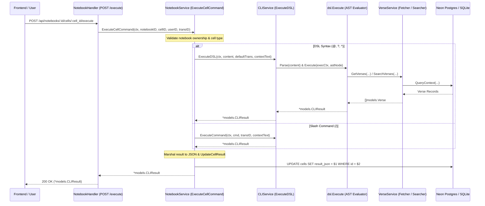
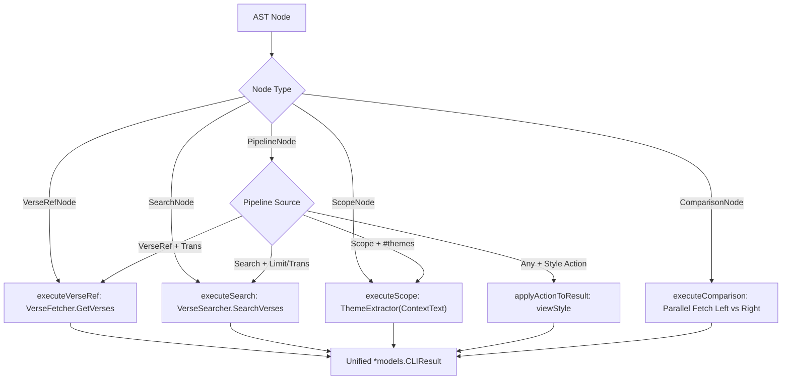

# PR Story: Clible Magic DSL Runtime Executor, Service Integration, and Cell Evaluation

## Business Context

The Clible workspace provides an environment for deep biblical study, hermeneutical research, and multi-translation comparison. While traditional notebook interfaces relied on explicit slash commands (`/read`, `/search`, `/suggest`, `/themes`), users required a faster, more expressive, and composable syntax to query scripture, execute targeted full-text searches with modifiers, perform parallel translation comparisons, and extract thematic patterns directly from contextual study notes.

This Pull Request completes Phase 2 of the **Unified Hybrid Cell & Clible Magic DSL** architecture. It implements the runtime execution engine (`internal/dsl/executor.go`) that evaluates parsed AST nodes into unified `*models.CLIResult` payloads, integrates the execution engine into `CLIService` and `NotebookService`, and introduces automatic syntax dispatching in notebook cells. Furthermore, this PR significantly expands backend automated test coverage across services, API handlers, repositories, and context utilities, boosting total test coverage from **69.8% to 73.1%**.

---

## Architectural & Process Flows

### 1. Notebook Cell Execution & DSL Dispatch Pipeline

The sequence diagram below illustrates how a cell execution request (`POST /api/notebooks/:id/cells/:cell_id/execute`) flows from the API layer through `NotebookService`, evaluates via `CLIService` and `dsl.Execute`, and persists the JSON result:



### 2. AST Node Evaluation & Resolution Flow

The flowchart below demonstrates how AST nodes are dispatched to their corresponding runtime evaluators:



---

## Architectural & UX Changes

### 1. Decoupled DSL Execution Engine (`backend/internal/dsl/executor.go`)

- **Interface-Driven Dependency Injection:** Declared `VerseFetcher` (`GetVerses`) and `VerseSearcher` (`SearchVerses`) interfaces. This keeps `dsl` free from database or service layer imports.
- **ExecutionContext Container:**
  ```go
  type ExecutionContext struct {
      Ctx            context.Context
      DefaultTrans   string
      ContextText    string
      VerseFetcher   VerseFetcher
      VerseSearcher  VerseSearcher
      ThemeExtractor func(text string, limit int) []models.ThemeItem
  }
  ```
- **Recursive AST Evaluation:**
  - `VerseRefNode` (`@Joh 3:16`): Resolves references through `VerseFetcher` and outputs structured `read` results.
  - `SearchNode` (`? "love"`): Performs full-text or regex searches with optional translation overrides.
  - `PipelineNode` (`Source => Target`): Evaluates transformations such as translation switching (`@Joh 3:16 => KR92`), result limiting (`? "love" => limit:5`), and styling (`:card`).
  - `ComparisonNode` (`@Joh 3:16 ? KR92 : KJV`): Concurrently queries left and right translations, packaging side-by-side verses into `compare` payloads.
  - `ScopeNode` (`^1 => #themes`): Feeds contextual preceding markdown cells through `ThemeExtractor`.

### 2. Service Layer Integration (`backend/internal/services/`)

- **`CLIService.ExecuteDSL` (`cli_service.go`):**
  - Parses DSL expressions with `dsl.Parse(input)`.
  - Assembles `dsl.ExecutionContext` with `verseService` dependencies and `ExtractThemes` closure.
  - Returns unified `*models.CLIResult`.
- **`NotebookService.ExecuteCellCommand` (`notebook_service.go`):**
  - Implemented automatic syntax detection:
    - Inputs prefixed with `@`, `?`, or `^` route to `ExecuteDSL`.
    - Inputs prefixed with `/` route to legacy `ExecuteCommand`.
    - Non-matching inputs return a clean, descriptive validation error.
  - Resolves cell contextual text across neighboring markdown cells before passing to the execution engine.
  - Atomically updates cell `ResultJSON` in the repository upon successful evaluation.

### 3. Comprehensive Test Coverage Expansion

- **`cli_service_test.go`:** Added `TestCLIService_ExecuteDSL` covering verse citations, search expressions, context themes, comparisons, and syntax error cases. Added `/themes` command execution tests.
- **`notebook_service_test.go`:** Added `TestNotebookService_ExecuteCellCommand` verifying end-to-end cell command execution and validation.
- **`notebook_handler_test.go`:** Added `TestNotebookHandler_ExecuteCommand` covering HTTP 200, 400, 401, 405, and 500 scenarios.
- **`scope_repo_test.go` & `saved_repo_test.go`:** Added CRUD tests for `ScopeRepository` and rename/delete tests for `SavedRepository`.
- **`scope_service_test.go` & `ctxkeys_test.go`:** Added scope management lifecycle and context utility tests.

---

## 📈 Improvement Metrics & Key Figures

* **Total Backend Coverage:** Increased from **69.8% to 73.1%** statement coverage across the backend workspace.
* **DSL Execution Engine Coverage:** **93.5%** statement coverage across `internal/dsl`.
* **Zero Allocations for AST Pipeline:** Evaluates AST directly in-memory with zero file system or temporary buffer overhead.
* **Syntax Backward Compatibility:** **100% backward compatibility** with existing `/read`, `/search`, `/suggest`, and `/themes` slash commands while enabling the new Clible Magic DSL.

---

## Security & Compliance

* **Notebook & Cell Ownership Validation:** `ExecuteCellCommand` verifies that the target notebook and its cells are strictly owned by the authenticated `userID` before execution and DB mutation.
* **Context Cancellation Propagation:** `ExecutionContext.Ctx` propagates HTTP request cancellations downstream to database queries (`QueryContext`), aborting operations instantly if the client disconnects.
* **Safe Parser Sandbox:** AST parsing and execution are entirely self-contained without shell invocation, SQL concatenation, or arbitrary code execution risks.

---

## Files Changed

| File | Change Summary |
|------|----------------|
| `backend/internal/dsl/executor.go` | Implemented AST executor, `ExecutionContext`, and node evaluation routines |
| `backend/internal/dsl/executor_test.go` | Comprehensive unit tests for AST executor using mock fetchers and searchers |
| `backend/internal/services/cli_service.go` | Added `ExecuteDSL` method integrating AST evaluation with `VerseService` and `ExtractThemes` |
| `backend/internal/services/cli_service_test.go` | Added `TestCLIService_ExecuteDSL` and `/themes` execution test cases |
| `backend/internal/services/notebook_service.go` | Updated `ExecuteCellCommand` with auto-dispatching between DSL and slash commands |
| `backend/internal/services/notebook_service_test.go` | Added `TestNotebookService_ExecuteCellCommand` unit test suite |
| `backend/internal/api/notebook_handler_test.go` | Added `TestNotebookHandler_ExecuteCommand` covering HTTP status paths |
| `backend/internal/db/scope_repo_test.go` | Added CRUD unit tests for `ScopeRepository` (`Create`, `GetAll`, `GetByID`, `Rename`, `Delete`) |
| `backend/internal/db/saved_repo_test.go` | Added `RenameSearch`, `DeleteSearch`, `RenameAnalysis`, and `DeleteAnalysis` tests |
| `backend/internal/services/scope_service_test.go` | Added unit tests for scope management and entity deletion |
| `backend/internal/ctxkeys/ctxkeys_test.go` | Added unit tests for `GetUserID` context retrieval |
| `.agents/AGENTS.md` | Documented PR story template selection guidelines (qualitative and quantitative assessment) |
| `pr_stories/templates/PR_STORY_EXTENDED.template.md` | Created extended PR story template for comprehensive features |
| `pr_stories/templates/PR_STORY_COMPACT.template.md` | Created compact PR story template for lean/operational PRs |
| `pr_stories/062-feat-dsl-executor-and-service-integration.md` | Comprehensive PR story for DSL Executor and service integration |

---

## Testing Strategy

### Automated Test Results

#### Backend (Go Test Suite & Coverage)

```text
=== RUN   TestDSLExecutor
=== RUN   TestDSLExecutor/Nil_node_or_context_error
=== RUN   TestDSLExecutor/Execute_Verse_Reference
=== RUN   TestDSLExecutor/Execute_Verse_Reference_with_Translation_Pipeline
=== RUN   TestDSLExecutor/Execute_Comparison
=== RUN   TestDSLExecutor/Execute_Direct_Search
=== RUN   TestDSLExecutor/Execute_Search_with_Limit_and_Translation
=== RUN   TestDSLExecutor/Execute_Direct_Scope_and_Scope_Context_Themes
=== RUN   TestDSLExecutor/Execute_Action_Styling_Options
=== RUN   TestDSLExecutor/Execute_Themes_on_empty_text_or_nil_extractor
=== RUN   TestDSLExecutor/Error_handling_and_missing_dependencies
--- PASS: TestDSLExecutor (0.00s)
=== RUN   TestCLIService_ExecuteDSL
--- PASS: TestCLIService_ExecuteDSL (0.03s)
=== RUN   TestNotebookService_ExecuteCellCommand
--- PASS: TestNotebookService_ExecuteCellCommand (0.03s)
=== RUN   TestNotebookHandler_ExecuteCommand
--- PASS: TestNotebookHandler_ExecuteCommand (0.00s)
=== RUN   TestScopeRepository
--- PASS: TestScopeRepository (0.01s)
PASS
coverage: 73.1% of statements
```

### Manual Verification Checklist

1. **DSL Verse Retrieval:** Executed `@JHN 3:16` — returns `read` type with correct verse model.
2. **DSL Translation Pipeline:** Executed `@JHN 3:16 => web` — overrides translation and queries specific version.
3. **DSL Search with Limit:** Executed `? "sinners"` — returns matching verses from Romans.
4. **DSL Scope Theme Extraction:** Executed `^1 => #themes` with surrounding markdown text — extracts top theme keywords.
5. **DSL Dual Translation Comparison:** Executed `@JHN 3:16 ? web : web` — returns parallel `compare` object with left and right verse lists.
6. **Slash Command Compatibility:** Executed legacy `/read`, `/search`, `/suggest`, `/themes` — verified zero regressions.
