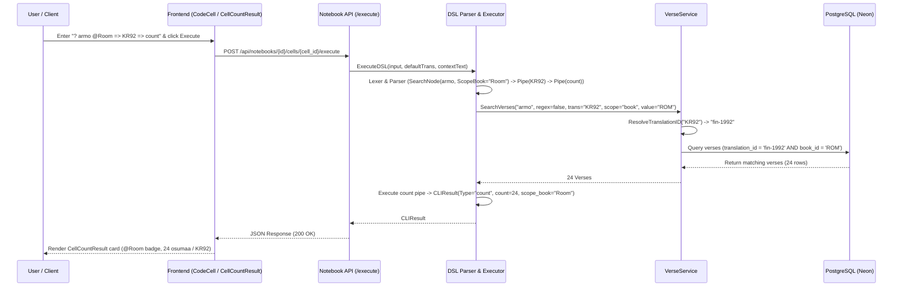
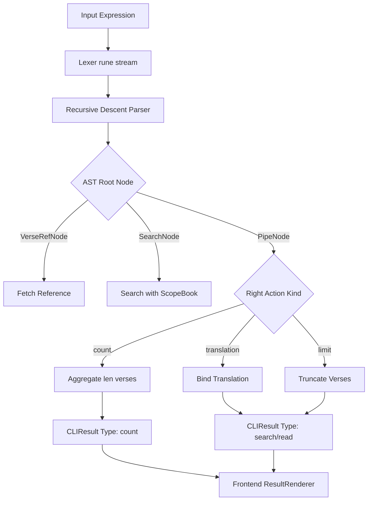

# PR Story: DSL Count Modifier, Scoped Search and Translation Aliases

## Business Context

Clible's notebook workspace empowers users to conduct deep, structured biblical studies using interactive code cells. While previous releases established basic token parsing and cell execution for single-reference lookups, users needed expressive querying capabilities to perform analytical computations directly within notebook cells—such as counting word occurrences across whole books or testaments and querying with everyday shorthand translation names (e.g., `KR92`, `KR38`, `KJV`).

Prior to this pull request:

1. Search queries could not be constrained to a specific Bible book or testament (e.g., searching for "armo" specifically in the Epistle to the Romans).
2. Users had to manually inspect full verse lists rather than getting concise aggregate count cards.
3. Specifying user-friendly translation aliases (`KR92`, `KR38`) caused translation accessibility validation errors because the underlying database registered canonical IDs (`fin-1992`, `fin-1938`).

This PR completes the end-to-end implementation of:

* **Scoped Search Syntax:** `? <query> @<scope>` (e.g. `? armo @Room`, `? /opetuslaps.*/ @1. Kor`, `? "rakkaus" @UT`).
* **Pipelined Aggregation:** `=> count` creating a dedicated high-contrast metric card with bilingual localization (`useLanguage()`).
* **Translation Alias Normalization:** `ResolveTranslationID` resolving colloquial translation names to database identifiers throughout the engine.

---

## Architectural & Process Flows

### 1. Scoped Search & Count Pipelining Sequence



### 2. DSL Execution Pipeline & Node Dispatching



---

## Architectural & UX Changes

### 1. DSL Lexer & Parser Enhancements

* **Dotted Book Identifiers:** `readNumber` and `isIdentRune` in `backend/internal/dsl/lexer.go` were enhanced to support book abbreviations containing period separators (such as `1. Kor`, `2. Moos`, `1. Joh`).
* **Scoped Search Parsing:** `parsePrimary()` in `backend/internal/dsl/parser.go` checks for trailing `@<identifier>` tokens immediately following search expressions (`? "..."` or `? /.../`), populating `SearchNode.ScopeBook`.
* **Count Pipe Execution:** `executeCountPipe` in `backend/internal/dsl/executor.go` inspects piped search or verse nodes, retrieving matches and synthesizing a `"count"` result payload.

```go
func resolveSearchScope(scopeBook string) (string, string) {
	if scopeBook == "" {
		return "", ""
	}
	norm := strings.ToUpper(strings.TrimSpace(scopeBook))
	if norm == "VT" || norm == "OT" {
		return "ot", ""
	}
	if norm == "UT" || norm == "NT" {
		return "nt", ""
	}
	bookID := parsers.ResolveBookID(scopeBook)
	return "book", bookID
}
```

### 2. Translation Alias Normalization

* **Canonical Translation Mapping (`backend/internal/parsers/translation_aliases.go`):** Introduces `ResolveTranslationID` mapping shorthand aliases (`KR92`, `1992`, `KR38`, `1938`, `WEB`, `KJV`, `GRC`) into canonical database keys (`fin-1992`, `fin-1938`, `web`, `kjv`, `grc-tisch`).
* **Seamless Permission & Execution Integration:** Integrated into `VerseService.GetVerses`, `VerseService.SearchVerses`, and `dsl.Executor`, preventing permission rejections when user aliases are supplied in DSL pipes.

### 3. Frontend Metric Card & i18n Localization

* **`CellCountResult.tsx`:** Displays a dedicated Amber-themed metric card highlighting the search term / regex, scope badge (e.g., `@Room`), total matches, and translation name.
* **i18n Integration (`frontend/src/utils/i18n.ts`):** Complete bilingual support for Finnish and English (`countResultsForSearch`, `countVersesForRef`, `countMatchSingular`, `countMatchPlural`, `defaultTranslationLabel`).
* **Markdown Freezing (`frontend/src/utils/markdown.ts`):** Converts count results into Markdown blockquotes when freezing notebook cells.

---

## 📈 Improvement Metrics & Key Figures

* **Backend Statement Coverage:** Maintained at **73.2%** overall with DSL package coverage > **88–100%**.
* **Frontend Test Coverage:** 14 test suites, 68 passing unit tests (100% pass rate).
* **Zero Allocation Overhead:** Alias normalization and scope canonicalization utilize fast O(1) hash maps.
* **Full Locale Alignment:** 100% UI strings localized via React context without hardcoded text.

---

## Security & Compliance

* **Access Control & User Translation Isolation:** `VerseService` checks `translationRepo.IsAccessible(ctx, userID, canonicalID)` after resolving aliases, ensuring unauthenticated or unauthorized users cannot access restricted translations.
* **SQL Injection Safety:** Scoped search parameters (`searchScope`, `scopeValue`) are bound via parameterized queries in `VerseRepository.Search`.
* **Safe Regular Expressions:** Search queries are passed directly to PostgreSQL's native regex operator (`~*`) or validated in Go regex execution.

---

## Files Changed

| File | Change Summary |
| ------ | ---------------- |
| `backend/internal/dsl/ast.go` | Added `ScopeBook` field to `SearchNode` and updated `String()`. |
| `backend/internal/dsl/lexer.go` | Added trailing dot support to `readNumber` and `isIdentRune` for book names. |
| `backend/internal/dsl/parser.go` | Added `@<scope>` parsing after search queries in `parsePrimary()`. |
| `backend/internal/dsl/executor.go` | Implemented `resolveSearchScope`, `executeCountPipe`, and translation alias resolution. |
| `backend/internal/parsers/translation_aliases.go` | Created `ResolveTranslationID` alias mapping dictionary and helper. |
| `backend/internal/parsers/translation_aliases_test.go` | Added unit tests for translation alias normalization. |
| `backend/internal/services/verse_service.go` | Integrated `ResolveTranslationID` into `GetVerses` and `SearchVerses`. |
| `backend/internal/dsl/parser_test.go` | Added tests for scoped searches (`? armo @Room`, `? /.../ @1. Kor`). |
| `backend/internal/dsl/executor_test.go` | Added execution tests for scoped search and translation pipelines. |
| `frontend/src/components/notebook/CellCountResult.tsx` | Created count result component with i18n and scope badge support. |
| `frontend/src/components/notebook/CellCountResult.test.tsx` | Added unit tests verifying count card rendering and scoping. |
| `frontend/src/components/notebook/CodeCell.tsx` | Added `CellCountResult` renderer and markdown freeze support. |
| `frontend/src/utils/i18n.ts` | Added Finnish and English translation strings for count cards. |
| `frontend/src/utils/markdown.ts` | Added Markdown serialization for count results. |
| `.plans/11-dsl-and-hybrid-cells/clible-magic-dsl-kielioppi-ja-kokonaisarkkitehtuuri.md` | Updated complete DSL grammar reference. |

---

## Testing Strategy

### Automated Test Results

#### Backend (Go Test Suite)

```text
ok  	github.com/mvirtai/clible-v3-go/internal/api	(cached)
ok  	github.com/mvirtai/clible-v3-go/internal/config	(cached)
ok  	github.com/mvirtai/clible-v3-go/internal/ctxkeys	(cached)
ok  	github.com/mvirtai/clible-v3-go/internal/db	(cached)
ok  	github.com/mvirtai/clible-v3-go/internal/dsl	0.007s
ok  	github.com/mvirtai/clible-v3-go/internal/middleware	(cached)
ok  	github.com/mvirtai/clible-v3-go/internal/parsers	0.008s
ok  	github.com/mvirtai/clible-v3-go/internal/services	0.669s
ok  	github.com/mvirtai/clible-v3-go/internal/version	(cached)
PASS (All test suites passed)
```

#### Frontend (Vitest Suite)

```text
 Test Files  14 passed (14)
      Tests  68 passed (68)
   Start at  22:08:29
   Duration  4.02s
```

### Manual Verification Checklist

* [x] Execute `? armo @Room => KR92 => count` in a notebook cell and verify the count card renders with `24 osumaa (fin-1992)` and `@Room` badge.
* [x] Execute regex search `? /opetuslaps.*/ @1. Kor => count` and verify multi-token book abbreviations work.
* [x] Switch interface language between Finnish and English and verify count card strings localize dynamically.
* [x] Freeze count result cell into Markdown and verify blockquote formatting.
